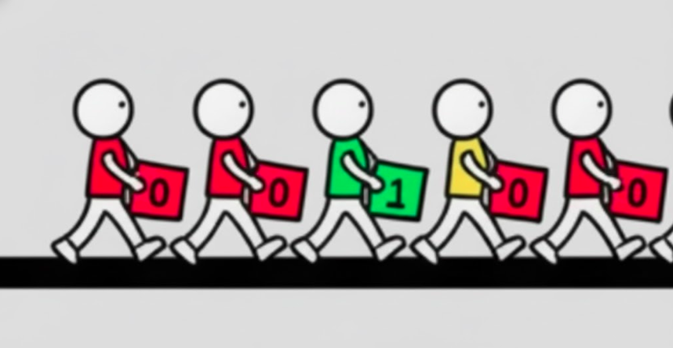
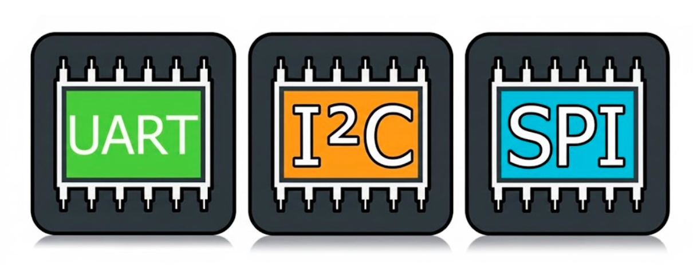
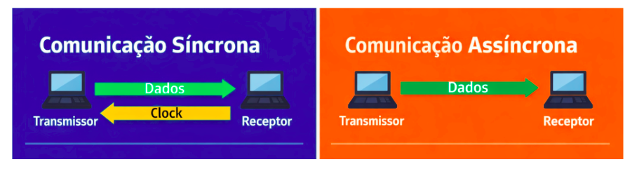
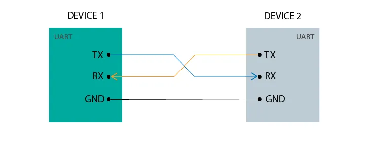
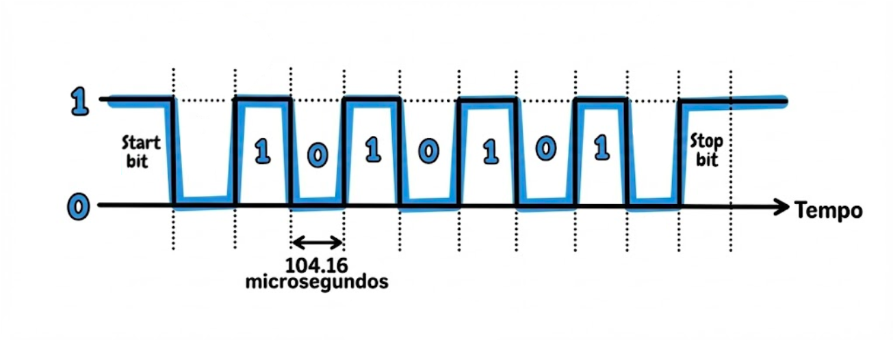
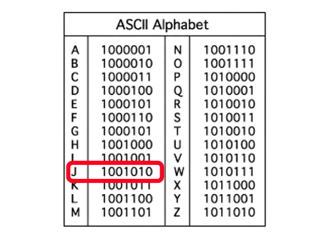
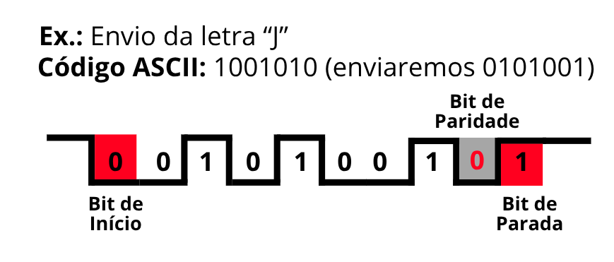

# Entendendo Interfaces Seriais de Comunicação

Desvendando a lógica por trás da transmissão serial
<!-- more -->

<figure markdown="span">
{ align=center, width="400"}
</figure>

Quando estamos trabalhando com sensores e alguns módulos, é comum nos depararmos com esse termo: Interfaces. Podemos definir isso como um **conjunto de hardware e software que permite que dois ou mais dispositivos eletrônicos "conversem" entre si, trocando informações seguindo regras específicas (chamadas de protocolos).**

> Podemos imaginar o protocolo como um idioma compartilhado que os dispositivos usam para trocar informações. Imagine, por exemplo,  que você está em uma festa e quer pedir uma bebida para o bartender. Mas nem você nem o bartender falam o mesmo idioma. Então, para se comunicar, vocês combinam usar gestos padronizados - por exemplo, levantar 1 dedo para pedir 1 cerveja, 2 dedos para 2 cervejas e assim por diante. Essa é a ideia!

No mundo da eletrônica e computação, dividimos essas interfaces principalmente em duas categorias: **Seriais** e **Paralelas.**

- A serial é aquela que envia os dados um bit por vez, sequencialmente, por um único canal ou fio. É como uma fila de pessoas passando por uma porta estreita.
- A paralela envia vários bits ao mesmo tempo por vários fios diferentes. É como várias pessoas atravessando várias portas lado a lado simultaneamente.

Antigamente, pensava-se que a comunicação paralela seria sempre melhor, mas a interface serial prevaleceu por 2 motivos principais:

- **Redução de Custo e Espaço:** Menos fios significam cabos mais finos, conectores menores e, principalmente, menos pinos nos chips. Isso é vital para dispositivos pequenos como smartphones e também para a redução de custos.

- **Integridade do Sinal:** Em altas velocidades, os sinais em cabos paralelos começam a "atropelar" uns aos outros devido à interferência eletromagnética. Na comunicação serial, como há apenas um caminho principal, esse problema é drasticamente reduzido.

    > Quando sinais viajam em frequências muito alta, eles geram campos eletromagnéticos que acabam "vazando" para os fios vizinhos. Esse fenômeno é chamado de Crosstalk.

# O Trio de Comunicação

<figure markdown="span">
{ align=center, width="400"}
</figure>

Nesse mundo, você encontrará 3 termos com frequência:

- **UART**: Interface que utiliza 2 fios e conecta apenas 2 dispositivos.
- **I2C**: Utiliza 2 fios também, mas permite conectar mais de 2 dispositivos.
- **SPI**: Também permite conectar mais de 2 dispositivos, mas precisa de 4 fios.

Calma, logo irei explicar em detalhes cada uma delas. Por enquanto, essas diferenças são o bastante.
Outro detalhe é que em qualquer uma delas você vai encontrar alguns termos, que já posso adiantar aqui, para não causar confusões posteriormente:

- **Baud Rate**: É o nome que damos à velocidade de transmissão, geralmente medido em bits por segundo (bps).
- **Full Duplex e Half Duplex**: Isso diz respeito a diferentes modos de transmissão. Se é possível enviar e receber dados ao mesmo tempo, então chamamos de Full Duplex. Se pode apenas fazer uma operação de cada vez, chamamos de Half Duplex.
> Há ainda um modo chamado Simplex, onde a comunicação ocorre apenas em uma direção. Um exemplo clássico de comunicação simplex é uma transmissão de rádio, onde a estação transmite e os ouvintes apenas recebem.
- **Síncrona e Assíncrona**: Existem 2 formas de comunicação serial:

    <figure markdown="span">
    { align=center, width="600"}
    </figure>

    1. **Síncrona**: Exige que haja um sinal a mais (que chamamos de Clock) para manter o emissor e receptor sincronizados, onde os dados são transmitidos seguindo um ritmo específico.
    > Como exemplo, temos a SPI e I2C.

    2. **Assíncrona**: Não exige um sinal para sincronização entre o receptor e o transmissor, pois os próprios dados já carregam as informações necessárias para manter tudo em ordem.
    > Como exemplo, temos a UART.

# Interfaces em Detalhes

## UART (Universal Asynchronous Receiver/Transmitter)

<figure markdown="span">
{ align=center, width="600"}
</figure>

A UART é um protocolo assíncrono de comunicação serial que permite a troca de dados entre dispositivos de forma simplex, half-duplex ou full-duplex (um deles, não todos ao mesmo tempo, lembre disso).

Ele funciona com a conexão de 2 fios, chamados TX e RX:

- **TX (Transmit):** É o pino de transmissão de dados. Por ele, o dispositivo envia informações para outro equipamento.
- **RX (Receive):** É o pino de recepção de dados. Por ele, o dispositivo recebe as informações enviadas pelo transmissor.

Além deles dois, há também o VCC e o GND, mas isso é universal em todos já que o VCC é o pino que fornece a tensão de alimentação para o circuito e o GND é o terra do circuito. Esse protocolo envia os dados em uma estrutura chamada **FRAME**, que é um conjunto de bits que representa um único caractere ou pacote de dados. Ele serve para que o receptor saiba exatamente onde o dado começa e onde termina. Um frame padrão é composto por quatro partes principais, enviadas nesta ordem:

1. **Start Bit (Bit de Início):** O transmissor envia um bit 0 (Low) para avisar ao receptor: "Prepare-se, um dado está chegando".
2. **Data Bits (Bits de Dados):** É o conteúdo real que você quer enviar (por exemplo, a letra 'A'). Geralmente são 5 a 9 bits, sendo o padrão mais comum 8 bits (1 byte). **O bit menos significativo (LSB) costuma ser enviado primeiro.**
3. **Parity Bit (Bit de Paridade) - Opcional**: Usado para detecção de erros simples.
4. **Stop Bits (Bits de Parada):** Para finalizar o frame e retornar a linha ao estado ocioso, o transmissor envia 1 ou 2 bits em estado "Alto" (1). Isso garante um intervalo mínimo antes do próximo Start Bit (que é o novo dado).

### Como a UART consegue sincronizar a transmissão e recepção sem um clock compartilhado?

Como já citado, a interface UART não utiliza um clock compartilhado para manter a sincronia entre os dispositivos. Porém, **cada dispositivo tem seu próprio relógio interno que conta o tempo baseado no baud rate combinado.** Assim, na hora que é enviado o bit de inicio, começa essa contagem justamente para saber onde a mensagem vai acabar.

> Assim, ambos os dispositivos concordam previamente sobre a velocidade de transmissão (baud rate, ex: 9600, 115200 bps).

Por exemplo, se a comunicação está configurada para 9600 bps, significa que cada bit dura 1 / 9600 segundos (~104 microsegundos). Assim, nossos dispositivos UART começarão a contar 104 microssegundos para saber quando o próximo bit será transmitido, garantindo que a informação seja enviada sem problemas.

<figure markdown="span">
{ align=center, width="500"}
</figure>

> Um detalhe é que no UART dizemos o tamanho dos dados que estamos enviando. Isso evita que dados altos (1) sejam tratados como fim da informação, quando na verdade são apenas bits de dados.

### Como detecta o fim da mensagem?

Mesmo com a sincronização do baud rate, precisamos de um mecanismo adicional para indicar o fim da mensagem. As abordagens mais comuns são:

- **1️⃣ Caracteres Especiais (Exemplo: \n, \0)** → O receptor lê até encontrar esse caractere.
- **2️⃣ Tamanho Fixo da Mensagem →** "10 bytes por mensagem"
- 3️⃣ **Byte Inicial Diz o Tamanho da Mensagem →** O primeiro byte enviado indica que a mensagem tem **X bytes**.
- 4️⃣ **Timeout (Esperar e Parar Após um Tempo Sem Dados)**

Para entender melhor, vamos tentar enviar alguma letra via UART, para entendermos como funciona. Primeiro, vamos pegar a tabela ASCII, porque assim teremos a representação em bits das letras. Nesse caso, vamos escolher a letra "J":

<figure markdown="span">
{ align=center, width="400"}
</figure>

Agora que temos os bits dessa letra, temos que inverter a ordem dos bits porque a UART envia o bit menos significativo primeiro, que chamamos de LSB. Nesse caso, em vez de enviarmos `10010010` vamos enviar `01001001`. Agora podemos enviar:

<figure markdown="span">
{ align=center, width="400"}
</figure>

### Vantagens e Desvantagens da UART

- **Vantagens:** facilidade de implementação, requisitos de hardware mínimos, comunicação full-duplex e suporte a distâncias maiores (até 15 metros).

- **Limitações:** funciona bem apenas para 2 dispositivos, velocidade menor (quando comparado com SPI e I2C), requer configurações sincronizadas (mesma baud rate) e quadro de dados limitado a 9 bits (8 bits para dados e 1 bit para a paridade, caso use).

# I2C (Inter-Integrated Circuit)

[ Em breve ]

# SPI (Serial Peripheral Interface)

[ Em breve ]