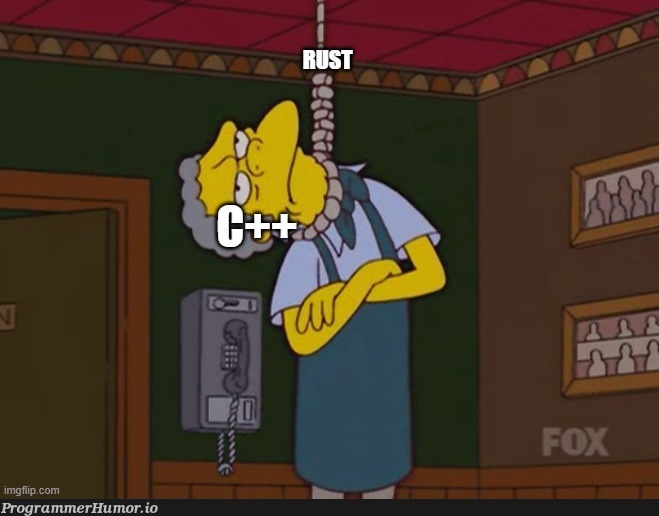
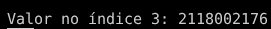
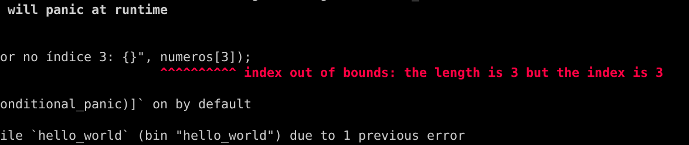
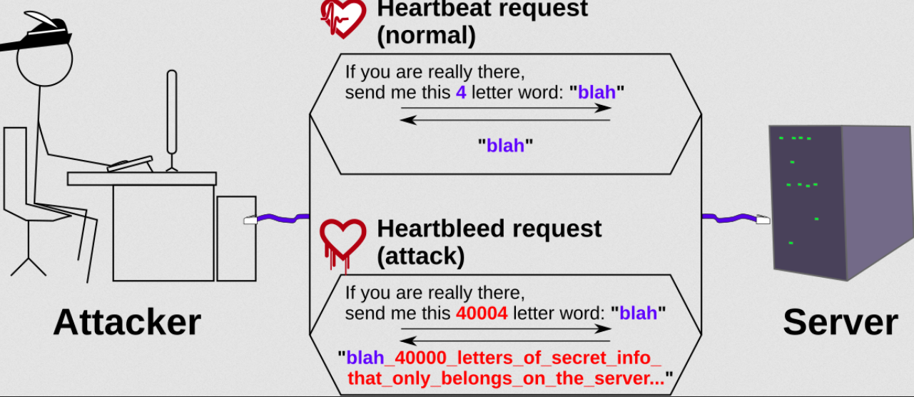
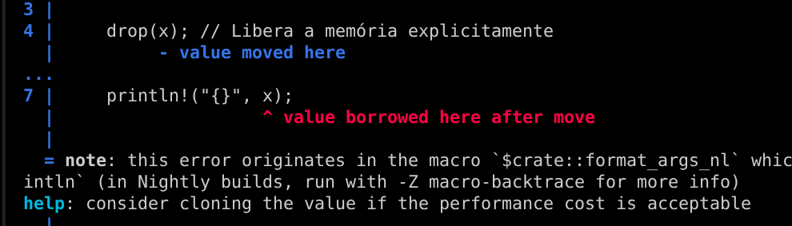

# Por que estão trocando C/C++ por Rust?

<!-- more -->
<figure markdown="span">
{ align=center, width="400"}
</figure>


Se você anda por dentro das notícias, verá diversas sobre a mudança de códigos escritos em C/C++ para Rust. Esse movimento está ocorrendo de forma gradual, mas a todo vapor. E aí surge a dúvida, qual a diferença entre os dois? Por que as empresas estão gastando tempo fazendo essa migração? Vamos explorar um pouco o que faz o Rust ser tão escolhido atualmente.

> Desde já, é interessante você ter algum conhecimento de C para facilitar o entendimento. Mas caso não tenha, sem problemas, tentarei explicar sem complicações.

## Os problemas do C/C++ e o porquê do Rust

C e C++ ainda existem, são extremamente relevantes e, ao mesmo tempo, continuam sendo a origem da maioria dos grandes problemas de segurança da computação moderna.

O C, na prática, quase não mudou. A linguagem mantém exatamente a mesma filosofia de décadas atrás: dar controle total ao programador sobre o hardware. Isso significa acesso direto à memória, ponteiros crus, aritmética livre e nenhuma proteção real contra usos incorretos. O que melhorou não foi o C em si, mas o ecossistema ao redor. Compiladores como GCC e Clang ficaram muito mais inteligentes, passaram a emitir avisos mais precisos e a detectar padrões perigosos. O problema é que esses avisos não são obrigatórios.

> No fim, a linguagem confia que o programador nunca vai errar — algo que simplesmente não é realista.

O C++ tentou corrigir isso ao longo do tempo. A partir do C++11, a linguagem passou por uma grande modernização e introduziu ferramentas importantes, como os smart pointers, que ajudam a gerenciar memória automaticamente. 

Essas ferramentas são boas e funcionam, mas elas convivem com todo o passado da linguagem. O C++ não pode remover os ponteiros crus nem proibir práticas antigas, porque isso quebraria bilhões de linhas de código existentes. **O resultado é um modelo onde a segurança é opcional.** O desenvolvedor pode usar os recursos modernos, mas basta uma única parte do código usar o estilo antigo para que os mesmos erros de memória de sempre voltem a existir. Em outras palavras, o C++ até oferece cinto de segurança, mas não obriga ninguém a usá-lo.

É nesse ponto que o Rust entra como substituto natural. A diferença do Rust para C e C++ não é apenas sintaxe ou modernidade, mas filosofia. Enquanto C e C++ são perigosos por padrão e exigem disciplina constante do programador para evitar erros, o Rust é seguro por padrão. Ele foi projetado desde o início para impedir classes inteiras de bugs antes mesmo do programa existir. Em vez de descobrir erros de memória em produção, através de crashes ou exploits, o Rust força esses problemas a aparecerem na compilação. Se o código compila, certas categorias de falhas simplesmente não podem acontecer.


Outro ponto fundamental é que o Rust não precisa carregar decisões dos anos 70 ou 80. Ele não tem a obrigação de manter compatibilidade com práticas inseguras do passado. Quando algo é potencialmente perigoso, o Rust exige que isso seja explícito. O uso de operações inseguras existe, mas é marcado, isolado e consciente. 

Para entender melhor, vamos comparar algumas situações...

### 1) Buffer Overflow (Estouro de Buffer)
> Um buffer overflow acontece quando você tenta escrever ou ler dados fora do espaço que foi reservado para eles.
Como exemplo, vamos criar um array e tentar acessar um valor fora dessa memória alocada.

```c
#include <stdio.h>

int main() {
    int numeros[3] = {10, 20, 30}; // Índices válidos: 0, 1, 2
    printf("Valor no índice 3: %d\n", numeros[3]); 
    return 0;
}
```

Aqui, o programa vai rodar e imprimir um valor "lixo" (qualquer coisa que esteja na memória naquele momento). No meu caso, apareceu isso aqui:

<figure markdown="span">
{ align=center, width="400"}
</figure>

Isso é uma falha grave pois permite que uma pessoa mal intencionada acesse outras informações guardadas em outros locais da memória do computador. Para evitar isso, o Rust faz o que chamamos de **Bounds Checking (Verificação de Limites).** Esse é o mesmo código em Rust:

```rust
fn main() {
    let numeros = [10, 20, 30];
    println!("Valor no índice 3: {}", numeros[3]);
}
```

O Rust sequer deixa compilar isso, pois o programa sofrerá um Panic (ele encerra imediatamente de forma segura) antes de acessar a memória proibida:

<figure markdown="span">
{ align=center, width="500"}
</figure>

---

Em 2014, o mundo aprendeu da pior forma que confiar na memória de um programador C é um risco de bilhões de dólares: Heartbleed. Ele não era um vírus complexo, era apenas uma falha de memória em uma biblioteca que quase todos os sites do mundo usavam, o OpenSSL - uma implementação de código aberto muito usada para criar conexões seguras por meio dos protocolos SSL e TLS.

A brecha permitia que hackers pudessem "pescar" até 64 KB de informações de dados hospedados em servidores. De forma simplificada, a ideia era pedir servidor para enviar uma palavra de 4 letras ("Oi"), mas mentia dizendo que a palavra tinha 500 letras. O C, sem checar os limites, lia o "Oi" e continuava lendo os próximos bytes da memória... que continham senhas e chaves privadas de outros usuários.

<figure markdown="span">
{ align=center, width="500"}
</figure>


> Para mais detalhes, consulte o site [Heartbleed](https://heartbleed.com/).  Aliás, os códigos de exploit para esta vulnerabilidade estão disponíveis publicamente.

A correção consistiu em adicionar, basicamente, uma única condição `if` antes de copiar os dados, dizendo ao computador: "Ei, antes de copiar, verifique se o tamanho que o usuário disse que mandou é realmente o tamanho que chegou". Bizarro, né?

- Em 2015, bastava receber um MMS (vídeo por mensagem) e o seu Android era hackeado antes mesmo de você abrir a mensagem.](https://github.com/ksparakis/Stagefright-Explained) O erro era um estouro de buffer na biblioteca de mídia escrita em C++.

No Rust, a checagem de limites (Bounds Checking) é o padrão. Para você fazer o que o C faz (ler memória proibida), você teria que usar uma palavra-chave chamada `unsafe` e se esforçar muito para fazer a bobagem.

---


### 2) Use-After-Free (Uso após liberação)
> Isso ocorre quando você libera uma memória (devolve ao sistema), mas seu código tenta usá-la de novo por engano. É uma espécie de ponteiro “fantasma”...

```c
#include <stdlib.h>
#include <stdio.h>

int main() {
    int *ptr = malloc(sizeof(int)); // Aloca memória
    *ptr = 100;

    free(ptr); // Libera a memória
    printf("%d", *ptr); 

    return 0;
}
```
O resultado é o mesmo problema anterior. O Rust resolve isso com o conceito de Ownership (Posse). Quando você "libera" algo, o compilador anota que aquela variável não existe mais. Veja o código abaixo, semelhante ao feito em C:

```rust
fn main() {
    let x = Box::new(100); // Aloca memória no heap (similar ao malloc)
    
    drop(x); // Libera a memória explicitamente

    println!("{}", x); 
}
```
Ao tentar compilar isso, veremos um erro:


<figure markdown="span">
{ align=center, width="500"}
</figure>


Aqui podemos ver "value borrowed here after move", significando que o compilador Rust detectou uma tentativa de usar (borrow) uma variável que já foi movida (move), violando as regras de ownership. Você pode ver melhor sobre isso na [Documentação Oficial do Rust](https://doc.rust-lang.org/book/ch04-01-what-is-ownership.html), mas de forma simplificada é o seguinte:

- **Cada valor no Rust tem um dono:** Existe uma variável que é a "proprietária" dos dados.
- **Apenas um dono por vez:** Você não pode ter duas variáveis sendo donas do mesmo espaço de memória simultaneamente.
- **Limpeza Automática:** Quando o dono sai do "escopo" (por exemplo, quando a função termina), o Rust deleta os dados automaticamente da memória.

Os dados em Rust ficam em basicamente 2 lugares: Pilha (Stack) ou no Monte (Heap):

- **Stack (Pilha):** É muito rápida. Armazena dados com tamanho fixo e conhecido antes de o programa rodar (ex: números inteiros, booleanos).

- **Heap (Monte):** É usada para dados que podem crescer ou cujo tamanho é desconhecido (ex: um texto que o usuário digita). O computador precisa procurar um espaço vazio para guardar esses dados, o que é um pouco mais lento.

Se um tipo de dado vive na Stack (como um número inteiro), o Rust apenas o copia.

```rust
let x = 5;
let y = x; // x continua sendo válido!
```

Se o dado está na Heap (como uma String), o Rust move a propriedade. O dono antigo perde o acesso.

```rust
let s1 = String::from("olá");
let s2 = s1; // O valor foi "movido" para s2. s1 não é mais dono de nada.
println!("{}", s1); // Isso causaria um ERRO no compilador.
```

Mas, se você quiser que ambos os nomes continuem válidos na Heap, você deve clonar os dados explicitamente.

```rust
let s1 = String::from("olá");
let s2 = s1.clone(); // Agora ambos são válidos e cada um tem seu próprio "olá" na memória.
```

Então, quando fazemos no código acima `let x = Box::new(100)`, a variável x torna-se a "dona" do valor no Heap, que é essa memória alocada. Mas, ao chamar a função `drop(x)`, você está entregando a posse da variável x para a função drop, que vai receber o valor, desalocar a memória e terminar sua execução.

Quando o compilador chega na linha `println!("{}", x)`, ele percebe que você está tentando usar uma variável que não possui mais nenhum valor associado a ela, **ou seja, que não tem nenhum dono.**


---
**A grande maioria das invasões de navegadores nos últimos 10 anos usou falhas de Use-After-Free.** O hacker induz o navegador a deletar um objeto da memória e, em seguida, usa o ponteiro fantasma para executar um código malicioso. Você pode ver isso na imagem abaixo ou na página oficial do Chromium clicando [**AQUI**](https://www.chromium.org/Home/chromium-security/memory-safety/)

> Caso você não saiba, o Chromium é a base utilizada na maioria dos navegadores atualmente, como o Chrome, Edge, Vivaldi, Opera GX e Brave.

<figure markdown="span">
{ align=center, width="500"}
</figure>

A Microsoft também já disse o mesmo: [70% dos erros de segurança vêm do mal gerenciamento de memória](https://www.zdnet.com/article/microsoft-70-percent-of-all-security-bugs-are-memory-safety-issues/). 

---


### 3) Tratamento de Erros Obrigatório
Em C, muitas funções retornam um número inteiro (como -1) para indicar erro. O problema é que o programador pode simplesmente ignorar esse retorno e continuar a execução, o que leva a estados inválidos do sistema.

O Rust usa o tipo `Result`. Se uma função pode falhar, ela retorna obrigatoriamente um `Result`. Se você não tratar o erro, o compilador emitirá um aviso ou erro, impedindo que você ignore a falha.

### 4) Ponteiros Nulos: "O Erro de um Bilhão de Dólares"

Em C, um ponteiro pode ser NULL. Se você tentar acessar o valor de um ponteiro nulo, o programa trava imediatamente com um Segmentation Fault. O problema é que o C não te obriga a checar se o ponteiro é nulo antes de usar.

Você precisa lembrar de fazer `if (ptr != NULL)` toda vez. Se esquecer uma única vez, o programa quebra. Em Rust não existe o valor `null`. O Rust usa um tipo chamado Option. Ele te obriga a tratar o caso onde o valor "não existe" antes mesmo de você tentar usar o dado.

---
### Uma breve História do NULL

Em 2009, um cientista da computação chamado Sir Tony Hoare (o criador do algoritmo QuickSort) [subiu ao palco de uma conferência e pediu desculpas ao mundo.](https://www.infoq.com/presentations/Null-References-The-Billion-Dollar-Mistake-Tony-Hoare/) Ele chamou a invenção da referência nula (NULL) de seu "erro de um bilhão de dólares". Pois é, o criador do NULL falando isso...

> "...Meu objetivo era garantir que todo uso de referências fosse absolutamente seguro... Mas eu não resisti à tentação de colocar uma referência nula, simplesmente porque era muito fácil de implementar..."

Um erro recente sobre o uso de NULL foi explorado no **CVE-2023-21768**.
> CVE significa Common Vulnerabilities and Exposures e é um sistema internacional de catálogo público de vulnerabilidades e exposições de segurança conhecidas. Basicamente é uma forma de nomear as falhas de segurança de forma organizada.


Ela foi falha explorada em um driver do Windows que permitia a elevação de privilégios. Na prática, imagine que cada programa que você abre — como um navegador ou um jogo — recebe um crachá invisível, chamado Access Token. Esse crachá diz exatamente até onde aquele programa pode ir dentro do Windows: o que pode acessar, o que não pode e quais portas estão fechadas.

O problema surgiu porque, em uma situação específica de erro, esse “assistente” do sistema recebia como entrada uma pasta vazia (o famoso NULL). Em vez de parar e dizer “isso aqui está errado”, ele seguia um comportamento totalmente robótico e previsível, algo como: "Pegue o endereço da pasta, avance exatamente 40 posições na memória e marque como ‘aprovado’ o que estiver lá."

Esse comportamento não verificava se aquilo realmente era uma pasta válida. Ele apenas seguia a receita. O atacante, sabendo disso, preparava o cenário: colocava exatamente nesse ponto — depois dessas “40 páginas” — uma estrutura falsa que representava um token com permissões elevadas. Quando o sistema chegava lá, simplesmente carimbava: "Aprovado".

O programa que antes era um simples usuário passava a agir como administrador do sistema, permitindo ao atacante controle privilegiado sobre o Windows. **Em resumo, não foi um ataque sofisticado de força bruta ou criptografia quebrada — foi o sistema confiando cegamente em um endereço de memória, sem validar o que realmente existia ali.**

No fim, se o próprio criador do NULL diz que isso foi um tremendo erro, quem somos nós para discordar?


## C++, o Jeito moderno?

Como já citado, o C++ trouxe algumas ferramentas para lidar com esses problemas, como os **Ponteiros Inteligentes** e **Containers**:

- **Smart Pointers**: Eles deletam a memória automaticamente quando não são mais usados. Isso evita o esquecimento do `free` ou `delete`.
- **Containers**: Em vez de usar arrays puros de C, você usa esses objetos que gerenciam o tamanho sozinhos.

Mas o C++ não pode proibir o "jeito velho". Se um programador quiser usar um ponteiro comum ou um array de C por preguiça ou por precisar de um código antigo, o C++ deixa. É como ter um carro com cinto de segurança, mas o carro ainda liga e corre a 100km/h mesmo se você não colocar o cinto.

## The End

Espero que esse mergulho na memória tenha te ajudado a entender que o Rust não é apenas "mais uma linguagem da moda". Claro que há mais coisas, mas isso é o bastante por hora. Ele é uma resposta direta a décadas de dores de cabeça, bugs bizarros e falhas de segurança que custaram bastante grana (né, Heartbleed?).

Vou ficando por aqui. Até a próxima 😁