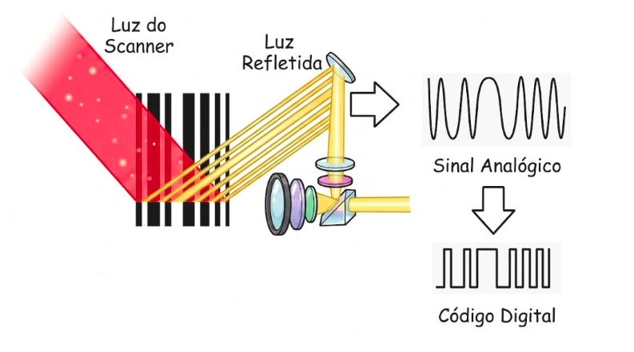

# The Mathematical Anatomy of the UPC (Universal Product Code)

To understand the structure of the UPC, we first need to break down the barcode into its smallest parts. The smallest unit of a barcode is called a "module", with a standard width of 0.33 millimeters (basically, the thinnest line possible). It is incredibly small.

> This size standardization is maintained by GS1 (Global System 1), an international, neutral, non-profit organization responsible for developing and maintaining global business communication standards.

This ensures that a barcode printed in Brazil is read exactly the same way in China, the United States, or anywhere else.

> You can see the size rules in the [GS1 - UPC Specifications](https://www.gs1ie.org/standards/data-carriers/barcodes/upc/).

But in general, GS1 allows this size to vary slightly to fit different packages:

- Minimum permitted size: $0.26 \text{ mm}$ (used on very small products, like gum or nail polish).
- Maximum permitted size: $0.66 \text{ mm}$ (used on large cardboard shipping boxes in warehouses, so operators can read them from a distance).

> Additionally, because the global GS1 organization needed to serve different industries, packaging sizes, and shipping needs, it created several barcode standards over the years. However, the ones that have survived to this day are the UPC-A (the traditional barcode) and the UPC-E (a compact version of the UPC-A, used on small products).

When we look at a barcode from a distance, we see black lines of various sizes (some thin, some medium, some very thick). But those thick lines are just multiple black modules placed side-by-side. In practice, this means we are encoding information in binary format:

<figure markdown="span">
  { align=center, width="500"}
</figure>

- **Background color module (White):** Normatively defined with a logical value of $0$.
- **Foreground color module (Black):** Normatively defined with a logical value of $1$.

Thus, all we have are binary-encoded numbers. However, we don't just have the product code itself; we also have a series of modules that orient the reader and ensure the scan is successful. Therefore, we can divide a barcode into three main sections:

1. **Data Blocks:** These are the modules that carry the product information.

    > In the traditional UPC-A code (the most common), we have 6 data blocks on the left and 6 data blocks on the right.

2. **Guards:** These are the modules that orient the reader.

    > 6 modules form the guard rails (2 at the start, 2 in the middle, 2 at the end).

3. **Quiet Zones:** The blank area before and after the barcode.

    > It is mandatory to have a blank space of at least 9 modules wide before and after the code. This helps the scanner identify where the code begins and ends.

For example, a code like this:

  

can be broken down like this:

> The table below illustrates an example of how it is structured and how each number is represented in the barcode.

  <table style="text-align: center; border-collapse: collapse; width: 100%; min-width: 800px; font-family: 'Outfit', 'Inter', system-ui, -apple-system, sans-serif; background-color: #80A080; border: none; color: #ffffff; margin: 0;">
    <caption style="padding: 14px; font-weight: 700; font-size: 1.1rem; background-color: #5a755a; color: #ffffff; letter-spacing: 0.5px; border-bottom: 2px solid rgba(255, 255, 255, 0.15);">
      Encoding table for the UPC-A barcode standard
    </caption>
    <thead>
      <tr style="background-color: #698b69; border-bottom: 2px solid rgba(255, 255, 255, 0.1);">
        <th rowspan="2" style="padding: 12px 6px; border: 1px solid rgba(255, 255, 255, 0.1); font-weight: 600; text-transform: uppercase; font-size: 0.85rem; letter-spacing: 0.5px;">Quiet Zone</th>
        <th rowspan="2" style="padding: 12px 6px; border: 1px solid rgba(255, 255, 255, 0.1); font-weight: 600; text-transform: uppercase; font-size: 0.85rem; letter-spacing: 0.5px;">GUARD</th>
        <th colspan="10" style="padding: 12px 6px; border: 1px solid rgba(255, 255, 255, 0.1); font-weight: 700; font-size: 0.9rem; text-transform: uppercase; letter-spacing: 1px;">Data Block (Left)</th>
        <th rowspan="2" style="padding: 12px 6px; border: 1px solid rgba(255, 255, 255, 0.1); font-weight: 600; text-transform: uppercase; font-size: 0.85rem; letter-spacing: 0.5px;">GUARD</th>
        <th colspan="10" style="padding: 12px 6px; border: 1px solid rgba(255, 255, 255, 0.1); font-weight: 700; font-size: 0.9rem; text-transform: uppercase; letter-spacing: 1px;">Data Block (Right)</th>
        <th rowspan="2" style="padding: 12px 6px; border: 1px solid rgba(255, 255, 255, 0.1); font-weight: 600; text-transform: uppercase; font-size: 0.85rem; letter-spacing: 0.5px;">GUARD</th>
        <th rowspan="2" style="padding: 12px 6px; border: 1px solid rgba(255, 255, 255, 0.1); font-weight: 600; text-transform: uppercase; font-size: 0.85rem; letter-spacing: 0.5px;">Quiet Zone</th>
      </tr>
      <tr style="background-color: #698b69;">
        <!-- L 0-9 -->
        <th style="padding: 8px 4px; border: 1px solid rgba(255, 255, 255, 0.1); font-weight: 700;">0</th>
        <th style="padding: 8px 4px; border: 1px solid rgba(255, 255, 255, 0.1); font-weight: 700;">1</th>
        <th style="padding: 8px 4px; border: 1px solid rgba(255, 255, 255, 0.1); font-weight: 700;">2</th>
        <th style="padding: 8px 4px; border: 1px solid rgba(255, 255, 255, 0.1); font-weight: 700;">3</th>
        <th style="padding: 8px 4px; border: 1px solid rgba(255, 255, 255, 0.1); font-weight: 700;">4</th>
        <th style="padding: 8px 4px; border: 1px solid rgba(255, 255, 255, 0.1); font-weight: 700;">5</th>
        <th style="padding: 8px 4px; border: 1px solid rgba(255, 255, 255, 0.1); font-weight: 700;">6</th>
        <th style="padding: 8px 4px; border: 1px solid rgba(255, 255, 255, 0.1); font-weight: 700;">7</th>
        <th style="padding: 8px 4px; border: 1px solid rgba(255, 255, 255, 0.1); font-weight: 700;">8</th>
        <th style="padding: 8px 4px; border: 1px solid rgba(255, 255, 255, 0.1); font-weight: 700;">9</th>
        <!-- R 0-9 -->
        <th style="padding: 8px 4px; border: 1px solid rgba(255, 255, 255, 0.1); font-weight: 700;">0</th>
        <th style="padding: 8px 4px; border: 1px solid rgba(255, 255, 255, 0.1); font-weight: 700;">1</th>
        <th style="padding: 8px 4px; border: 1px solid rgba(255, 255, 255, 0.1); font-weight: 700;">2</th>
        <th style="padding: 8px 4px; border: 1px solid rgba(255, 255, 255, 0.1); font-weight: 700;">3</th>
        <th style="padding: 8px 4px; border: 1px solid rgba(255, 255, 255, 0.1); font-weight: 700;">4</th>
        <th style="padding: 8px 4px; border: 1px solid rgba(255, 255, 255, 0.1); font-weight: 700;">5</th>
        <th style="padding: 8px 4px; border: 1px solid rgba(255, 255, 255, 0.1); font-weight: 700;">6</th>
        <th style="padding: 8px 4px; border: 1px solid rgba(255, 255, 255, 0.1); font-weight: 700;">7</th>
        <th style="padding: 8px 4px; border: 1px solid rgba(255, 255, 255, 0.1); font-weight: 700;">8</th>
        <th style="padding: 8px 4px; border: 1px solid rgba(255, 255, 255, 0.1); font-weight: 700;">9</th>
      </tr>
    </thead>
    <tbody>
      <tr style="background-color: #80A080; vertical-align: top;">
        <td style="padding: 12px 6px; border: 1px solid rgba(255, 255, 255, 0.1); background-color: rgba(255, 255, 255, 0.05);"></td>
        <td style="padding: 12px 6px; border: 1px solid rgba(255, 255, 255, 0.1);"></td>
        <!-- L 0-9 -->
        <td style="padding: 12px 6px; border: 1px solid rgba(255, 255, 255, 0.1);"></td>
        <td style="padding: 12px 6px; border: 1px solid rgba(255, 255, 255, 0.1);"></td>
        <td style="padding: 12px 6px; border: 1px solid rgba(255, 255, 255, 0.1);"></td>
        <td style="padding: 12px 6px; border: 1px solid rgba(255, 255, 255, 0.1);"></td>
        <td style="padding: 12px 6px; border: 1px solid rgba(255, 255, 255, 0.1);"></td>
        <td style="padding: 12px 6px; border: 1px solid rgba(255, 255, 255, 0.1);"></td>
        <td style="padding: 12px 6px; border: 1px solid rgba(255, 255, 255, 0.1);"></td>
        <td style="padding: 12px 6px; border: 1px solid rgba(255, 255, 255, 0.1);"></td>
        <td style="padding: 12px 6px; border: 1px solid rgba(255, 255, 255, 0.1);"></td>
        <td style="padding: 12px 6px; border: 1px solid rgba(255, 255, 255, 0.1);"></td>
        <!-- M -->
        <td style="padding: 12px 6px; border: 1px solid rgba(255, 255, 255, 0.1);"></td>
        <!-- R 0-9 -->
        <td style="padding: 12px 6px; border: 1px solid rgba(255, 255, 255, 0.1);"></td>
        <td style="padding: 12px 6px; border: 1px solid rgba(255, 255, 255, 0.1);"></td>
        <td style="padding: 12px 6px; border: 1px solid rgba(255, 255, 255, 0.1);"></td>
        <td style="padding: 12px 6px; border: 1px solid rgba(255, 255, 255, 0.1);"></td>
        <td style="padding: 12px 6px; border: 1px solid rgba(255, 255, 255, 0.1);"></td>
        <td style="padding: 12px 6px; border: 1px solid rgba(255, 255, 255, 0.1);"></td>
        <td style="padding: 12px 6px; border: 1px solid rgba(255, 255, 255, 0.1);"></td>
        <td style="padding: 12px 6px; border: 1px solid rgba(255, 255, 255, 0.1);"></td>
        <td style="padding: 12px 6px; border: 1px solid rgba(255, 255, 255, 0.1);"></td>
        <td style="padding: 12px 6px; border: 1px solid rgba(255, 255, 255, 0.1);"></td>
        <!-- E -->
        <td style="padding: 12px 6px; border: 1px solid rgba(255, 255, 255, 0.1);"></td>
        <td style="padding: 12px 6px; border: 1px solid rgba(255, 255, 255, 0.1); background-color: rgba(255, 255, 255, 0.05);"></td>
      </tr>
    </tbody>
  </table>

Each number must use a block of exactly 7 modules. The image below illustrates this well:

<figure markdown="span">
  { align=center, width="400"}
</figure>

With this in mind, the "recipe" for the number 1 on the left side is (3 white, 2 black, 1 white, 1 black):

$$\text{White} - \text{White} - \text{White} - \text{Black} - \text{Black} - \text{White} - \text{Black}$$

Meanwhile, on the right side of the code, the recipe for the number 1 is different (basically the inverse, where black becomes white and vice-versa):

$$\text{Black} - \text{Black} - \text{Black} - \text{White} - \text{White} - \text{Black} - \text{White}$$

---

### Why is there this difference?

This difference in recipes exists for a simple reason: to give the computer orientation, in the same way a traffic sign tells you if a street is "one-way" or "do not enter."

For example, if the number 1 were drawn identically on the left and right, the sequence of slices would be identical. When the product passed upside down, the laser would start reading the code from the end (from the right), thinking it was the beginning (the left).

The computer would read all the numbers backward. Instead of reading the actual product code, it would read an entirely incorrect sequence, the system wouldn't find the price, and the register would freeze.

That is why we use this trick of mirroring the recipe of each number. Thus:

- **On the Left Side**: All numbers (from 0 to 9) are designed with an **ODD** number of black slices.
- **On the Right Side**: All numbers are designed with an **EVEN** number of black slices.

Thus, when the laser crosses the barcode, the first thing the software does is count the parity of the 7-slice blocks it just read. If the result is odd, it knows it is reading the left side. If it is even, it knows it is reading the right side.

This way, if it is read backward, instead of throwing an error and freezing the checkout, the computer simply performs a quick internal mathematical operation: it mirrors and reverses the order of the bits in memory, transforming what it read backward into the correct code.

---

Taking this layout into account, every UPC-A code has exactly 30 black bars. Since it uses 12 digits for data, this means the maximum capacity is 100 billion different product combinations ($10^{11}$ or $100,000,000,000$). This is plenty of space to register products for decades.

---

## And what are those numbers at the bottom?

When we look at a barcode printed on a product package, we usually see some numbers aligned underneath the bars. As mentioned, these are exactly the numbers encoded in the bars. They were put there so humans can read the barcode in case it needs to be typed manually into a system due to a scanning issue.

However, if you look closely at the structure of a UPC-A code, you'll notice that the first number and the last number are pushed outwards, slightly isolated in the corners. In our previous example, we have the 0 and 2 isolated at the outer edges:

  

According to official GS1 rules, they mean:

- **Left**: The category digit (Number System Character). It identifies the type of product or category the item belongs to (in the example, it's the number 0).
- **Right**: The check digit. It is used to ensure the barcode was read correctly (in the example, it's the number 2).

### Category Digit

This first digit (which sits isolated on the far left) tells the store's computer what kind of product it is dealing with:

| Code | Description |
| --- | --- |
| 0, 1, 6, 7, 8, 9 | Used for standard supermarket items. The following numbers identify the manufacturer and product. |
| 2 | Reserved for items weighed at checkout (like meat, cheese, or fruit). When the supermarket packages a tray of meat, the store itself generates this code. The system reads the number 2, understands it is a variable weight item, and uses the last numbers of the code to pull the weight or price directly from the scale. |
| 3 | Reserved for national drug and health-related items (in the US, the middle numbers correspond to the government's official National Drug Code registration, the NDC). |
| 4 | Reserved for local store use, typically used for loyalty cards or store-specific discount coupons. |
| 5 | Reserved for manufacturer coupons (those offering cumulative discounts on specific products). |

### Check Digit

Its sole function is to answer one question for the computer: *"Were the bars read correctly, or is the code scratched, dirty, or crumpled?"*

When the laser sweeps across the barcode, the computer reads the first 11 numbers and, in a fraction of a millisecond, runs a mathematical calculation with them. The final result of this calculation must match the last number.

> See the mathematical details and step-by-step guide on how to perform this calculation in: [How the barcode check digit works](./calculo-digito-verificador.md)

### What about the rest? (Company and Product Codes)

The central numeric values are the data itself, i.e., the product code. Generally, they are split between the company code and the product code. So, using our example barcode:

- **36000**: Company code (identifies who manufactured or distributed the product). For example, it signals that the product was made by "Colgate-Palmolive".
- **29145**: Product code (identifies the specific product). For example, it could be the "Colgate Total 12 90g Toothpaste".

Companies don't invent codes out of thin air; they lease an exclusive block of numbers from GS1 to ensure no other company in the world has the same code. The division of the code depends on the manufacturer's size. Large corporations receive a short company prefix (leaving more digits to register thousands of products). Small producers receive a long prefix (leaving fewer digits, enough for a small product line).

> This is very similar to IP address allocation, where a larger or smaller range is set aside for hosts or routers depending on the size of the company.

[3) Calculating the Check Digit ➔](./calculo-digito-verificador.en.md)

