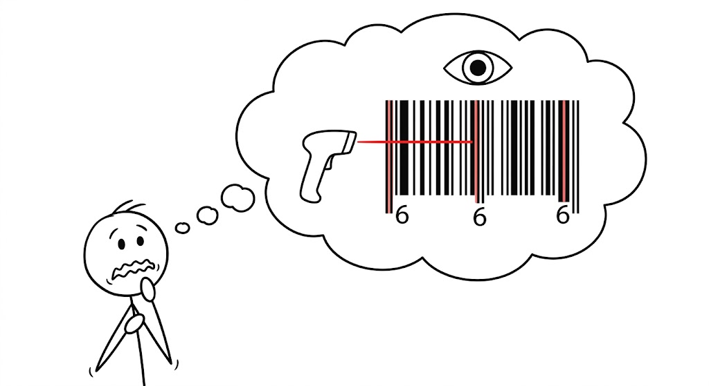

# Desafios na Implementação e Ceticismo Inicial

<figure markdown="span">
  { align=center, width="500"}
</figure>

Assim como qualquer nova tecnologia, a introdução do código de barras enfrentou forte ceticismo inicial por parte de diversos setores da sociedade:

- **Consumidores**: Questionavam a precisão dos preços registrados.

    > Eles pensavam: *"Se o preço não está grudado no produto, como vou saber se a máquina me cobrou o valor certo na hora de passar no caixa?"*. Havia o medo real de que os supermercados alterassem os preços no computador central sem que o cliente percebesse.

- **Sindicatos**: Temiam que as máquinas causassem desemprego em massa.

    > Os sindicatos perceberam que a leitura óptica faria as filas andarem muito mais rápido e eliminaria a necessidade de mais funcionários para atendimento e para carimbar preços em cada produto do estoque.

- **Varejistas e Fabricantes**: Mostravam-se relutantes em investir em leitores para produtos que ainda não vinham com o código impresso na embalagem.

    > Implementar o código de barras exigia um investimento altíssimo. Os donos de supermercados precisavam comprar computadores centrais caros e leitores de laser que ainda eram tecnologia de ponta. Os fabricantes, por sua vez, precisavam mudar suas linhas de produção e designs de embalagem para imprimir o código. Ninguém queria dar o primeiro passo e perder dinheiro.

- **População Geral**: Havia o medo de que o ["Grande Irmão" (1984 - George Orwell)](https://share.google/aimode/tBDfyyY5aR02ICXQZ) usasse a tecnologia para vigiar e rastrear a vida dos cidadãos.

- **Teorias da Conspiração**: Alguns grupos, influenciados por livros religiosos da época como *"The New Money System 666" de Mary Stewart Relf*, afirmavam que os códigos ocultavam o número `666`, representando a "Marca da Besta" bíblica.

    > Como já explicado, o código de barras UPC possui três barras de proteção mais longas (no início, no meio e no fim) que servem apenas para guiar o laser do leitor. Acontece que, visualmente, o desenho dessas três barras é idêntico ao padrão que o sistema usa para ler o número 6. Para os religiosos da época, ver uma estrutura que parecia fixar o 6-6-6 em um sistema feito justamente para "comprar e vender" foi o encaixe perfeito com a profecia apocalíptica da Marca da Besta.

[Conclusão ➔](../../../posts/2026-05-06_cod_barras/como-codbarras-funciona/como-codbarras-funciona.md#conclusao)

