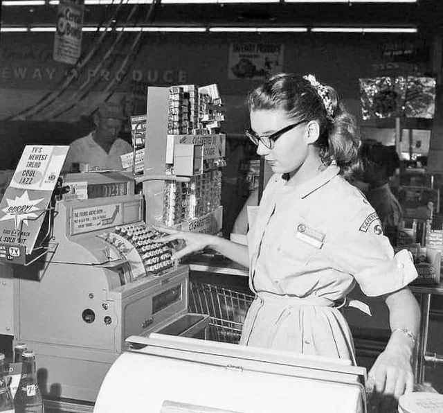
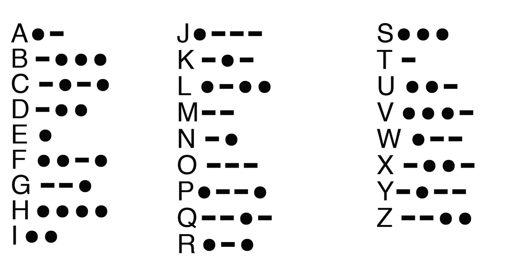
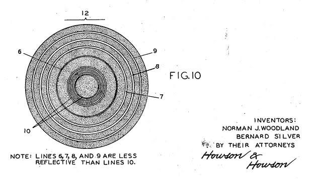
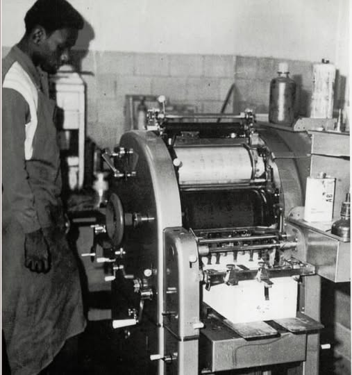
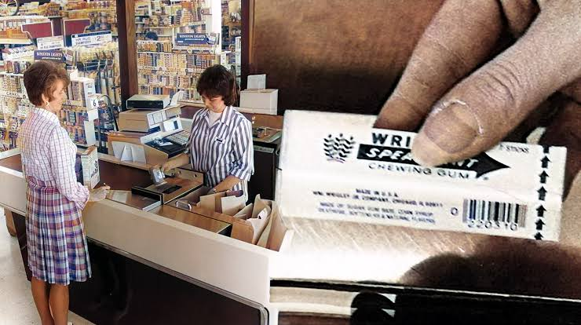
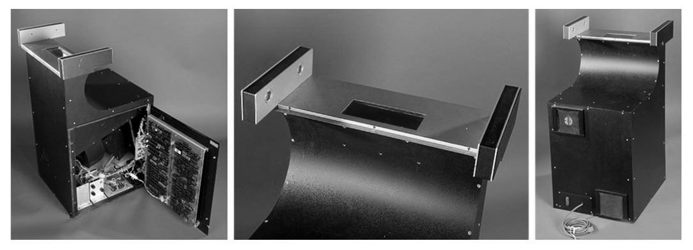

# A História do Código de Barras: Como Tudo Começou

A ideia não nasceu em um laboratório de alta tecnologia, mas sim de uma conversa de corredor em 1948, nos Estados Unidos. Bernard Silver, um estudante do Drexel Institute, localizada na Filadélfia, ouviu por acaso o presidente de uma rede de supermercados implorando a um diretor da faculdade por um sistema automático que agilizasse as filas do caixa e controlasse o estoque. Mas, qual era o problema?

Naquela época, os operadores de caixa precisavam olhar para cada produto, identificar o preço impresso ou colado na embalagem e digitar manualmente, dígito por dígito, em caixas registradoras mecânicas. Esse movimento mecânico, acelerado e repetido milhares de vezes por dia fez com que muitos caixas desenvolvessem problemas crônicos de saúde, sendo a [síndrome do túnel do carpo](https://share.google/aimode/mvH9ppXfqoA0GWQ3w) a mais comum e dolorosa delas (uma inflamação nos nervos do pulso causada por esforço repetitivo).

<figure markdown="span">
  { align=center, width="500"}
</figure>

Como o processo dependia totalmente da velocidade de digitação humana, as filas nos supermercados eram gigantescas, gerando gargalos operacionais monstruosos para os donos de redes de comércio.

Bernard correu para contar ao seu amigo, Norman Joseph Woodland. Woodland bitolou no problema. Ele se mudou para a Flórida para focar em uma solução e, em um belo dia na praia, começou a desenhar na areia os pontos e traços do Código Morse (tecnologia que ele conhecia bem por ter sido escoteiro). Certo, mas o que era isso?

---

## O que é o Código Morse?

Para contextualizar, o Código Morse é, essencialmente, o avô do código binário que usamos hoje: ele transforma letras e números em apenas dois estímulos (um curto e um longo). Criado nos anos 1830 por Samuel Morse, esse sistema foi feito para transmitir mensagens à distância através do telégrafo (um aparelho que enviava impulsos elétricos por um fio). Como não dava para enviar a voz humana ou letras escritas pelo fio, Morse criou um alfabeto baseado em apenas dois tipos de sinais sonoros ou elétricos:

- O Ponto ($\cdot$): Um sinal rápido e curto.
- O Traço ($-$): Um sinal que dura o triplo do tempo do ponto.

Combinando esses pontos e traços, você consegue escrever qualquer palavra:

<figure markdown="span">
  { align=center, width="500"}
</figure>

---

Voltando para o caso da praia, o grande estalo de Bernard foi: E se, em vez de pontos e traços, eu puxar essas marcações para baixo, transformando-as em linhas verticais finas e grossas?

Ao fazer isso, Woodland percebeu que um feixe de luz (que mais tarde viria a ser o laser) poderia passar por aquelas linhas e ler o reflexo: as linhas pretas absorveriam a luz e as brancas a refletiriam de volta, gerando um sinal elétrico correspondente a uma sequência de números.

<figure markdown="span">
  { align=center, width="500"}
</figure>

Em 1952, eles patentearam a ideia. No entanto, o primeiro código de barras comercial não era uma linha reta, era circular! Parecia um alvo de tiro ao alvo. Eles desenharam assim porque achavam que seria mais fácil para o funcionário do mercado passar o produto em qualquer direção sobre o leitor.

A imagem abaixo mostra exatamente o desenho técnico que constava no documento oficial dessa patente. Repare que eles incluíram uma nota super importante no rodapé do desenho: "As linhas 6, 7, 8 e 9 são menos reflexivas que as linhas 10". Ou seja, ali já nascia o conceito de usar a diferença de reflexão da luz (linhas escuras que absorvem a luz vs. espaços claros que refletem) para gerar dados digitais.

<figure markdown="span">
  { align=center, width="500"}
</figure>

> Você pode visualizar a patente completa no Google Patents ([US2612994A](https://patents.google.com/patent/US2612994A/en))

A ideia era brilhante, mas estava à frente do seu tempo. Os computadores da década de 1950 eram gigantescos, os lasers ainda não existiam e a tecnologia para ler aquelas linhas de forma barata simplesmente não existia. A patente acabou esquecida por um tempo.

O jogo só começou a mudar no final de 1969. Aquele problema das filas dos supermercados escalou tanto que as maiores associações de comércio dos Estados Unidos se uniram e contrataram a famosa empresa de consultoria McKinsey & Company. Juntos, eles fundaram um comitê chamado Uniform Product Code Council (UPCC). A missão era clara: definir um formato numérico padrão e desafiar as empresas de tecnologia a criarem, do zero, um símbolo visual que pudesse ser lido por máquinas.

> Que mais tarde viria a se chamar UPC (Universal Product Code, ou Código Universal de Produto).

Isso iniciou uma disputa feroz no Vale do Silício. Gigantes da tecnologia como RCA, Singer, Pitney Bowes e a própria IBM criaram laboratórios secretos para desenhar propostas competitivas e apresentá-las ao comitê.

## O Nascimento do UPC pelas mãos de George Laurer

Naquela época, o engenheiro Heard Baumeister apresentou duas fórmulas de códigos lineares que a IBM possuía guardadas, chamadas de Delta A e Delta B.

A versão Delta B tentava calcular a informação comparando a largura exata da barra preta com a largura do espaço branco. Foi um desastre nos testes: se a prensa da gráfica colocasse um pouquinho mais de pressão ou tinta, a linha preta borrava para os lados (*ink spread*), engolia o espaço branco e o computador errava a leitura.

Foi aí que, no meio de 1971, outro engenheiro da IBM chamado William "Bill" Crouse teve um estalo genial e inventou um novo código chamado Delta C. Em vez de medir a grossura da linha preta inteira, a matemática do Delta C media apenas a distância da borda inicial (esquerda) de uma linha até a borda inicial da linha seguinte.

Essa sacada mudou tudo: se a gráfica borrasse e deixasse a linha preta mais gorda, ela cresceria para os dois lados por igual, mas a distância entre o início de uma linha e o início da outra continuaria milimetricamente a mesma. O código tornou-se imune aos borrões de tinta.

> Infelizmente, não existem páginas de internet ou links diretos dedicados exclusivamente à documentação do Delta B e Delta C, pois eles foram apenas codificações internas da IBM. Mas o código Delta C, que resolvia o problema do borrão medindo de "borda a borda", foi patenteado por William Crouse em 1971 e você pode acessar em [US Patent US3723710A](https://patents.google.com/patent/US4533825A/en28)

### O Círculo vs. A Linha Reta

Mesmo com a matemática do Delta C funcionando, a indústria ainda estava obcecada pela ideia do código circular (o "alvo" de tiro ao alvo). Empresas concorrentes, como a RCA e a Litton Industries, insistiam que o círculo era melhor porque o funcionário podia passar o produto em qualquer direção sobre o vidro do caixa.

Porém, Baumeister e George Laurer provaram que os círculos eram impossíveis de imprimir em alta velocidade sem deformar. Se a esteira da gráfica corresse rápido, o círculo virava uma elipse (uma forma oval) e o leitor falhava.

Isso porque as gráficas da década de 1970 usavam prensas rotativas que corriam em altíssima velocidade. O grande problema técnico era que a tinta borrava na direção do movimento da prensa — um fenômeno conhecido na indústria gráfica como *ink slurring* ou *press gain*. A pressão e o movimento contínuo do rolo fazem a tinta fresca "escorrer" levemente para frente ou para trás na direção em que o papel caminhava.

<figure markdown="span">
  { align=center, width="300"}
</figure>

Com as linhas retas, Laurer percebeu que o borrão da máquina apenas tornaria as linhas verticais um pouco mais altas ou compridas, mas a espessura exata de cada uma delas (que é onde a informação fica guardada) continuaria idêntica. No dia seguinte, ele sugeriu algo ainda melhor: cortar o código de barras em duas metades (lado esquerdo e lado direito).

Com essas duas propostas, eles conseguiram reduzir o tamanho do código de barras para um terço do tamanho do "alvo" circular da RCA. Laurer pegou a lógica Delta C de Bill Crouse e encolheu o tamanho final da etiqueta para apenas $38\text{ mm} \times 23\text{ mm}$. Era o nascimento visual do código de barras que conhecemos hoje.

### O "Anel Mágico" e a Homologação

Para convencer a diretoria da IBM e o comitê dos supermercados de que aquele pedacinho de linhas retas funcionava de verdade, Bill Crouse construiu um protótipo de leitor portátil que se usava no dedo, como se fosse um anel, conectado a uma pulseira.

No dia 1º de dezembro de 1972, a equipe apresentou o projeto em Minnesota. Durante a reunião, Crouse usou seu "anel mágico" para ler os códigos impressos. Para chocar os executivos, ele passou o leitor em cima de uma foto de revista, velha e mal impressa, cheia de falhas bi-dimensionais. O leitor funcionou perfeitamente em quase todas as tentativas. A robustez da matemática da IBM esmagou os concorrentes.

Para deixar o sistema 100% seguro contra fraudes, o matemático David Savir e George Laurer adicionaram a regra de inverter as cores no lado direito para o computador identificar se o produto passou de cabeça para baixo.

> Esse detalhe será explicado com mais detalhes no tópico sobre a [Anatomia Matemática do UPC](./anatomia-matematica-upc.md).

Por fim, um cientista do MIT chamado Murray Eden sugeriu o toque humano: colocar os números legíveis na parte de baixo do desenho, servindo como um sistema de segurança (*fail-safe*) caso o leitor óptico quebrasse.

---

Para fins de curiosidade, a imagem abaixo representa o design dos concorrentes que Laurer (IBM) derrotou. Os registros históricos preservaram os conceitos visuais exatos que foram apresentados ao comitê da UPCC:

<figure markdown="span">
  { align=center, width="500"}
</figure>

Embora o leitor de anel de Crouse tenha sido o argumento definitivo de portabilidade para convencer a diretoria da IBM de que a tecnologia funcionava de forma simples e rápida, foi a engenharia de impressão das linhas retas que garantiu a vitória no comitê.

---

## O Primeiro "Bip"

O primeiro produto escaneado na história não foi uma grande caixa ou um item caro, mas sim um pacotinho de chicletes Wrigley's Juicy Fruit (sabor tutti-frutti). Esse evento aconteceu no dia 26 de junho de 1974, às 8h01 da manhã, em um supermercado chamado Marsh's Supermarket, na cidade de Troy, Ohio (EUA). A operadora de caixa que fez as honras se chamava Sharon Buchanan, e o cliente era Clyde Dawson. Dawson subiu até o caixa com um carrinho cheio de itens, mas puxou o chiclete primeiro para fazer o teste histórico. O scanner (desenvolvido pela empresa Spectra-Physics usando a tecnologia de código linear da IBM) leu o código de primeira com um "bipe" limpo. Abaixo está a foto do chiclete e do primeiro scanner utilizado.

<figure markdown="span">
  { align=center, width="500"}
</figure>

<figure markdown="span">
  { align=center, width="500"}
</figure>

> O sucesso foi tão marcante que, hoje em dia, [uma réplica desse scanner original e um dos pacotes de chiclete daquele mesmo lote de 1974 estão preservados e em exposição no prestigiado museu Smithsonian (o National Museum of American History), em Washington, D.C.](https://www.si.edu/object/supermarket-scanner:nmah_892778)

A escolha não foi por acaso. O comitê dos supermercados e os engenheiros queriam provar uma coisa crucial: se o leitor óptico e a gráfica conseguissem funcionar perfeitamente em uma embalagem minúscula, cilíndrica, amassada e plastificada de um chiclete que custava apenas 67 centavos de dólar, funcionariam em qualquer outra coisa do planeta.

### Sempre teve o som?

Não. O "bipe" surgiu em 1974 por um motivo de psicologia e agilidade. Nos primeiros testes, os leitores eram silenciosos. Isso obrigava o funcionário a parar e olhar para a tela a cada produto para ter certeza de que o preço tinha entrado, o que atrasava as filas.

Para resolver isso, os engenheiros colocaram um pequeno alto-falante no scanner com uma regra simples: se a leitura fosse bem-sucedida, a máquina disparava um som curto. O bipe é o computador dizendo: "A matemática fechou, o preço foi registrado. Pode passar o próximo."

O som é um estalido agudo (entre 2 kHz e 4 kHz) porque essa é a faixa de frequência que o ouvido humano capta melhor, permitindo que o funcionário isole o som mesmo no meio do barulho do supermercado.

[2) A Anatomia Matemática do UPC ➔](./anatomia-matematica-upc.md)

