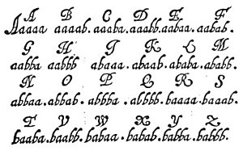
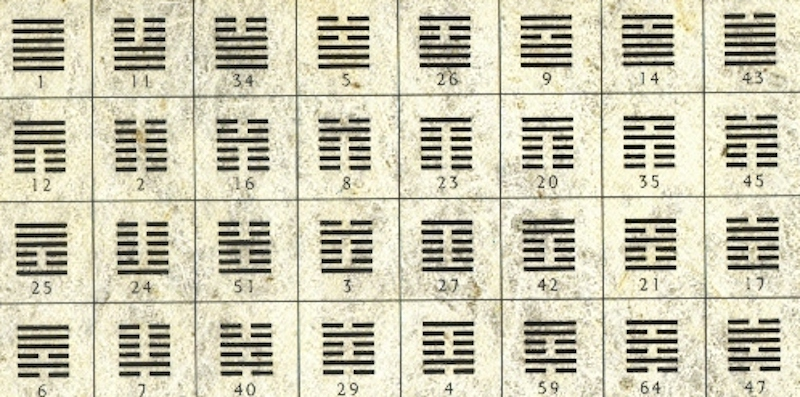

# Afinal, o que é Binário?

Se você já foi atrás de algum conteúdo sobre programação ou hardware, com certeza já
leu essa palavra por aí. Mas, afinal de contas, o que é binário? Indo na tradução literal, temos que:

> "Composto de duas unidades ou dois elementos; que tem duas faces ou dois modos de ser."

Em português mais claro, significa que é algo que pode assumir apenas dois estados, como uma moeda: cara ou coroa. Outro exemplo seria um interruptor de luz: ligado ou desligado. 

Mas... por que isso é importante para a computação? De onde surgiu? Por que é assim? Vamos voltar um pouco no tempo para entender.

---

# A origem do Sistema Binário: Gottfried Leibniz?

Popurlamente, a criação do sistema binário é atribuída ao matemático e filósofo alemão Gottfried Leibniz no século XVII. No entanto, essa história é mais complexa do que parece. Vamos voltar um pouco no tempo para entender.

### Pingala (Índia, por volta do século III a.C.)

Um matemático indiano chamado Pingala é considerado o pioneiro conhecido no uso de um sistema binário. No seu tratado [Chandaḥśāstra (ou Chandah Shastra)](https://archive.org/details/in.ernet.dli.2015.327579/mode/2up), ele estudava a métrica poética védica (o que chamamos de prosódia, ou seja, o estudo do ritmo, da duração e da estrutura dos versos).

A base de todo o seu sistema era extremamente simples e genial: ele classificava todas as sílabas em apenas duas categorias:

* **Laghu** (leve ou curta) → sílaba que se pronuncia rápido (dura 1 tempo)
* **Guru** (pesada ou longa) → sílaba que se pronuncia mais demorado (dura 2 tempos)

Com essa divisão simples, ele conseguia mapear e organizar todos os ritmos poéticos possíveis. Ele desenvolveu métodos sistemáticos (como o [Prastaar](https://www.linkedin.com/posts/centreforhumansciences_prast%C4%81ra-the-ancient-binary-algorithm-activity-7416713309124587520-OiFP?utm_source=share&utm_medium=member_desktop&rcm=ACoAAEKPyMABKpRT_i5iDDFoOjvwFXE8EyaDeAc)) para enumerar todas as combinações possíveis de sílabas em versos, o que equivalia a gerar sequências binárias. Isso permitia listar 2^n combinações para n sílabas. 

Seu sistema binário era ligeiramente diferente do moderno (a ordem dos dígitos aumentava da direita para a esquerda em alguns contextos, e começava do 1 em vez do 0), mas o princípio fundamental, a representação posicional com dois estados, estava presente.

### Francis Bacon (1605)

No livro[ The Advancement of Learning,](https://archive.org/details/baconlogicad00bacouoft/mode/2up) Bacon descreveu um cifra bilateral (Bacon's Bilateral Cipher) para criptografia. Cada letra do alfabeto era representada por um grupo de 5 letras "A" ou "B" (equivalente a 5 bits binários). Exemplo: A = aaaaa (00000), B = aaaab (00001):

<figure markdown="span">
  { align=center, width="400"}
</figure>

Era mais uma ferramenta criptográfica do que um sistema aritmético completo, mas demonstrava o uso prático de sequências binárias para codificar informação.

### Juan Caramuel y Lobkowitz (1670)

Na espanha, um bispo e matemático chamado Juan Caramuel y Lobkowitz, publicou um estudo sistemático de sistemas de numeração não-decimais no livro Mathesis biceps vetus et nova (1670). Ele dedicou uma seção ("Meditatio") à aritmética binária (base 2), além de outras bases (3, 4, 5 etc.)

Essa é considerada uma das primeiras publicações explícitas sobre aritmética binária na Europa. Caramuel explorou operações matemáticas nessa base. Alguns historiadores argumentam que Leibniz teve acesso indireto ou direto ao trabalho de Caramuel e que pode ter se inspirado nele, embora Leibniz seja frequentemente creditado como inventor independente. O trabalho de Caramuel passou relativamente despercebido na época.

### Gottfried Wilhelm Leibniz (1679–1703)

Originalmente, o sistema binário que conhecemos foi proposto por um matemático  e filósofo alemão, chamado Gottfried Leibniz, no século XVII. Em seu artigo [Explication de l'Arithmétique Binaire](https://www.uniba.it/it/docenti/petrocelli-carla/attivita-didattica/explication-de-larithmetique-binaire-1.pdf), ele desenvolveu um sistema que usava apenas os dígitos binários 0 e 1 para operações aritméticas. 

Mas... por que diabos ele escreveu esse artigo? Bem, em sua juventude, Leibniz estava profundamente interessado em estudos de alquimia e misticismo.

Em 1666–1667, aos cerca de 20 anos, Leibniz aceitou o cargo de secretário assalariado de uma sociedade alquímica secreta em Nuremberg. Ele sabia pouco sobre o assunto inicialmente, mas leu livros de alquimia, compilou termos obscuros e escreveu uma carta enigmática para 

> Na época, a alquimia era vista como uma busca séria por conhecimento da natureza, não apenas charlatanismo.

Esse contato precoce com o mundo oculto e esotérico deixou marcas profundas no jovem Leibniz. Ele via na alquimia não apenas a promessa de transmutar metais, mas a busca por princípios fundamentais que regiam as transformações da matéria — uma espécie de “linguagem secreta” da natureza.

Anos depois, essa mesma busca por simplicidade e princípios básicos o levou a outro grande projeto: a criação de uma máquina de calcular "superior". Em 1673, Leibniz apresentou ao mundo a Stepped Reckoner (Calculadora de Passos), uma evolução da famosa máquina de Pascal.

<figure markdown="span">
  { align=center, width="400"}
</figure>

Ela foi a primeira máquina capaz de fazer as quatro operações aritméticas (somar, subtrair, multiplicar e dividir). No entanto, o sistema decimal exigia engrenagens muito precisas com 10 posições diferentes (de 0 a 9).

Os artesãos da época não tinham tecnologia de corte de metal precisa o suficiente para isso. Por causa do atrito e da complexidade de transferir o "vai um" (as dezenas) mecanicamente em base 10, a máquina original sofria com travamentos e erros de alinhamento.

Leibniz percebeu que a matemática tradicional (com os números de 0 a 9) exigia tabelas de multiplicação longas e regras cheias de exceções. Ele queria uma matemática melhor, mais simples, mais elegante e mais fácil de mecanizar.

### Mas, como ele chegou no binário?

Bem, Leibniz não era apenas matemático, era um filósofo profundamente religioso. Ele seguia a doutrina pitagórica de que a origem e essência de tudo são os números. Interpretando 0 como “nada” e 1 como “Deus”, ele via no sistema binário um símbolo perfeito da criação divina: do Nada e da Unidade (Deus) surgia toda a diversidade do universo

Além disso, pouco antes de publicar o artigo, Leibniz teve contato com o I Ching, um texto clássico chinês milenar, por meio de missionários jesuítas. Ele ficou fascinado ao descobrir que o sistema era composto por 64 hexagramas, cada um feito de seis linhas que são ou yin (quebradas) ou yang (sólidas). Era, essencialmente, um sistema binário antigo representando a dualidade da vida e do universo.

<figure markdown="span">
  { align=center, width="400"}
</figure>

Com tudo isso — a influência da alquimia, a busca por uma linguagem universal, a frustração com as limitações mecânicas do decimal e a inspiração filosófica e cultural —, Leibniz viu o sistema binário como um símbolo da criação divina. Ele acreditava que Deus havia criado o universo com a máxima simplicidade e eficiência, e o sistema binário representava exatamente essa simplicidade.

Em 1703, Leibniz publicou o artigo "Explication de l’Arithmétique Binaire" (Explicação da Aritmética Binária), descrevendo o sistema binário e suas aplicações práticas. Ele propôs que o sistema poderia ser usado para representar qualquer tipo de informação, desde números até letras e símbolos. Você pode acesssar a tradução desse conteúdo através do livro ["Leibniz on Binary: The Invention of Computer Arithmetic",](https://leibniz-translations.com/leibnizonbinary) que reúne a coleção completa das escritas de Gottfried Wilhelm Leibniz sobre o sistema binário traduzidas para o inglês. 

### E como isso chegou nos computadores?

Bem, a história realmente começa a tomar forma com Charles Babbage e Ada Lovelace no século XIX.

Babbage é frequentemente chamado de "pai do computador" por projetar a Máquina Analítica, um dispositivo mecânico programável. Ada Lovelace, uma matemática genial, percebeu que a máquina poderia ir além de simples cálculos e escrever programas para ela, tornando-se a primeira programadora da história. Suas anotações sobre como a máquina poderia manipular símbolos e lógica foram fundamentais para o desenvolvimento da computação.