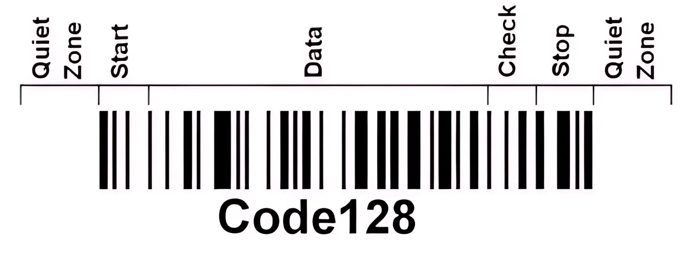

# Como funciona o Code 128
No nosso último post, [nós desvendamos os segredos dos códigos de barras tradicionais (como o UPC-A e o EAN-13) e vimos como eles são incríveis para os supermercados.](../como-codbarras-funciona/como-codbarras-funciona.md) Mas você já deve ter reparado em uma coisa: eles têm uma limitação severa. Eles só aceitam números e têm um tamanho estritamente fixo.

Agora, imagine o desafio de uma empresa como a Amazon ou os Correios. Como colocar o código de rastreio BR123456789X, o ID de um contêiner ou o nome de um funcionário em um crachá usando apenas barras verticais?

É aqui que entra o super-herói da logística global: o Code 128. Diferente do padrão de supermercado, **o Code 128 ganhou esse nome por um motivo fantástico: ele consegue codificar todos os 128 caracteres da tabela ASCII.** 

E o melhor de tudo: ele tem tamanho variável. Você pode gerar um código para a palavra "Oi" (curtinho) ou para uma frase inteira (mais comprido).


# Entendendo o funcionamento

Assim como o código de barras tradicional (UPC-A), o Code 128 também é dividido em barras, que chamamos de módulos. Cada caractere escrito **é composto por exatamente 11 módulos (apenas um que não)**.

Esses módulos não são aleatórios. Eles são divididos em 7 seções estritas que o leitor a laser decodifica da esquerda para a direita (ou vice-versa!):

<figure markdown="span">
  { align=center, width="500"}
</figure>


- Zona de Silêncio Esquerda (Quiet Zone): Um espaço em branco obrigatório de, no mínimo, 10 módulos (10X, onde X é a largura da barra mais fina). Sem isso, o leitor não consegue identificar onde o código começa.

- Símbolo de Início (Start): Um padrão de barras que avisa o leitor em qual "modo" o código está começando.

    > Os caracteres do Cod 128 podem ser codificados em 3 modos diferentes: A, B e C. Veja mais sobre isso em [Os 3 Modos de Codificação do Code 128](#1-a-mágica-dos-modos). São mais 11 módulos.

- Dados Codificados: O texto ou os números que você quer transmitir.

- Símbolo de Verificação (Checksum): Um caractere matemático obrigatório para garantir que nada foi lido errado.

- Símbolo de Parada (Stop): Avisa que os dados acabaram.

    > Ocupa 13 módulos (é o único que tem largura diferente).

- Barra Final: Uma barrinha preta extra de 2 unidades acoplada ao símbolo de parada.

- Zona de Silêncio Direita: Outro espaço em branco obrigatório de, no mínimo, 10 módulos.

Diferente do UPC-A, onde cada número ocupa 7 espacinhos (módulos), **no Code 128 cada caractere ocupa exatamente 11 módulos.** Dentro desses 11 módulos, a física do código dita regras rígidas:

- Todo símbolo deve ter exatamente 3 barras pretas e 3 espaços brancos alternados.

    > Aliás, por convenção, todo caractere começa obrigatoriamente com uma barra preta e termina com um espaço branco.

- A largura de cada barra ou espaço varia de 1 a 4 módulos.

- Para o leitor não se perder, a soma das larguras das barras pretas é sempre um número par (4, 6 ou 8), e a dos espaços brancos é sempre um número ímpar (3, 5 ou 7).

## 1) A "Mágica" dos Modos

Antes de falar da estrutura física, é importante entender o grande problema que o Code 128 resolve de forma inteligente. O Code 128 precisa representar todos os 128 caracteres ASCII (letras maiúsculas, minúsculas, números, símbolos e caracteres de controle). Porém, o código não tem 128 padrões físicos diferentes de barras. [Na verdade, segundo a especificação oficial (ISO/IEC 15417:2007), o Code 128 possui 108 símbolos no total:](https://www.iso.org/standard/43896.html)

- 103 símbolos para codificar dados (os caracteres úteis)
- 3 símbolos de Início (Start A, Start B e Start C)
- 2 símbolos de Parada (Stop)


Ele usa um sistema de troca de marcha dinâmica dividida em 3 conjuntos de códigos:


- **128A (Code Set A):** Letras maiúsculas (A-Z), números (0-9) e os antigos comandos de controle de terminal.

    > Esse modo foi feito pensando nos computadores antigos dos anos 70 e 80 (terminais de grande porte). Naquela época, as pessoas não usavam letras minúsculas em sistemas de fábrica ou logística. Os Caracteres de Controle são comandos invisíveis que não se imprimem, mas que dizem ao computador o que fazer. Exemplos: CR (que equivale a apertar a tecla Enter), TAB (para pular de coluna), ou SOH (início de transmissão).

- **128B (Code Set B):** O padrão para texto. Letras maiúsculas e minúsculas (A-Z, a-z), números e caracteres especiais padrão (!, ", #).

    > Este é o modo mais comum e o padrão da computação moderna. Se você precisa gerar um código de barras para um nome de produto, uma senha que mistura letras e números ou um endereço de e-mail, você usa o Modo B.

- **128C (Code Set C):** O "Modo Turbo": Feito exclusivamente para números. Cada símbolo representa dois números de uma vez (de 00 até 99). Isso reduz o tamanho do código de barras pela metade se você tiver muitos números em sequência!

    > Este é o grande segredo da eficiência do Code 128. Os criadores perceberam que a maioria dos códigos de barras no mundo (como códigos de rastreamento de correio, números de série e boletos) são compostos apenas por números.

O modo é sinalizado pelos caracteres de início (`START`) com os seguintes valores:

| Valor (Decimal) | Símbolo | Caractere (Fonte) | Padrão Binário |
| :---: | :---: | :---: | :---: |
| 103 | Start Code A | Ë / Ð / ø | `11010000100` |
| 104 | Start Code B | Ì / Ñ / ù | `11010010000` |
| 105 | Start Code C | Í / Ò / ú | `11010011100` |

A verdadeira mágica acontece porque um único código de barras não precisa ficar preso a um modo só. É aí que entram os caracteres de troca de marcha. 
Para eliminar qualquer confusão de uma vez por todas, vamos organizar a tabela focando **apenas** nas "placas de trânsito" (os comandos de mudança) e nos caracteres de largada (*Start*).

Esqueça as letras com acento por um momento. O segredo é olhar para a tabela sabendo **onde o leitor está navegando no momento**. Aqui está a tabela mestre de sinalização de modos:

### Tabela de Comandos de Modo (Code 128)

| ID (Valor) | Padrão de Barras | Se o leitor estiver no **Modo A** | Se o leitor estiver no **Modo B** | Se o leitor estiver no **Modo C** | O que este símbolo faz? |
| --- | --- | --- | --- | --- | --- |
| **98** | `11110100010` | **Shift B** | **Shift A** | *Não aplicável* | Pega **uma** única letra emprestada do outro modo e volta. |
| **99** | `10111011110` | **Code C** | **Code C** | Número `99` | Se o leitor vir este desenho no Modo A ou B, ele **muda em definitivo para o Modo C**. |
| **100** | `10111101110` | **Code B** | *Função FNC4* | **Code B** | Se o leitor vir este desenho no Modo A ou C, ele **muda em definitivo para o Modo B**. 


---

### Por que não usaram 128 símbolos físicos?

Você pode se perguntar:

> "Mas por que não usaram 128 símbolos físicos?"

O Code 39 (criado antes, em 1974) fez exatamente o caminho mais "simples" e acabou sofrendo justamente com o problema do tamanho, ocupando muito espaço físico nas embalagens. Com isso em mente, os criadores do Code 128 tiveram uma ideia brilhante: em vez de criar um símbolo diferente para cada caractere, eles criaram um sistema mais inteligente...

O inventor do código, Ted Williams, não escolheu o número 103 por acaso. A própria matemática e a física dos leitores de laser da época impuseram esse limite. Para garantir uma leitura rápida e sem erros, ele criou uma regra geométrica estrita para cada caractere:

- Cada símbolo deve ter exatamente 11 módulos de largura total.
- Cada símbolo deve ser composto por exatamente 3 barras pretas e 3 espaços brancos.
- Nenhuma barra ou espaço pode ser mais fina que 1 módulo ou mais grossa que 4 módulos.

Quando aplicamos essas regras na análise combinatória, descobrimos que existem apenas 108 combinações possíveis no universo que se encaixam nesse padrão. Não era matematicamente possível criar 128 símbolos físicos sem aumentar o tamanho do código de barras.

---

# A Matemática Oculta: O Checksum

Para garantir que o código foi lido com 100% de precisão, o Code 128 usa um cálculo chamado Módulo 103. Ele pega o valor interno de cada caractere, multiplica pelo seu "peso" (a posição dele na fila) e soma tudo.

Veja um exemplo prático de como calcular o checksum para a palavra "PJJ123C" usando o Modo A:

| Caractere | Valor do Símbolo | Posição (Peso) | Valor × Peso |
| :---: | :---: | :---: | :---: |
| **Start Code A** | 103 | — | 103 |
| **P** | 48 | 1 | 48 |
| **J** | 42 | 2 | 84 |
| **J** | 42 | 3 | 126 |
| **1** | 17 | 4 | 68 |
| **2** | 18 | 5 | 90 |
| **3** | 19 | 6 | 114 |
| **C** | 35 | 7 | 245 |
| **SOMA TOTAL** | | | **878** |

Agora pegamos o total e dividimos por 103:

$$878 \div 103 = 8 \text{ com resto } \mathbf{54}$$

O resto da divisão foi **54**. Olhando na tabela oficial do Code 128, o valor 54 corresponde à letra "V". Então, a biblioteca joga as barras da letra "V" logo antes do símbolo de Stop. O leitor faz a mesma conta; se o resto bater, o pacote é bipado com sucesso!


# Criando um Cod 128 na prática

Para entender a mágica acontecendo na prática, vamos simular a conversão das letras da palavra "oi".

Nesse caso, percebemos que utilizaremos apenas o Modo B (Letras Maiúsculas e Minúsculas, Números e Caracteres Especiais Padrão). Então temos o Símbolo de Início com valor 104.

Agora, precisamos pegar os valores na tabela oficial para as letras 'o' e 'i' usando o Modo B. Para isso, veja a tabela completa clicando [AQUI](./topicos/tabela-valores.md). Mas separei aqui os valores para facilitar a nossa visualização:

| Valor | Posição | Caractere (Latin-1) | Padrão de Barras | Larguras |
| :---: | :---: | :---: | :---: | :---: |
| 111 | 79 | o | `10001111010` | `134111` |
| 105 | 73 | i | `10000110100` | `142112` |

Então, a nossa sequência de valores até agora é: [104, 79, 73].

Antes de desenhar as barras, precisamos calcular o símbolo de verificação (checksum) para garantir que a leitura seja segura. Lembra da regra dos pesos? Multiplicamos o valor de cada caractere pela sua posição na fila (o Start não é multiplicado por nada, ele entra com peso 1):

| Caractere | Valor do Símbolo | Posição (Peso) | Valor × Peso |
| :---: | :---: | :---: | :---: |
| **Start Code B** | 104 | — | 104 |
| **o** | 79 | 1 | 79 |
| **i** | 73 | 2 | 146 |
| **SOMA TOTAL** | | | **329** |

Agora dividimos a soma total por 103 para achar o resto:

$329 \div 103 = 3 \text{ com resto } \mathbf{20}$

O resto da divisão foi 20. [Olhando na tabela oficial, o valor 20 corresponde ao caractere "4":](./topicos/tabela-valores.md)

| Valor | Posição | Caractere (Latin-1) | Padrão de Barras | Larguras |
| :---: | :---: | :---: | :---: | :---: |
| 20 | 16 | 4 | `11011001110` | `221231` |

Esse será o nosso dígito verificador! Então, a nossa sequência de valores até agora é: [104, 79, 73, 20].

Para finalizar, precisamos incluir o símbolo de Stop. Olhando na tabela oficial, o valor 106 corresponde ao símbolo de Stop:

| Valor | Caractere (Latin-1) | Padrão de Barras | Larguras |
| :---: | :---: | :---: | :---: |
| 106 | j | `11000111010` | `233111` |


Então, a nossa sequência de valores para o código de barras "oi" é: [104, 79, 73, 20, 106]. Agora que já temos os valores, podemos converter em barras e ter o nosso código de barras pronto para ser impresso.resultado final seria algo parecido com isso:


```ts
11010010000 11000010100 11110010100 11001001110 1100011101011
 ██ ███ ████ ██████ ███  ██████ ███  ████ ██ ███ █████ ███ █ ██
 ██ ███ ████ ██████ ███  ██████ ███  ████ ██ ███ █████ ███ █ ██
 ██ ███ ████ ██████ ███  ██████ ███  ████ ██ ███ █████ ███ █ ██
 ██ ███ ████ ██████ ███  ██████ ███  ████ ██ ███ █████ ███ █ ██
 ██ ███ ████ ██████ ███  ██████ ███  ████ ██ ███ █████ ███ █ ██
   [Start B]     [ o ]       [ i ]     [Check: 20]    [Stop]
```


---
