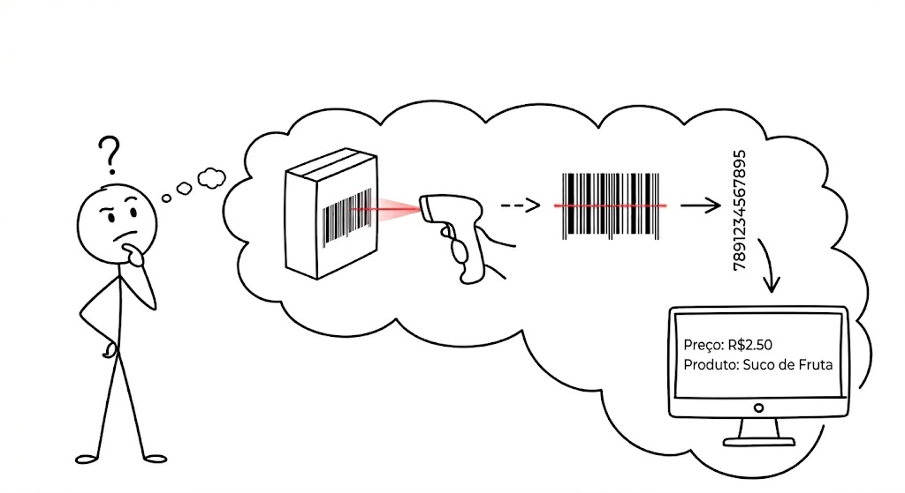

# How Barcodes Work

<figure markdown="span">
  { align=center, width="500"}
</figure>

You probably hear this sound almost every day: the "beep" of the ATM or the supermarket scanner. But have you ever stopped to think about what the technology is actually looking at when it reads a barcode?

Most of us spend our entire lives thinking that the scanner reads those black lines. But what if I told you that the optical reader actually reads the white spaces too?

Let's explore the secrets behind this technology together, journeying from its origins to the innovation we know today.

  - ### [1) The History of the Barcode: From the beach to the supermarket](./topicos/historico-codigo-barras.md)

  - ### [2) The Mathematical Anatomy of the UPC: How the magic works](./topicos/anatomia-matematica-upc.md)

  - ### [3) The Compact UPC-E Model: The secret to saving space](./topicos/modelo-upc-e.md)

  - ### [4) Other Market Standards (EAN-13, Code 39 and more): Codes for every need](./topicos/outros-padroes-codigos.md)

  - ### [5) Implementation Challenges and Skepticism: The journey to global acceptance](./topicos/desafios-e-ceticismo.md)

---

### Conclusion {: #conclusao }

Looking at all this evolution shows us that the linear barcode, invented by George Laurer, was one of the greatest revolutions in modern history. It transformed inventory management, logistics, and retail on a global scale, bringing unprecedented efficiency to the world economy.

But... even though it was brilliant for its time and is still used today, it eventually hit an insurmountable technical ceiling.

The great Achilles' heel of the traditional barcode was its geometric limitation: it only reads information in a single direction (from left to right). If the industry needed to store more data about a product, the code had to get longer and longer, turning into a giant line impossible to print.

In addition, it required surgical precision: the reader had to pass at the exact angle over the lines, and if the code was slightly dirty, crumpled, or torn, the system simply broke down and read nothing.

This fragility took its toll in Japan. A Toyota subsidiary needed to track auto parts inventory in real time, but operators wasted a lot of time trying to align the laser reader with the codes on the boxes. To make matters worse, when the technology was brought to the field to help farmers track and monitor cow health, the traditional barcode failed miserably. After all, a cow doesn't stand still waiting for the light beam to pass in a perfect horizontal line, and to top it off, the labels in the pasture were constantly covered in mud and manure, completely blinding the laser reader.

It was from this scenario of frustration that engineer Masahiro Hara, in 1994, redesigned the concept from scratch and created the QR Code. But that is a story for another page.

See you later!
