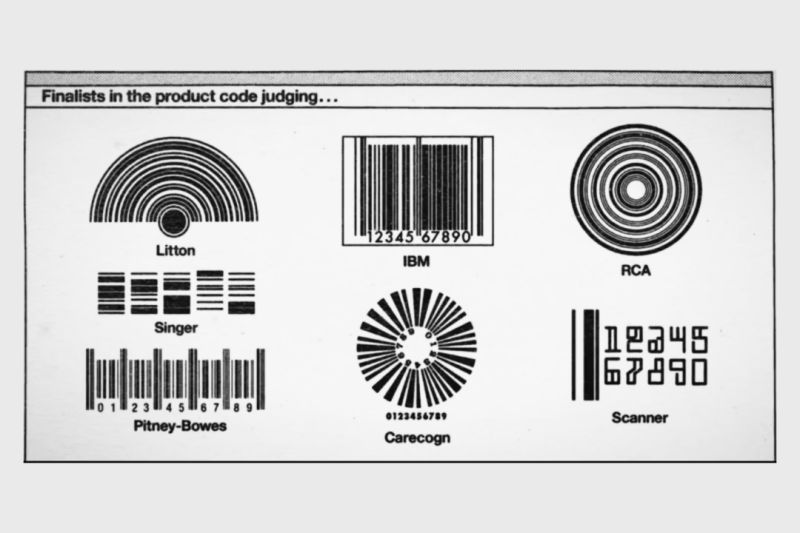
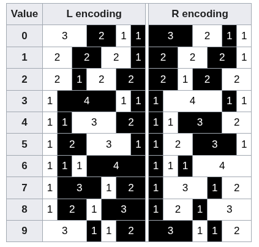
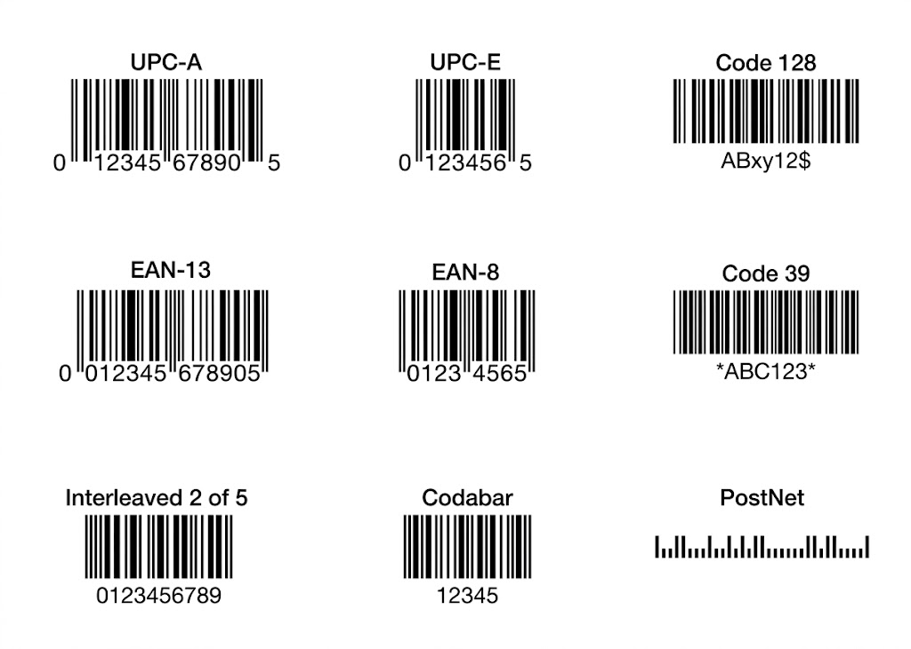

# Como funciona o Código de Barras?

Você provavelmente ouve esse som quase todo dia: o "bipe" do caixa eletrônico ou do supermercado. Mas você já parou para pensar no que a tecnologia está olhando quando lê um código de barras?

A maioria de nós passa a vida inteira achando que o scanner está lendo aquelas linhas pretas. Mas a verdade é o oposto: o leitor óptico ignora o preto e lê os espaços em branco. Como assim?

Vamos entender como essa tecnologia funciona e porque ela acabou ficando pequena demais para a indústria.

# Como tudo começou...

A ideia não nasceu em um laboratório de alta tecnologia, mas sim de uma conversa de corredor em 1948, nos Estados Unidos. Bernard Silver, um estudante do Drexel Institute, localizada na Filadélfia, ouviu por acaso o presidente de uma rede de supermercados implorando a um diretor da faculdade por um sistema automático que agilizasse as filas do caixa e controlasse o estoque. Mas, qual era o problema?

Naquela época, os operadores de caixa precisavam olhar para cada produto, identificar o preço impresso ou colado na embalagem e digitar manualmente, dígito por dígito, em caixas registradoras mecânicas. Esse movimento mecânico, acelerado e repetido milhares de vezes por dia fez com que muitos caixas desenvolvessem problemas crônicos de saúde, sendo a [síndrome do túnel do carpo](https://share.google/aimode/mvH9ppXfqoA0GWQ3w) a mais comum e dolorosa delas (uma inflamação nos nervos do pulso causada por esforço repetitivo).

<figure markdown="span">
{ align=center, width="500"}
</figure>

Como o processo dependia totalmente da velocidade de digitação humana, as filas nos supermercados eram gigantescas, gerando gargalos operacionais monstruosos para os donos de redes de comércio.

Bernard correu para contar ao seu amigo, Norman Joseph Woodland. Woodland bitolou no problema. Ele se mudou para a Flórida para focar em uma solução e, em um belo dia na praia, começou a desenhar na areia os pontos e traços do Código Morse (tecnologia que ele conhecia bem por ter sido escoteiro). Certo, mas o que era isso?

---

## O que é o Código Morse?

Para contextualizar, o Código Morse é, essencialmente, o avô do código binário que usamos hoje: ele transforma letras e números em apenas dois estímulos (um curto e um longo). Criado nos anos 1830 por Samuel Morse, esse sistema foi feito para transmitir mensagens à distância através do telégrafo (um aparelho que enviava impulsos elétricos por um fio). Como não dava para enviar a voz humana ou letras escritas pelo fio, Morse criou um alfabeto baseado em apenas dois tipos de sinais sonoros ou elétricos:

- O Ponto ($\cdot$): Um sinal rápido e curto.
- O Traço ($-$): Um sinal que dura o triplo do tempo do ponto.

Combinando esses pontos e traços, você consegue escrever qualquer palavra:

<figure markdown="span">
{ align=center, width="500"}
</figure>

---

Voltando para o caso da praia, o grande estalo de Bernard foi: E se, em vez de pontos e traços, eu puxar essas marcações para baixo, transformando-as em linhas verticais finas e grossas?

Ao fazer isso, Woodland percebeu que um feixe de luz (que mais tarde viria a ser o laser) poderia passar por aquelas linhas e ler o reflexo: as linhas pretas absorveriam a luz e as brancas a refletiriam de volta, gerando um sinal elétrico correspondente a uma sequência de números.

<figure markdown="span">
{ align=center, width="500"}
</figure>

Em 1952, eles patentearam a ideia. No entanto, o primeiro código de barras comercial não era uma linha reta, era circular! Parecia um alvo de tiro ao alvo. Eles desenharam assim porque achavam que seria mais fácil para o funcionário do mercado passar o produto em qualquer direção sobre o leitor.

A imagem abaixo mostra exatamente o desenho técnico que constava no documento oficial dessa patente. Repare que eles incluíram uma nota super importante no rodapé do desenho: "As linhas 6, 7, 8 e 9 são menos reflexivas que as linhas 10". Ou seja, ali já nascia o conceito de usar a diferença de reflexão da luz (linhas escuras que absorvem a luz vs. espaços claros que refletem) para gerar dados digitais.

<figure markdown="span">
{ align=center, width="500"}
</figure>

> Você pode visualizar a patente completa no Google Patents ([US2612994A](https://patents.google.com/patent/US2612994A/en))

A ideia era brilhante, mas estava à frente do seu tempo. Os computadores da década de 1950 eram gigantescos, os lasers ainda não existiam e a tecnologia para ler aquelas linhas de forma barata simplesmente não existia. A patente acabou esquecida por um tempo.

O jogo só começou a mudar no final de 1969. Aquele problema das filas dos supermercados escalou tanto que as maiores associações de comércio dos Estados Unidos se uniram e contrataram a famosa empresa de consultoria McKinsey & Company. Juntos, eles fundaram um comitê chamado Uniform Product Code Council (UPCC). A missão era clara: definir um formato numérico padrão e desafiar as empresas de tecnologia a criarem, do zero, um símbolo visual que pudesse ser lido por máquinas.

> Que mais tarde viria a se chamar UPC (Universal Product Code, ou Código Universal de Produto).

Isso iniciou uma disputa feroz no Vale do Silício. Gigantes da tecnologia como RCA, Singer, Pitney Bowes e a própria IBM criaram laboratórios secretos para desenhar propostas competitivas e apresentá-las ao comitê.

## O Nascimento do UPC pelas mãos de George Laurer

Naquela época, o engenheiro Heard Baumeister apresentou duas fórmulas de códigos lineares que a IBM possuía guardadas, chamadas de Delta A e Delta B.

A versão Delta B tentava calcular a informação comparando a largura exata da barra preta com a largura do espaço branco. Foi um desastre nos testes: se a prensa da gráfica colocasse um pouquinho mais de pressão ou tinta, a linha preta borrava para os lados (*ink spread*), engolia o espaço branco e o computador errava a leitura.

Foi aí que, no meio de 1971, outro engenheiro da IBM chamado William "Bill" Crouse teve um estalo genial e inventou um novo código chamado Delta C. Em vez de medir a grossura da linha preta inteira, a matemática do Delta C media apenas a distância da borda inicial (esquerda) de uma linha até a borda inicial da linha seguinte.

Essa sacada mudou tudo: se a gráfica borrasse e deixasse a linha preta mais gorda, ela cresceria para os dois lados por igual, mas a distância entre o início de uma linha e o início da outra continuaria milimetricamente a mesma. O código tornou-se imune aos borrões de tinta.

> Infelizmente, não existem páginas de internet ou links diretos dedicados exclusivamente à documentação do Delta B e Delta C, pois eles foram apenas codificações internas da IBM. Mas o código Delta C, que resolvia o problema do borrão medindo de "borda a borda", foi patenteado por William Crouse em 1971 e você pode acessar em [US Patent US3723710A](https://patents.google.com/patent/US4533825A/en28)

### O Círculo vs. A Linha Reta

Mesmo com a matemática do Delta C funcionando, a indústria ainda estava obcecada pela ideia do código circular (o "alvo" de tiro ao alvo). Empresas concorrentes, como a RCA e a Litton Industries, insistiam que o círculo era melhor porque o funcionário podia passar o produto em qualquer direção sobre o vidro do caixa.

Porém, Baumeister e George Laurer provaram que os círculos eram impossíveis de imprimir em alta velocidade sem deformar. Se a esteira da gráfica corresse rápido, o círculo virava uma elipse (uma forma oval) e o leitor falhava.

Isso porque as gráficas da década de 1970 usavam prensas rotativas que corriam em altíssima velocidade. O grande problema técnico era que a tinta borrava na direção do movimento da prensa — um fenômeno conhecido na indústria gráfica como *ink slurring* ou *press gain*. A pressão e o movimento contínuo do rolo fazem a tinta fresca "escorrer" levemente para frente ou para trás na direção em que o papel caminhava.

<figure markdown="span">
{ align=center, width="300"}
</figure>

Com as linhas retas, Laurer percebeu que o borrão da máquina apenas tornaria as linhas verticais um pouco mais altas ou compridas, mas a espessura exata de cada uma delas (que é onde a informação fica guardada) continuaria idêntica. No dia seguinte, ele sugeriu algo ainda melhor: cortar o código de barras em duas metades (lado esquerdo e lado direito).

Com essas duas propostas, eles conseguiram reduzir o tamanho do código de barras para um terço do tamanho do "alvo" circular da RCA. Laurer pegou a lógica Delta C de Bill Crouse e encolheu o tamanho final da etiqueta para apenas $38\text{ mm} \times 23\text{ mm}$. Era o nascimento visual do código de barras que conhecemos hoje.

### O "Anel Mágico" e a Homologação

Para convencer a diretoria da IBM e o comitê dos supermercados de que aquele pedacinho de linhas retas funcionava de verdade, Bill Crouse construiu um protótipo de leitor portátil que se usava no dedo, como se fosse um anel, conectado a uma pulseira.

No dia 1º de dezembro de 1972, a equipe apresentou o projeto em Minnesota. Durante a reunião, Crouse usou seu "anel mágico" para ler os códigos impressos. Para chocar os executivos, ele passou o leitor em cima de uma foto de revista, velha e mal impressa, cheia de falhas bi-dimensionais. O leitor funcionou perfeitamente em quase todas as tentativas. A robustez da matemática da IBM esmagou os concorrentes.

Para deixar o sistema 100% seguro contra fraudes, o matemático David Savir e George Laurer adicionaram a regra de inverter as cores no lado direito para o computador identificar se o produto passou de cabeça para baixo.

> Esse detalhe será explicado com mais detalhes no tópico sobre o [Dígito Verificador](./como-codbarras-funciona.md#dígito-verificador).

Por fim, um cientista do MIT chamado Murray Eden sugeriu o toque humano: colocar os números legíveis na parte de baixo do desenho, servindo como um sistema de segurança (*fail-safe*) caso o leitor óptico quebrasse.

---

Para fins de curiosidade, a imagem abaixo representa o design dos concorrentes que Laurer (IBM) derrotou. Os registros históricos preservaram os conceitos visuais exatos que foram apresentados ao comitê da UPCC:

<figure markdown="span">
{ align=center, width="500"}
</figure>

Embora o leitor de anel de Crouse tenha sido o argumento definitivo de portabilidade para convencer a diretoria da IBM de que a tecnologia funcionava de forma simples e rápida, foi a engenharia de impressão das linhas retas que garantiu a vitória no comitê.

---

## O Primeiro "Bip"

O primeiro produto escaneado na história não foi uma grande caixa ou um item caro, mas sim um pacotinho de chicletes Wrigley's Juicy Fruit (sabor tutti-frutti). Esse evento aconteceu no dia 26 de junho de 1974, às 8h01 da manhã, em um supermercado chamado Marsh's Supermarket, na cidade de Troy, Ohio (EUA). A operadora de caixa que fez as honras se chamava Sharon Buchanan, e o cliente era Clyde Dawson. Dawson subiu até o caixa com um carrinho cheio de itens, mas puxou o chiclete primeiro para fazer o teste histórico. O scanner (desenvolvido pela empresa Spectra-Physics usando a tecnologia de código linear da IBM) leu o código de primeira com um "bipe" limpo. Abaixo está a foto do chiclete e do primeiro scanner utilizado.

<figure markdown="span">
{ align=center, width="500"}
</figure>

<figure markdown="span">
{ align=center, width="500"}
</figure>

> O sucesso foi tão marcante que, hoje em dia, [uma réplica desse scanner original e um dos pacotes de chiclete daquele mesmo lote de 1974 estão preservados e em exposição no prestigiado museu Smithsonian (o National Museum of American History), em Washington, D.C.](https://www.si.edu/object/supermarket-scanner:nmah_892778)

A escolha não foi por acaso. O comitê dos supermercados e os engenheiros queriam provar uma coisa crucial: se o leitor óptico e a gráfica conseguissem funcionar perfeitamente em uma embalagem minúscula, cilíndrica, amassada e plastificada de um chiclete que custava apenas 67 centavos de dólar, funcionariam em qualquer outra coisa do planeta.

### Sempre teve o som?

Não. O "bipe" surgiu em 1974 por um motivo de psicologia e agilidade. Nos primeiros testes, os leitores eram silenciosos. Isso obrigava o funcionário a parar e olhar para a tela a cada produto para ter certeza de que o preço tinha entrado, o que atrasava as filas.

Para resolver isso, os engenheiros colocaram um pequeno alto-falante no scanner com uma regra simples: se o cálculo do dígito verificador estivesse correto, a máquina disparava um som curto.

O bipe é o computador dizendo: "A matemática fechou, o preço foi registrado. Pode passar o próximo."

O som é um estalido agudo (entre 2 kHz e 4 kHz) porque essa é a faixa de frequência que o ouvido humano capta melhor, permitindo que o funcionário isole o som mesmo no meio do barulho do supermercado.

---

## A Anatomia Matemática do UPC (Universal Product Code)

Agora que já mergulhamos na história e entendemos o contexto por trás da criação do UPC, vamos adentrar na sua estrutura.

Primeiro, precisamos quebrar o código de barras em suas menores partes. A menor unidade de um código de barras é chamada de "módulo", com uma largura padrão de 0,33 milímetros (basicamente, é a linha mais fina possível). Ele é incrivelmente pequeno. 

> Essa padronização de tamanho é mantida pela GS1 (Global System 1), uma organização internacional, neutra e sem fins lucrativos, responsável por desenvolver e manter os padrões globais de comunicação empresarial.

Isso garante que um código de barras impresso no Brasil seja lido exatamente do mesmo jeito na China, nos Estados Unidos ou em qualquer outro lugar.

> Você pode ver as regras de tamanho em [GS1 - UPC Specifications](https://www.gs1ie.org/standards/data-carriers/barcodes/upc/).

Mas, de forma geral, a GS1 permite que esse tamanho varie um pouco para caber em embalagens diferentes:

- O tamanho mínimo permitido: $0,26 \text{ mm}$ (usado em produtos bem pequenos, como chicletes ou esmaltes).
- O tamanho máximo permitido: $0,66 \text{ mm}$ (usado em caixas grandes de papelão em estoques, para o operador conseguir ler de longe).

> Aliás, como a organização global GS1 precisava atender a diferentes tipos de indústrias, tamanhos de embalagens e necessidades de transporte, ela criou vários padrões de códigos de barras ao longo dos anos. No entanto, os que sobreviveram até hoje é o UPC-A (O código de barras tradicional) e o UPC-E (uma versão compacta do UPC-A, usada em produtos pequenos). Haverá um breve tópico sobre isso neste post, mas é importante entender o "normal" primeiro, então vá com calma...

Quando olhamos para um código de barras de longe, vemos linhas pretas de vários tamanhos (umas finas, outras médias, outras bem grossas). Mas essas linhas grossas são apenas vários módulos pretos colocados colados um ao lado do outro. Na prática, isso significa que estamos codificando uma informação de forma binária: 

<figure markdown="span">
{ align=center, width="500"}
</figure>

- **Módulo de cor de fundo (Branco):** É definido normativamente com o valor lógico $0$.
- **Módulo de cor de primeiro plano (Preto):** É definido normativamente com o valor lógico $1$.

Assim, tudo que temos ali são números codificados em binário. No entanto, não temos apenas o código em si do produto, temos também uma série de módulos que servem para orientar o leitor e garantir que a leitura seja feita corretamente. Dessa forma, podemos dividir um código de barras em três grandes grupos: 

1. **Blocos de dados (Data Blocks):** São os módulos que carregam a informação do produto. 

    > No código UPC-A tradicional (o mais comum), temos 6 blocos de dados à esquerda e 6 blocos de dados à direita.
    

2. **Portões (Guards):** São os módulos que servem para orientar o leitor. 

    > 6 módulos formam os portões de segurança (2 na entrada, 2 no meio, 2 na saída).

3. **Zona de silêncio (Quiet Zones):** É a área em branco antes do código de barras. 

    > É obrigatório ter um espaço em branco de pelo menos 9 módulos de largura antes e depois do código. Isso serve para o leitor entender onde o código começa e onde ele termina. 

Por exemplo, um código assim:

  

pode ser dividido assim:

> A tabela abaixo não representa o código de barras acima, mas sim um exemplo de como ele é estruturado e como seria a representação de cada número no código de barras.

  <table style="text-align: center; border-collapse: collapse; width: 100%; min-width: 800px; font-family: 'Outfit', 'Inter', system-ui, -apple-system, sans-serif; background-color: #80A080; border: none; color: #ffffff; margin: 0;">
    <caption style="padding: 14px; font-weight: 700; font-size: 1.1rem; background-color: #5a755a; color: #ffffff; letter-spacing: 0.5px; border-bottom: 2px solid rgba(255, 255, 255, 0.15);">
      Tabela de codificação para o padrão de código de barras UPC-A
    </caption>
    <thead>
      <tr style="background-color: #698b69; border-bottom: 2px solid rgba(255, 255, 255, 0.15);">
        <th rowspan="2" style="padding: 12px 6px; border: 1px solid rgba(255, 255, 255, 0.1); font-weight: 600; text-transform: uppercase; font-size: 0.85rem; letter-spacing: 0.5px;">Zona de Silêncio</th>
        <th rowspan="2" style="padding: 12px 6px; border: 1px solid rgba(255, 255, 255, 0.1); font-weight: 600; text-transform: uppercase; font-size: 0.85rem; letter-spacing: 0.5px;">PORTÃO</th>
        <th colspan="10" style="padding: 12px 6px; border: 1px solid rgba(255, 255, 255, 0.1); font-weight: 700; font-size: 0.9rem; text-transform: uppercase; letter-spacing: 1px;">Bloco de Dados (Esquerda)</th>
        <th rowspan="2" style="padding: 12px 6px; border: 1px solid rgba(255, 255, 255, 0.1); font-weight: 600; text-transform: uppercase; font-size: 0.85rem; letter-spacing: 0.5px;">PORTÃO</th>
        <th colspan="10" style="padding: 12px 6px; border: 1px solid rgba(255, 255, 255, 0.1); font-weight: 700; font-size: 0.9rem; text-transform: uppercase; letter-spacing: 1px;">Bloco de Dados (Direita)</th>
        <th rowspan="2" style="padding: 12px 6px; border: 1px solid rgba(255, 255, 255, 0.1); font-weight: 600; text-transform: uppercase; font-size: 0.85rem; letter-spacing: 0.5px;">PORTÃO</th>
        <th rowspan="2" style="padding: 12px 6px; border: 1px solid rgba(255, 255, 255, 0.1); font-weight: 600; text-transform: uppercase; font-size: 0.85rem; letter-spacing: 0.5px;">Zona de
      silêncio</th>
      </tr>
      <tr style="background-color: #698b69;">
        <!-- L 0-9 -->
        <th style="padding: 8px 4px; border: 1px solid rgba(255, 255, 255, 0.1); font-weight: 700;">0</th>
        <th style="padding: 8px 4px; border: 1px solid rgba(255, 255, 255, 0.1); font-weight: 700;">1</th>
        <th style="padding: 8px 4px; border: 1px solid rgba(255, 255, 255, 0.1); font-weight: 700;">2</th>
        <th style="padding: 8px 4px; border: 1px solid rgba(255, 255, 255, 0.1); font-weight: 700;">3</th>
        <th style="padding: 8px 4px; border: 1px solid rgba(255, 255, 255, 0.1); font-weight: 700;">4</th>
        <th style="padding: 8px 4px; border: 1px solid rgba(255, 255, 255, 0.1); font-weight: 700;">5</th>
        <th style="padding: 8px 4px; border: 1px solid rgba(255, 255, 255, 0.1); font-weight: 700;">6</th>
        <th style="padding: 8px 4px; border: 1px solid rgba(255, 255, 255, 0.1); font-weight: 700;">7</th>
        <th style="padding: 8px 4px; border: 1px solid rgba(255, 255, 255, 0.1); font-weight: 700;">8</th>
        <th style="padding: 8px 4px; border: 1px solid rgba(255, 255, 255, 0.1); font-weight: 700;">9</th>
        <!-- R 0-9 -->
        <th style="padding: 8px 4px; border: 1px solid rgba(255, 255, 255, 0.1); font-weight: 700;">0</th>
        <th style="padding: 8px 4px; border: 1px solid rgba(255, 255, 255, 0.1); font-weight: 700;">1</th>
        <th style="padding: 8px 4px; border: 1px solid rgba(255, 255, 255, 0.1); font-weight: 700;">2</th>
        <th style="padding: 8px 4px; border: 1px solid rgba(255, 255, 255, 0.1); font-weight: 700;">3</th>
        <th style="padding: 8px 4px; border: 1px solid rgba(255, 255, 255, 0.1); font-weight: 700;">4</th>
        <th style="padding: 8px 4px; border: 1px solid rgba(255, 255, 255, 0.1); font-weight: 700;">5</th>
        <th style="padding: 8px 4px; border: 1px solid rgba(255, 255, 255, 0.1); font-weight: 700;">6</th>
        <th style="padding: 8px 4px; border: 1px solid rgba(255, 255, 255, 0.1); font-weight: 700;">7</th>
        <th style="padding: 8px 4px; border: 1px solid rgba(255, 255, 255, 0.1); font-weight: 700;">8</th>
        <th style="padding: 8px 4px; border: 1px solid rgba(255, 255, 255, 0.1); font-weight: 700;">9</th>
      </tr>
    </thead>
    <tbody>
      <tr style="background-color: #80A080; vertical-align: top;">
        <td style="padding: 12px 6px; border: 1px solid rgba(255, 255, 255, 0.1); background-color: rgba(255, 255, 255, 0.05);"></td>
        <td style="padding: 12px 6px; border: 1px solid rgba(255, 255, 255, 0.1);"></td>
        <!-- L 0-9 -->
        <td style="padding: 12px 6px; border: 1px solid rgba(255, 255, 255, 0.1);"></td>
        <td style="padding: 12px 6px; border: 1px solid rgba(255, 255, 255, 0.1);"></td>
        <td style="padding: 12px 6px; border: 1px solid rgba(255, 255, 255, 0.1);"></td>
        <td style="padding: 12px 6px; border: 1px solid rgba(255, 255, 255, 0.1);"></td>
        <td style="padding: 12px 6px; border: 1px solid rgba(255, 255, 255, 0.1);"></td>
        <td style="padding: 12px 6px; border: 1px solid rgba(255, 255, 255, 0.1);"></td>
        <td style="padding: 12px 6px; border: 1px solid rgba(255, 255, 255, 0.1);"></td>
        <td style="padding: 12px 6px; border: 1px solid rgba(255, 255, 255, 0.1);"></td>
        <td style="padding: 12px 6px; border: 1px solid rgba(255, 255, 255, 0.1);"></td>
        <td style="padding: 12px 6px; border: 1px solid rgba(255, 255, 255, 0.1);"></td>
        <!-- M -->
        <td style="padding: 12px 6px; border: 1px solid rgba(255, 255, 255, 0.1);"></td>
        <!-- R 0-9 -->
        <td style="padding: 12px 6px; border: 1px solid rgba(255, 255, 255, 0.1);"></td>
        <td style="padding: 12px 6px; border: 1px solid rgba(255, 255, 255, 0.1);"></td>
        <td style="padding: 12px 6px; border: 1px solid rgba(255, 255, 255, 0.1);"></td>
        <td style="padding: 12px 6px; border: 1px solid rgba(255, 255, 255, 0.1);"></td>
        <td style="padding: 12px 6px; border: 1px solid rgba(255, 255, 255, 0.1);"></td>
        <td style="padding: 12px 6px; border: 1px solid rgba(255, 255, 255, 0.1);"></td>
        <td style="padding: 12px 6px; border: 1px solid rgba(255, 255, 255, 0.1);"></td>
        <td style="padding: 12px 6px; border: 1px solid rgba(255, 255, 255, 0.1);"></td>
        <td style="padding: 12px 6px; border: 1px solid rgba(255, 255, 255, 0.1);"></td>
        <td style="padding: 12px 6px; border: 1px solid rgba(255, 255, 255, 0.1);"></td>
        <!-- E -->
        <td style="padding: 12px 6px; border: 1px solid rgba(255, 255, 255, 0.1);"></td>
        <td style="padding: 12px 6px; border: 1px solid rgba(255, 255, 255, 0.1); background-color: rgba(255, 255, 255, 0.05);"></td>
      </tr>
    </tbody>
  </table>

Cada número precisa usar um bloco de exatamente 7 módulos. A imagem abaixo ilustra bem isso:

<figure markdown="span">
{ align=center, width="400"}
</figure>

Com isso em mente, a "receita" do número 1 para o lado esquerdo é (3 branco, 2 preto, 1 branco, 1 preto):

$$\text{Branco} - \text{Branco} - \text{Branco} - \text{Preto} - \text{Preto} - \text{Branco} - \text{Preto}$$

Já para o lado direito do código, a receita do número 1 é diferente (basicamente é o inverso, onde era preto fica branco e vice-versa):

$$\text{Preto} - \text{Preto} - \text{Preto} - \text{Branco} - \text{Branco} - \text{Preto} - \text{Branco}$$

---

### Por que existe essa diferença?

A mudança de receita existe por um motivo simples: dar o sentido da direção para o computador, da mesma forma que uma placa de trânsito diz se uma rua é "mão" ou "contramão".

Por exemplo, se o número 1 fosse desenhado igual na esquerda e na direita, a estrada de fatias seria idêntica. Quando o produto passasse de cabeça para baixo, o laser começaria a ler o código pelo lado fim (pela direita) achando que era o começo (a esquerda).

O computador leria todos os números de trás para frente. Em vez de ler o código real do produto, ele leria uma sequência totalmente errada, o sistema não encontraria o preço e o caixa travaria.

É por isso que há esse truque de espelhar a receita de cada número. Assim:

- No Lado Esquerdo: Todos os números (de 0 a 9) foram desenhados com um número ÍMPAR de fatias pretas.

- No Lado Direito: Todos os números foram desenhados com um número PAR de fatias pretas.

Assim, quando o laser cruza o código de barras, a primeira coisa que o software faz é contar a paridade dos blocos de 7 fatias que ele acabou de ler. Se o resultado for ímpar, ele sabe que está lendo o lado esquerdo. Se for par, ele sabe que está lendo o lado direito. Dessa forma, caso esteja sendo lido invertido, em vez de dar um erro e travar o caixa, o computador simplesmente faz uma operação matemática interna: ele espelha e inverte a ordem dos bits na memória, transformando o que ele leu de trás para frente no código correto.

---

Levando em conta essa organização, todo código UPC-A tem exatamente 30 barras pretas. Como ele usa 12 dígidos para dados, isso significa que a capacidade máxima é de 100 bilhões de combinações de produtos diferentes ($10^{11}$ ou $100.000.000.000$). É espaço de sobra para registrar produtos por décadas.

## E o que são aqueles números embaixo?

Quando olhamos para um código de barras impresso na embalagem de um produto, costumamos ver alguns números alinhados embaixo das barras. Como já citado, eles são exatamente os números que estão codificados nas barras. Foram feitos para que os humanos possam ler o código de barras caso precise digitar manualmente em algum sistema por algum problema.

Porém, se você reparar bem na organização de um código do tipo UPC-A, vai notar que o primeiro número e o último ficam "jogados" para fora, meio isolados nos cantos. No nosso exemplo anterior, temos o 0 e 2 isolados nas extremidades:

  

Segundo as regras oficiais da GS1, eles significam:

- **Esquerdo**: É o dígito de agrupamento. Ele identifica o tipo de produto ou categoria ao qual o item pertence.

    > No exemplo, é o número 0.

- **Direito**: É o dígito verificador. Ele é usado para garantir que o código de barras foi lido corretamente. Faremos uma breve explicação de como ele funciona depois.

    > No exemplo, é o número 2.

### Dígito de Agrupamento

Esse primeiro dígito (que fica isolado no canto esquerdo) avisa ao computador da loja com que tipo de produto ele está lidando:

| Código | Descrição | 
| --- | --- |
| 0, 1, 6, 7, 8, 9 | São para produtos comuns de supermercado. Onde os números seguintes identificam a fábrica e o produto. |
| 2 | É reservado para itens pesados na hora (como carne, queijo ou frutas). Quando o mercado embala uma bandeja de carne, o próprio mercado gera esse código. O sistema lê o número 2, entende que é um item de peso variável e usa os últimos números do código para puxar o peso ou o preço direto da balança |
| 3 | Reservado para medicamentos e remédios (nos EUA, os números do meio correspondem ao registro oficial de drogas do governo, o NDC). |
| 4 | Reservado para uso interno da própria loja, geralmente usado em cartões de fidelidade ou cupons de desconto do próprio estabelecimento. |
| 5 | Reservado para cupons de desconto de fabricantes (aqueles que dão desconto cumulativo em produtos específicos). |

### Dígito Verificador

A única função dele é responder a uma pergunta para o computador: "As barras foram lidas corretamente ou o código está riscado, sujo ou amassado?"

Quando o laser passa pelo código de barras, o computador lê os 11 primeiros números e, em uma fração de milissegundo, faz uma conta matemática com eles. O resultado final dessa conta obrigatoriamente precisa dar igual ao último número. Mas... que cálculo é esse?

> Para não prolongar demais essa página, veja o cálculo do dígito verificador no link: [Como funciona o dígito verificador do código de barras](calculo-digito-verificador.md)

### E o resto?

Os valores númericos centrais são os dados em si, ou seja, o código do produto. Geralmente, são divididos entre código da empresa e código do produto. Então, usando aquela código de barras de exemplo:

- **36000:** Código da empresa (identifica quem fabricou ou distribui o produto). Por exemplo, sinaliza que o produto foi fabricado por "Colgate-Palmolive".
- **29145:** Código do produto (identifica o produto específico). Por exemplo, pode ser o "Creme Dental Colgate Total 12 de 90g".

As empresas não inventam os códigos do nada; elas alugam um bloco exclusivo de números da GS1 para garantir que nenhuma empresa no mundo tenha um código igual ao seu. A divisão do código depende do tamanho da fabricante. Grandes corporações recebem um prefixo de empresa curto (sobrando mais dígitos para cadastrar milhares de produtos). Pequenos produtores recebem um prefixo longo (sobrando poucos dígitos, o suficiente para uma linha pequena de produtos).

> Algo muito parecido com a divisão de IPs, onde uma faixa maior ou menor é separada para os hosts ou roteadores, dependendo do tamanho da empresa.

---

# E quando o espaço é pequeno? O modelo UPC-E

Toda essa estrutura de 12 dígitos funciona perfeitamente em caixas de cereal, garrafas de refrigerante ou livros. Mas o que acontece quando o produto é minúsculo, como um chiclete, um batom ou um esmalte? O código padrão de 12 dígitos (UPC-A) simplesmente não cabe na embalagem.

Para resolver isso, a GS1 criou o UPC-E, que é a versão "compactada" do código de barras. Ele possui as seguintes diferenças:

1. Elimina todos os zeros no meio do código;
2. Não possui as barras de "portão" no início e no fim;
3. Usa apenas 6 dígitos para codificar o produto, ao invés de 12.

Abaixo temos um exemplo para você notar a diferença:

<figure markdown="span">
{ align=center, width="500"}
</figure>

> Já que ele possui apenas 6 dígitos, ele consegue ter uma capacidade máxima de 1 milhão de produtos diferentes ($10^6$ ou $1.000.000$).

# E os outros códigos de barras?

<figure markdown="span">
{ align=center, width="500"}
</figure>

Embora o UPC tenha sido o pioneiro nas prateleiras dos supermercados, a necessidade de automatizar diferentes indústrias fez com que o mundo da tecnologia criasse dezenas de outros formatos. **Cada modelo de código de barras que existe hoje nasceu para resolver uma limitação geográfica, de espaço físico ou de tipo de informação que o padrão original da IBM não conseguia tratar sozinho.**

## 1) EAN-13: O padrão mundial

Quando essa tecnologia cruzou o oceano em 1977, a Europa percebeu que precisava de um padrão que identificasse o comércio internacional; assim nasceu o EAN-13, que adicionou um dígito ao modelo americano para incluir o país de origem do produto.

Seguindo a mesma lógica de portabilidade do irmão americano, os europeus também criaram o EAN-8, uma versão reduzida para 8 dígitos usada para etiquetar embalagens pequenas.

## 2) Code 39

Fora do varejo tradicional, as necessidades eram outras, pois indústrias e transportadoras precisavam registrar letras e não apenas números. Para resolver isso, surgiu o Code 39, o primeiro modelo alfanumérico da história, muito adotado pelo setor automotivo e pelo Departamento de Defesa dos EUA devido à sua alta segurança contra falhas, ideal para inventários de grande porte e peças de metal.

## 3) Code 128

Pouco depois, buscando mais eficiência de espaço, foi desenvolvido o Code 128, um código de altíssima densidade que consegue armazenar letras, números e símbolos de forma muito mais compacta, tornando-se o padrão absoluto para o rastreio de encomendas na logística global e em crachás corporativos.

## 4) Interleaved 2 of 5

Para lidar com impressões de qualidade inferior, como caixas de papelão ásperas de armazéns, foi criado o Interleaved 2 of 5 (Intercalado 2 de 5), que armazena números em pares e possui alta tolerância a falhas de tinta — uma característica que o tornou perfeito para ser adotado, até os dias de hoje, na leitura de boletos bancários.

## 5) Codabar

Já o Codabar nasceu em 1972 com foco em impressoras térmicas antigas, utilizando letras especiais para marcar o início e o fim da leitura, o que garantiu seu uso histórico em tubos de ensaio de bancos de sangue e etiquetas de livros em bibliotecas.

## 6) PostNet

Por fim, até os serviços postais ganharam soluções exclusivas, como o PostNet, um código peculiar composto por barras de alturas variadas (curtas e longas) desenhado sob medida pelo correio americano para decifrar os CEPs nos envelopes e acelerar a triagem de cartas em altíssima velocidade.

---

# Desafios na Implementação do Código de Barras

Assim como qualquer nova tecnologia, a introdução do código de barras enfrentou forte ceticismo inicial por parte de diversos setores:

- **Consumidores**: Questionavam a precisão dos preços registrados.

    > Eles pensavam: "Se o preço não está grudado no produto, como vou saber se a máquina me cobrou o valor certo na hora de passar no caixa?". Havia o medo real de que os supermercados alterassem os preços no computador central sem que o cliente percebesse.

- **Sindicatos**: Temiam que as máquinas causassem desemprego em massa.

    > Os sindicatos perceberam que a leitura óptica faria as filas andarem muito mais rápido e eliminaria a necessidade de funcionários para carimbar preços em cada produto do estoque.

- **Varejistas e Fabricantes**: Mostravam-se relutantes em investir em leitores para produtos que ainda não vinham com o código impresso na embalagem.

    > Implementar o código de barras exigia um investimento altíssimo. Os donos de supermercados precisavam comprar computadores centrais caros e leitores de laser que ainda eram tecnologia de ponta. Os fabricantes, por sua vez, precisavam mudar suas linhas de produção e designs de embalagem para imprimir o código. Ninguém queria dar o primeiro passo e perder dinheiro.

- **População Geral**: Havia o medo de que o ["Grande Irmão" (1984 - George Orwell)](https://share.google/aimode/tBDfyyY5aR02ICXQZ) usasse a tecnologia para vigiar os cidadãos.
- **Teorias da Conspiração**: Alguns cristãos, influenciados pelo livro ["The New Money System 666" de Mary Stuart Relf](https://archive.org/details/newmoneysystem6600relf), afirmavam que os códigos ocultavam o número 666, representando a "Marca da Besta" bíblica.

    > Como já explicado, o código de barras UPC possui três barras de proteção mais longas (no início, no meio e no fim) que servem apenas para guiar o laser do leitor. Acontece que, visualmente, o desenho dessas três barras é idêntico ao padrão que o sistema usa para ler o número 6. Para os religiosos da época, ver uma estrutura que parecia fixar o 6-6-6 em um sistema feito justamente para "comprar e vender" foi o encaixe perfeito com a profecia apocalíptica da Marca da Besta.

---

# Conclusão

Olhar para toda essa evolução nos mostra que o código de barras linear, inventado por George Laurer, foi uma das grandes revoluções da história moderna. Ele transformou a gestão de estoques, a logística e o varejo em escala global, trazendo eficiência inédita para a economia mundial.

Mas... mesmo sendo brilhante para sua época e sendo usado até hoje, ele acabou encontrando um teto técnico intransponível.

O grande calcanhar de Aquiles do código de barras tradicional era a sua limitação geométrica: ele só lê informações em uma única direção (da esquerda para a direita). Se a indústria precisasse guardar mais dados sobre um produto, o código tinha que ficar cada vez mais comprido, virando uma linha gigante impossível de imprimir. 

Além disso, ele exigia precisão cirúrgica: o leitor precisava passar no ângulo exato sobre as linhas, e se o código estivesse minimamente sujo, amassado ou rasgado, o sistema simplesmente quebrava e não lia nada.

Essa fragilidade cobrou o seu preço no Japão. Uma subsidiária da Toyota precisava rastrear o estoque de autopeças em tempo real, mas os operadores perdiam muito tempo tentando alinhar o leitor laser com os códigos nas caixas. Para piorar, quando a tecnologia foi levada para o campo para ajudar os fazendeiros no rastreamento e controle de saúde das vacas, o código de barras tradicional fracassou feio. Afinal, uma vaca não fica parada esperando o feixe de luz passar na horizontal perfeita e, para completar, as etiquetas no pasto viviam cobertas de lama e esterco, o que cegava completamente o leitor laser.

Foi a partir desse cenário de frustração que o engenheiro Masahiro Hara, em 1994, redesenhou o conceito do zero e criou o QR Code. Mas isso é uma história para outra página.

Até mais!