# Como funciona um sensor de Impressão Digital

A nossa pele é formada por camadas, e o encontro entre a derme (mais interna) e a epiderme (mais externa) é irregular, criando ondulações chamadas. Para ficar fácil de visualizar, imagine a superfície do seu dedo como um terreno com montanhas e buracos: as cristas são as partes elevadas da pele, os "picos" das linhas que você enxerga; já os vales são as depressões ou os espaços que ficam entre uma linha e outra:

<figure markdown="span">
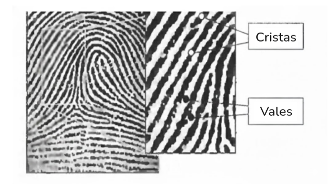{ align=center, width="500"}
</figure>

O segredo da identificação está no fato de que essas linhas não são perfeitas. Em alguns pontos, uma crista pode parar de repente ou se dividir em duas,**e são justamente essas "falhas" no caminho das cristas e vales que criam as características únicas de cada pessoa.** Sem essa alternância entre altos e baixos, o sensor veria apenas uma mancha lisa e não conseguiria distinguir ninguém.

## 1) Captando a imagem
Agora que entendemos que o seu dedo possui esse relevo de cristas (partes altas) e vales (partes baixas), podemos avançar para o próximo passo: como a tecnologia transforma esse relevo em um dado digital.  **O primeiro estágio técnico é a aquisição da imagem, onde o sensor atua como uma interface para capturar esse desenho biológico.** Existem diferentes formas de fazer isso: 

- Sensores Ópticos
- Sensores Capacitivos
- Sensores Ultrassônicos

Vamos focar inicialmente nos capacitivos, pois são mais comuns em dispositivos portáteis devido ao seu tamanho compacto e baixo consumo de energia. Esse tipo de sensor "sente" a eletricidade do seu corpo através de uma placa composta por milhares de minúsculos dispositivos semicondutores integrados. Quando você encosta o dedo na superfície do sensor, a sua pele atua como uma das placas de um capacitor, enquanto o sensor metálico é a outra:

<figure markdown="span">
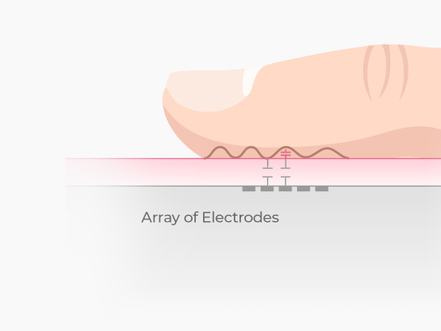{ align=center, width="400"}
</figure>

O segredo está na distância: como as cristas (partes altas) tocam o sensor diretamente e os vales (partes baixas) ficam afastados por uma pequena camada de ar, o sensor detecta valores de capacitância diferentes para cada ponto do relevo.

---
### Entendendo os Fundamentos
O princípio fundamental é que a capacitância (C) é inversamente proporcional à distância entre essas duas "placas". A fórmula geral de capacitância é:

<figure markdown="span">
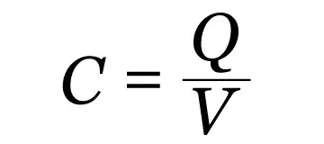{ align=center, width="200"}
</figure>

No entanto, para entender onde a distância entra na história, precisamos olhar para a fórmula da capacitância de um capacitor de placas paralelas, que é o modelo físico utilizado pelo sensor para "ler" o seu dedo:

<figure markdown="span">
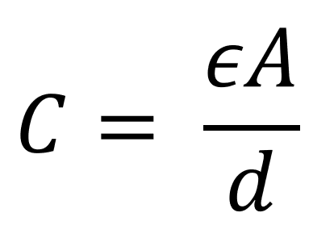{ align=center, width="200"}
</figure>

Nela, temos as seguintes variáveis:

- **d (Distância):** É o fator crucial. Ela representa o espaço entre a pele do seu dedo (placa superior) e o eletrodo do sensor (placa inferior)
- **ϵ (Permitividade):** Refere-se ao material entre as placas (como o ar nos vales ou a camada protetora do sensor nas cristas).
-  **A (Área):** É o tamanho da célula do sensor.

Como a capacitância (C) é inversamente proporcional à distância (d), o sistema funciona assim:

1. **Nas Cristas:** O dedo toca o sensor ou fica muito próximo dele. A distância (d) é pequena, o que faz com que a capacitância (C) seja alta (cerca de 44 fF).
2. **Nos Vales:** O relevo da pele está longe do sensor, criando uma bolsa de ar. A distância (d) é grande, o que faz com que a capacitância (C) seja baixa (cerca de 20 fF)

O sensor usa essa mudança na capacitância para alterar a voltagem final que o computador lê. Ou seja: a distância define a capacitância, que por sua vez define a voltagem. Se a voltagem for alta (distância curta/crista), o sistema gera o bit 1; se for baixa (distância longa/vale), gera o bit 0!

> Para facilitar, imagine que você está segurando um ímã perto de uma placa de metal: quanto menor a distância, maior é a força que você sente. No sensor, o "ímã" é o seu dedo e a "força" é a capacitância. O computador não mede a distância com uma régua, ele "sente" a força elétrica e deduz se ali é uma linha da sua digital ou um espaço vazio.

---
Após essa detecção física, as variações elétricas são convertidas em sinais de voltagem ou corrente, que passam por um conversor analógico-digital (ADC) para serem transformados em dados binários. Por exemplo, uma crista (que toca o sensor) pode gerar uma voltagem maior, enquanto um vale (que está longe) gera uma voltagem menor. Essa voltagem ainda é um sinal "analógico" — ou seja, é uma eletricidade contínua que pode ter qualquer valor, como 0,52V ou 1,28V.

É aí que entra o ADC. Ele "mede" essa voltagem e atribui um valor numérico binário a ela,. Se o sensor tiver uma resolução de, por exemplo, 8 bits, ele pode transformar essa voltagem em um número entre 0 e 255. Assim, uma célula que detectou uma crista escura vira o número "255" (em bits: 11111111), e uma célula que detectou um vale claro vira o número "0" (em bits: 00000000)

Abaixo podemos ver um ADC de 6 bits convertendo a variação da voltagem analógica (que vai de 3.02V a 1.57V) em códigos digitais. Nesse caso, ele mapeia o relevo em uma escala de 0 a 63 (pois 2⁶ = 64), o que representa diferentes tons de cinza

<figure markdown="span">
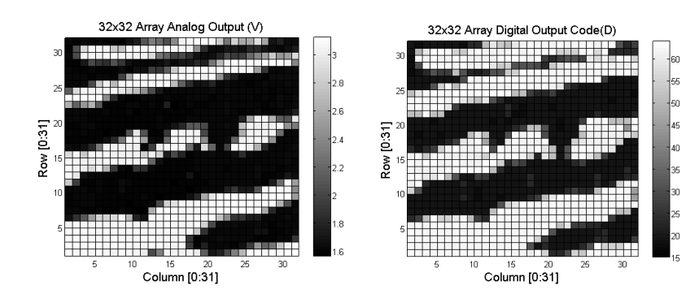{ align=center, width="500"}
</figure>

> Em alguns sensores modernos, para ganhar velocidade, o sistema usa comparadores em vez de um ADC completo. O comparador simplesmente decide: "esta voltagem é maior que o limite?". Se for, ele gera o bit 1; se for menor, gera o bit 0. Outros sistemas mais avançados comparam duas células vizinhas e geram códigos de dois bits, como "01" para uma mudança de vale para crista ou "10" para crista para vale, criando um mapa digital muito rápido da estrutura do dedo.

Logo após a captura, o sistema realiza a "normalização", que serve justamente para uniformizar e corrigir esses níveis de cinza da imagem original, equilibrando índices de iluminação, que é o que veremos a seguir...
## 2) Preparando (Normalização)

Após capturar essa "foto" inicial, o sistema precisa prepará-la, pois a imagem bruta costuma vir com ruídos, como sujeira no dedo ou falhas na iluminação. Esse passo é chamado de pré-processamento.

### 2.1) Normalização

Ocorre primeiro a normalização, que serve para equilibrar os níveis de cinza da imagem, deixando-a com uma iluminação uniforme.

### 2.2) Aplicação dos Filtros

Depois, aplicam-se filtros em sequência para remover componentes irrelevantes e destacar bem o contraste entre as linhas pretas (cristas) e o fundo branco (vales), criando uma matriz binária clara.

**Primeiro, aplica-se o Filtro Gaussiano**, que suaviza a imagem removendo ruídos e pequenas imperfeições que possam interferir na identificação. Ele "limpa" a imagem bruta, preparando-a para o próximo passo.

- [Filtro Gaussiano](./gaussian.md)

<figure markdown="span">
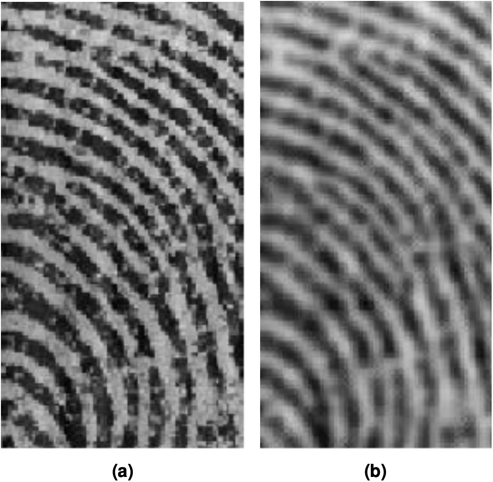{ align=center, width="400"}
<label>A ideia é remover as imperfeições</label>
</figure>

**Em seguida, aplica-se o Filtro de Gabor**, que é especializado em detectar padrões direcionais (como as linhas da digital). Ele realça as cristas e vales, melhorando o contraste após o Gaussiano ter removido os ruídos. Abaixo podemos ver o antes (esquerda) e depois (direita) da aplicação do Filtro de Gabor:

- [Filtro de Gabor](./gabor.md)

<figure markdown="span">
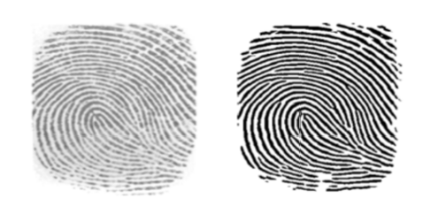{ align=center, width="600"}
</figure>

Em resumo, esta técnica é usada para remover as escalas de cinza, destacando as cristas e vales de forma monocromática (só preto e branco).

### 2.3) Afinamento

Após os filtros de pré-processamento, ocorre o processo de **Afinamento.** Este é um processo onde há a remoção de pixels das linhas da digital sem alterar sua estrutura básica. O objetivo é criar um "esqueleto" da imagem, onde as cristas (as linhas da digital) tenham a largura reduzida ao mínimo possível, ou seja, à espessura de apenas um pixel.

> Esse processo preserva o desenho e a conectividade original das linhas, mas remove toda a "massa" lateral que não é necessária para a identificação.

<figure markdown="span">
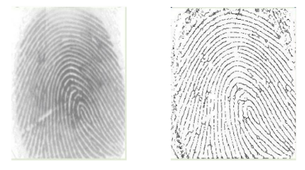{ align=center, width="400"}
</figure>

A principal razão para realizar o afinamento é facilitar a extração de minúcias. Quando as linhas são grossas, é mais difícil para o computador determinar o ponto exato onde uma linha termina ou se divide. Com o esqueleto de apenas um pixel, os algoritmos conseguem analisar a vizinhança de cada pixel com precisão cirúrgica, identificando rapidamente as coordenadas exatas das características únicas do dedo.

## Extração de Minúcias

Nesta etapa, algoritmos analisam o "esqueleto" da imagem — onde as linhas têm apenas um pixel de largura — para identificar pontos geométricos específicos que tornam a digital única, como bifurcações (onde uma linha se divide) e terminações (onde uma linha acaba). Na prática, a ideia é:

- Se houver um pixel branco sem vizinhos significa que encontramos um ponto terminal.
- Caso um ponto branco possua 3 pontos vizinhos, significa que encontramos uma bifurcação. 

<figure markdown="span">
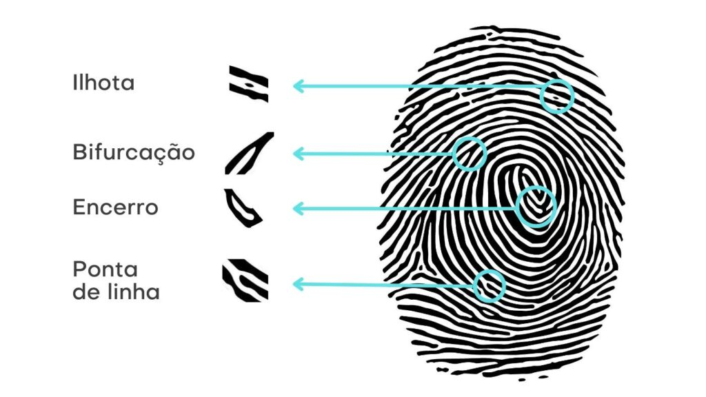{ align=center, width="400"}
</figure>

O objetivo é transformar o desenho visual em um conjunto de dados matemáticos. Sobre o armazenamento e o formato, o sistema não guarda uma imagem ou um simples mapa de bits (bitmap) do seu dedo; em vez disso, ele gera uma representação digital chamada template (ou modelo). O mapa de minúcias extraído é convertido em um vetor de coordenadas e ângulos. Podemos ver o algoritmo completo abaixo:

<figure markdown="span">
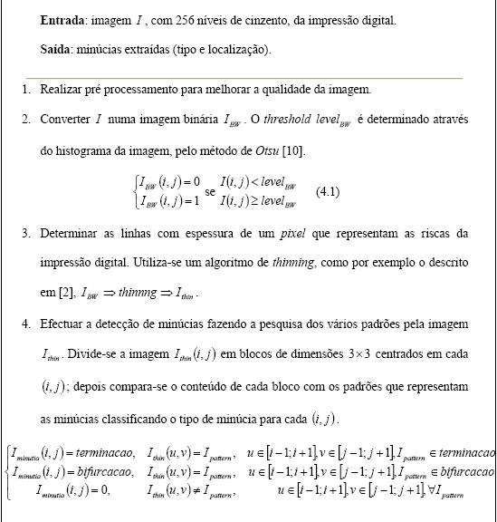{ align=center, width="400"}
</figure>

> Outros detalhes biológicos profundos, conhecidos como características de Nível 3, incluem os poros de suor, as cicatrizes e as dobras (creases) da pele, que ajudam a tornar a identificação ainda mais infalível.

Esse arquivo é muito pequeno e eficiente, ocupando geralmente entre 300 e 1200 bytes, o que permite que ele seja armazenado até em dispositivos com pouca memória.

Para garantir a segurança, esse template é criptografado (geralmente usando o algoritmo AES) antes de ser salvo no banco de dados do sistema. Quando você tenta acessar o sistema novamente, ele extrai as minúcias do seu dedo "ao vivo" e compara esse novo mapa com o template criptografado armazenado. Em um nível macro, as digitais são classificadas primeiro por três padrões fundamentais de desenho que guiam a busca do sensor: o Arco (Arch), o Laço (Loop) e a Espiral (Whorl):

<figure markdown="span">
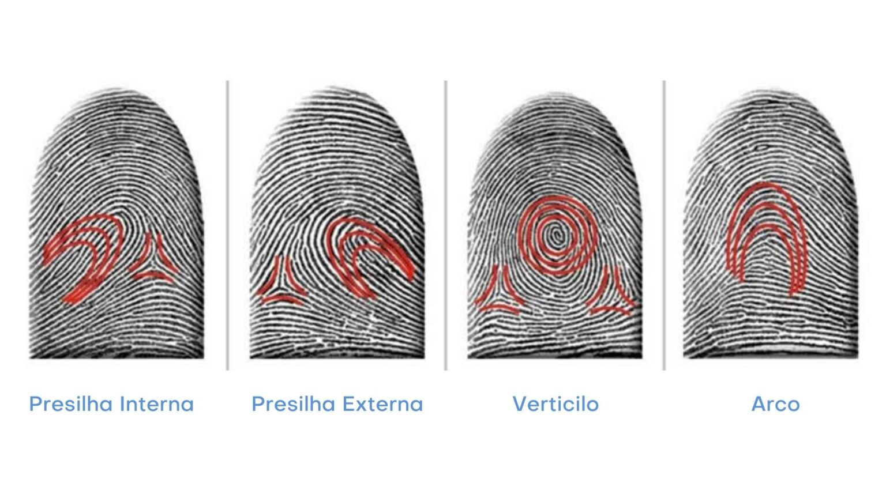{ align=center, width="500"}
</figure>
> Os três padrões macroscópicos mais comuns internacionalmente são o Arco (Arch), Laço (Loop) e Espiral (Whorl), mas a imagem acima mostra 4 porque é conhecida como o Sistema de Vucetich, que é o padrão oficial no Brasil. Internacionalmente, a Presilha Interna e Externa são agrupados na categoria geral de Laço (Loop)

 Na etapa de comparação final (matching), o algoritmo também avalia a quantidade de atributos próximos e coincidentes para determinar o nível de confiança da autenticação. Se os pontos coincidirem em posição e tipo em uma quantidade suficiente, o acesso é liberado!

<figure markdown="span">
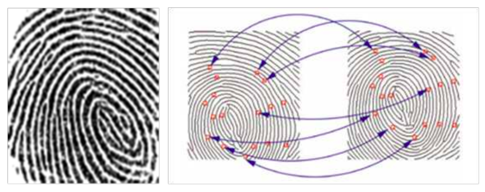{ align=center, width="500"}
</figure>

---

## Histórico de Evolução

### 2025-12-23 - Pesquisa Inicial
- Entendimento básico sobre cristas/vales, tipos de sensores, ADC, normalização, filtros, afinamento, minúcias e matching.

### 2025-12-26 - Entendimento das Fórmulas de Capacitância e Filtro Gaussiano
- Fundamentos de capacitância com fórmulas
- Entendimento básico do filtro Gaussiano e preparamento para o filtro de Gabor
