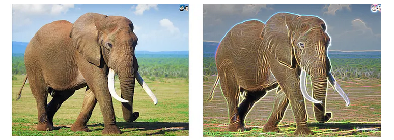

# Filtro de Gabor

<figure markdown="span">
{ align=center, width="500"}
</figure>

O Filtro de Gabor é uma ferramenta matemática essencial em processamento de imagens e visão computacional, famosa por imitar a maneira como o cérebro humano processa informações visuais. Ele foi desenvolvido pelo físico húngaro Dennis Gabor em 1946 e é amplamente usado em reconhecimento de impressões digitais, análise de texturas e detecção de bordas.

Em termos simples, **o Filtro de Gabor é um detector de padrões linear.** Ele é usado para analisar se existe um conteúdo de frequência específico (como uma textura ou uma borda) em uma direção específica em uma região localizada da imagem.

Ela nada mais é do que a multiplicação de duas funções matemáticas famosas: uma Gaussiana (envelope) e um Cosseno (onda). A fórmula geral para gerar o valor de cada posição $(x,y)$ do filtro é:

$$G(x, y) = \underbrace{\exp\left(-\frac{x'^2 + \gamma^2 y'^2}{2\sigma^2}\right)}_{\text{Parte 1: Gaussiana}} \times \underbrace{\cos\left(2\pi\frac{x'}{\lambda} + \psi\right)}_{\text{Parte 2: Onda}}$$

Vamos decifrar as variáveis (os "ingredientes"):

- $\lambda$ (Lambda): É o comprimento da onda. Na digital, é a distância média entre duas linhas pretas (cristas). Se a pessoa tem dedos grandes, o $\lambda$ é maior.

- $\theta$ (Theta): É o ângulo de rotação. É aqui que definimos se o filtro vai procurar linhas verticais, horizontais ou inclinadas.

- $\sigma$ (Sigma): É o tamanho do foco. Controla o tamanho da "mancha" Gaussiana. Determina quantos vizinhos o filtro vai olhar. Veja mais sobre isso na [página de Filtro Gaussiano](./gaussian.md)

- $\gamma$ (Gama): É a elipticidade. Define se o filtro é um círculo perfeito ou uma elipse esticada (geralmente queremos elipse para acompanhar a linha da digital).

### O Truque da Rotação ($x'$ e $y'$):

Para aplicar o ângulo ($\theta$), não usamos o $x$ e $y$ originais da imagem. Nós rotacionamos as coordenadas:

$$x' = x \cos\theta + y \sin\theta$$

$$y' = -x \sin\theta + y \cos\theta$$

Isso garante que a "onda" do filtro esteja apontando para a direção certa.

### A Aplicação (Convolução)

Agora que temos a fórmula, como ela vira código/aplicação? Através de uma matriz numérica pequena, chamada Kernel. Imagine que calculamos a fórmula acima para uma grelha de 5x5 pixels. Teremos uma matriz de números parecida com isto (exemplo simplificado):

$$
\begin{bmatrix}
-1 & -2 &  4 & -2 & -1 \\
-2 & -4 &  8 & -4 & -2 \\
 0 &  0 &  0 &  0 &  0 \\
 2 &  4 & -8 &  4 &  2 \\
 1 &  2 & -4 &  2 &  1
\end{bmatrix}
$$

> Isso tem a ver com o Filtro Gaussiano. Clique [AQUI](./gaussian.md) para entender melhor como isso é formado!

O Passo a Passo na imagem é a seguinte:

1. Sobreposição: O computador pega essa matriz 5x5 e coloca em cima de um pedaço 5x5 da sua imagem digital.
2. Multiplicação: Ele multiplica o número da matriz pelo valor do pixel da imagem que está embaixo dele.

    > Ex: Pixel da imagem (200) $\times$ Valor do filtro (4) = 800.

3. Soma: Ele soma todos os 25 resultados dessas multiplicações.
4. Resultado: Essa soma vira o novo valor do pixel central.
5. Deslize: A matriz desliza 1 pixel para o lado e repete o processo.

O gif abaixo mostra melhor essa etapa de convolução:

<figure markdown="span">
{ align=center, width="300"}
</figure>

### O "Pulo do Gato": Banco de Filtros

Aqui está o segredo que faz funcionar em digitais: Uma única fórmula não basta. Como a digital muda de direção o tempo todo (faz curvas), aplicar um filtro com $\theta = 0º$ (vertical) só limparia as partes verticais e estragaria as horizontais.

O sistema cria um Banco de Filtros (vários Kernels diferentes).

- Filtro 1: $\theta = 0º$
- Filtro 2: $\theta = 22.5º$
- Filtro 3: $\theta = 45º$... até 180º.

Antes de filtrar, o sistema calcula o mapa de orientação da digital original. Ele descobre: "Neste pixel $(10,10)$, a linha está a 45º". Ele seleciona apenas o Filtro 3 (que é de 45º) para aplicar naquele pixel específico.

Assim, a fórmula matemática cria pequenos moldes (matrizes). O computador escolhe o molde que tem o mesmo ângulo da linha da digital naquele ponto e aplica a matemática (convolução) para reforçar a linha e apagar o ruído.

## Referências

- https://medium.com/@anuj_shah/through-the-eyes-of-gabor-filter-17d1fdb3ac97
- Hong, L., Wan, Y., & Jain, A. (1998). "Fingerprint image enhancement: Algorithm and performance evaluation".
    > Este é o artigo científico que definiu como o Filtro de Gabor é usado mundialmente para limpar digitais.
