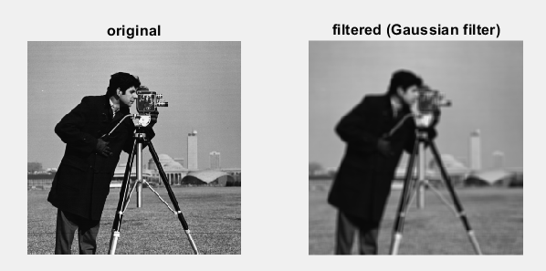
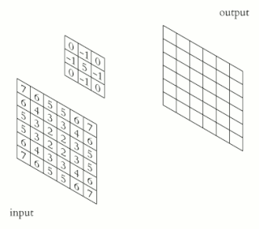

# Filtro Gaussiano

<figure markdown="span">
{ align=center, width="400"}
</figure>

O Filtro Gaussiano é uma ferramenta fundamental em processamento de imagens e visão computacional, usada para suavizar imagens e reduzir ruído.

## 1) O Conceito Principal: A Curva do Sino

O nome "Gaussiano" vem da matemática (Distribuição Gaussiana ou Normal), que tem o formato de um sino.

- No centro do sino (topo): O valor é máximo.
- Nas bordas do sino: O valor cai suavemente até quase zero.

Quando aplicamos isso a uma imagem, dizemos ao computador: **"Dê muita importância ao pixel central que estamos analisando, e um pouco de importância aos vizinhos, mas quanto mais longe o vizinho, menos ele importa."**

## 2) Como Funciona

Diferente de uma Média Simples (onde todos os vizinhos têm o mesmo peso), o Filtro Gaussiano usa uma Média Ponderada. O processo é feito através de uma "janela" (chamada de Kernel ou Máscara) que desliza sobre toda a imagem, pixel por pixel.

1. O filtro pega um pixel central.
2. Olha para os vizinhos ao redor.
3. Multiplica o valor de cada vizinho por um "peso" (baseado na curva do sino).
4. Soma tudo e define o novo valor do pixel central.

Para entender melhor, vamos ver como isso funciona...

## 3) Exemplo Prático

Imagine uma pequena região de 3x3 pixels da sua imagem em tons de cinza (valores de 0 a 255):

$$
\begin{bmatrix}
100 & 100 & 100 \\
100 & \textbf{200} & 100 \\
100 & 100 & 100
\end{bmatrix}
$$

Note que temos um ponto brilhante (200) cercado por um fundo cinza (100). Isso pode ser um ruído (noise). Como poderíamos perceber se é um ruído ou não? Simples, comparando com seus vizinhos, assim vamos saber se o valor faz sentido ou se é algum erro.

Para fazer essa comparação com os vizinhos, primeiro precisamos definir com quantos vizinhos vamos comparar e é isso que chamamos de **Tamanho do Kernel**. 

O tamanho do kernel define quantos pixels ao redor do pixel central vamos considerar. Por exemplo:

- Um kernel **3×3** olha para 8 vizinhos (mais o pixel central = 9 pixels no total)
- Um kernel **5×5** olha para 24 vizinhos (mais o pixel central = 25 pixels no total)
- Um kernel **7×7** olha para 48 vizinhos (mais o pixel central = 49 pixels no total)

> **Por que geralmente usamos números ímpares?** Porque assim temos um pixel central bem definido! Com um kernel 3×3, o pixel central está exatamente no meio (posição 2,2). Com um kernel 4×4, não teríamos um centro único, o que complicaria a comparação com vizinhos.

**Quanto maior o kernel, mais vizinhos são considerados e mais suave será o efeito, mas também mais "borrada" a imagem ficará.** É um equilíbrio entre remover ruído e preservar detalhes.

Agora vamos pegar um kernel. Para criar um Kernel Gaussiano nós usamos uma fórmula matemática precisa para calcular o valor de cada quadradinho da matriz.

A fórmula do Gaussiano 2D é:

$$
G(x, y) = \frac{1}{2\pi\sigma^2} \cdot e^{-\frac{x^2 + y^2}{2\sigma^2}}
$$

> Eu sei, parece loucura. Mas calma, vamos entender tudo de forma simples, como sempre!

Não precisamos calcular a fórmula completa na mão, mas precisamos entender o que ela faz. Ela pede três coisas:

- $x$ e $y$ são as coordenadas de cada posição no kernel, medidas a partir do centro. O centro é $(0,0)$, então um pixel à esquerda seria $(-1, 0)$, um pixel acima seria $(0, -1)$, e assim por diante.
- $\sigma$ (sigma) é o desvio padrão, que controla o "espalhamento" do filtro.

    > Ele decide o quão "contagiosa" é a influência do pixel central sobre os vizinhos. Na prática, quanto maior esse número, mais borrado vai ficar porque está dizendo: "Todo mundo tem quase a mesma importância. Vamos misturar tudo!"

- $e$ e $\pi$ são constantes matemáticas padrão, então já é da fórmula.

> Voce pode acessar uma calculadora geradora diso clicando [**AQUI**](http://demofox.org/gauss.html).

### Como a fórmula vira um kernel?

Vamos escolher um tamanho de kernel para nosso exemplo. Vamos começar com **3×3** porque é simples e muito comum. Agora, o computador aplica a fórmula $G(x, y)$ para cada uma das 9 posições do kernel 3×3. Por exemplo:

- No centro $(0, 0)$: a fórmula retorna o valor máximo (porque $x^2 + y^2 = 0$)
- Nas posições adjacentes como $(1, 0)$ ou $(0, 1)$: valores médios
- Nas quinas como $(1, 1)$: valores menores (mais distantes do centro)

O resultado são números decimais que formam o "formato do sino". Se você calcular com $\sigma = 1$, por exemplo, obteria algo como:

- Centro: ~0.16
- Adjacentes: ~0.10  
- Quinas: ~0.06

Para facilitar os cálculos e a visualização, é comum usar uma **aproximação inteira** desses valores, multiplicando tudo por um fator (normalizando) e arredondando para números inteiros. Isso mantém as proporções do sino, mas torna tudo mais simples de trabalhar.  

Este é um exemplo de um kernel 3×3 (os valores somam 16 para facilitar a divisão final):

$$
\begin{bmatrix}
1 & 2 & 1 \\
2 & 4 & 2 \\
1 & 2 & 1
\end{bmatrix}
$$

> **Olhe com atenção:** Veja como o formato do sino aparece aqui. O centro é alto (4), os vizinhos diretos são médios (2) e as quinas distantes são baixas (1). A soma de todos esses pesos é 16 ($1+2+1+2+4+2+1+2+1$). Lembre-se desse número!

Agora vamos "passar" esse kernel por cima da nossa imagem. Multiplicamos cada pixel pelo seu peso correspondente, somamos tudo e dividimos pela soma dos pesos (16):

$$
\text{Novo Valor} = \frac{(100 \times 1) + (100 \times 2) + (100 \times 1) + (100 \times 2) + (\textbf{200} \times \textbf{4}) + (100 \times 2) + (100 \times 1) + (100 \times 2) + (100 \times 1)}{16}
$$

$$
\text{Novo Valor} = \frac{100 + 200 + 100 + 200 + \textbf{800} + 200 + 100 + 200 + 100}{16}
$$

$$
\text{Novo Valor} = \frac{2000}{16} = \textbf{125}
$$

O pixel central que era 200 (muito destoante) foi suavizado para 125, ficando muito mais próximo dos vizinhos (100). O ruído foi "diluído". A **Convolução** é o nome chique que damos para o movimento de passar o Kernel por cima da imagem. Abaixo podemos ver um gif desse ato.

<figure markdown="span">
{ align=center, width="300"}
</figure>


---

### O Kernel real é um pouco mais feio...

> Esta é apenas uma simplificação didática para que você possa entender a lógica. Na vida real, o computador usa os números quebrados que variam entre 0 e 1. Ou seja, seria valores como: 

$$\begin{bmatrix}
0.0778 & 0.1233 & 0.0778 \\
0.1233 & \mathbf{0.1953} & 0.1233 \\
0.0778 & 0.1233 & 0.0778
\end{bmatrix}$$

Inclusive, a fórmula matemática da curva de Gauss (o sino) tem uma característica irritante: ela nunca toca o chão (o zero). Ela vai diminuindo, diminuindo, vira 0.0000001, depois 0.00000000001... mas matematicamente ela se estende até o infinito.

Por isso, é comum ter um valor chamado **Support (ou limiar de truncagem)**, que é o número que você define para dizer ao computador: "Computador, se o valor do peso for menor que 0.01, joga fora. Finja que é zero e corte a matriz ali." É o limite da insignificância. É como dizer: "Se a contribuição do vizinho for menor que 1 centavo, eu não quero nem saber a opinião dele".

> No caso, na matriz acima, o Support é 0.1, e por isso você não vai ver números abaixo disso...

---


## O que aconteceu?

O filtro Gaussiano "puxou" o valor do pixel central para baixo, aproximando-o da média dos vizinhos. O ruído foi suavizado. Se tivéssemos usado um Sigma maior (espalhando mais os pesos), o valor final seria ainda mais próximo de 100, mas a imagem ficaria mais borrada. É assim que o filtro remove ruídos de fotos: ele faz com que pixels "rebeldes" entrem na linha, baseando-se no consenso dos vizinhos.

# Python World

Aqui está a implementação prática em Python. A biblioteca padrão que quase todo mundo usa para isso é o OpenCV. Ela cuida de toda a matemática complexa (a fórmula e a convolução) nos bastidores com apenas uma linha de código:

```py

import cv2

# 1. Carregar a imagem
# O '0' carrega em Escala de Cinza (preto e branco), mais fácil de ver o efeito
imagem = cv2.imread('foto.jpg', 0)

# 2. Aplicar o Filtro Gaussiano (Blur)
# Parâmetro 1: A imagem de origem
# Parâmetro 2: O Tamanho do Kernel (deve ser ímpar, ex: 5x5)
# Parâmetro 3: O Sigma (0 significa "calcular automaticamente baseado no tamanho")
imagem_borrada = cv2.GaussianBlur(imagem, (5, 5), 0)

# 3. Mostrar o resultado
cv2.imshow('Original', imagem)
cv2.imshow('Gaussian Blur', imagem_borrada)
cv2.waitKey(0)

```

## Guia Prático: Escolhendo Tamanho e Sigma

Basicamente, a combinação de **Tamanho do Kernel** e **Sigma** define o que você quer. Aqui estão três cenários comuns:

### A. Limpeza Leve (Tirar "sujeira" de escaneamento)

> **Uso:** Documentos escaneados ou fotos com pouca luz e granulação fina.

- **Tamanho:** `(3, 3)`
- **Sigma:** `0.8` até `1.0`
- **Efeito:** A imagem quase não muda, apenas os pontinhos isolados somem. Detalhes finos (cabelo, texto pequeno) são preservados.

### B. Limpeza Forte (Suavização de Pele / "Modo Beleza")

> **Uso:** Remover rugas ou imperfeições em apps de selfie.

- **Tamanho:** `(5, 5)` ou `(7, 7)`
- **Sigma:** `1.5` até `2.0`
- **Efeito:** A pele fica lisa ("boneca de cera"), mas você começa a perder a textura dos poros.

### C. Efeito Artístico / Privacidade (Desfocar Fundo)

> **Uso:** Borrar rostos de pessoas ou simular o "Modo Retrato" (Bokeh).

- **Tamanho:** `(15, 15)` ou maior (sempre ímpar: `21`, `31`, `51`...)
- **Sigma:** `5.0` ou mais
- **Efeito:** A imagem fica irreconhecível. Tudo vira manchas de cor.


## Referências
- http://hyperphysics.phy-astr.gsu.edu/hbase/Math/gaufcn.html#:~:text=Gaussian%20Distribution%20Function&text=The%20nature%20of%20the%20gaussian,over%20from%20the%20binomial%20distribution%20
- https://softwarebydefault.com/2013/06/08/calculating-gaussian-kernels/
- https://www.wikiwand.com/en/articles/Gaussian_blur
- https://www.wikiwand.com/en/articles/Kernel_(image_processing)
- https://homepages.inf.ed.ac.uk/rbf/HIPR2/gsmooth.htm
- https://menimato.github.io/IMGedu.jl/filtragem.html
- https://lvelho.impa.br/ip09/demos/jbu/filtros.html
- https://medium.com/turing-talks/implementa%C3%A7%C3%A3o-do-desfoque-gaussiano-d6e21e314920
- https://datahacker.rs/opencv-average-and-gaussian-filter/