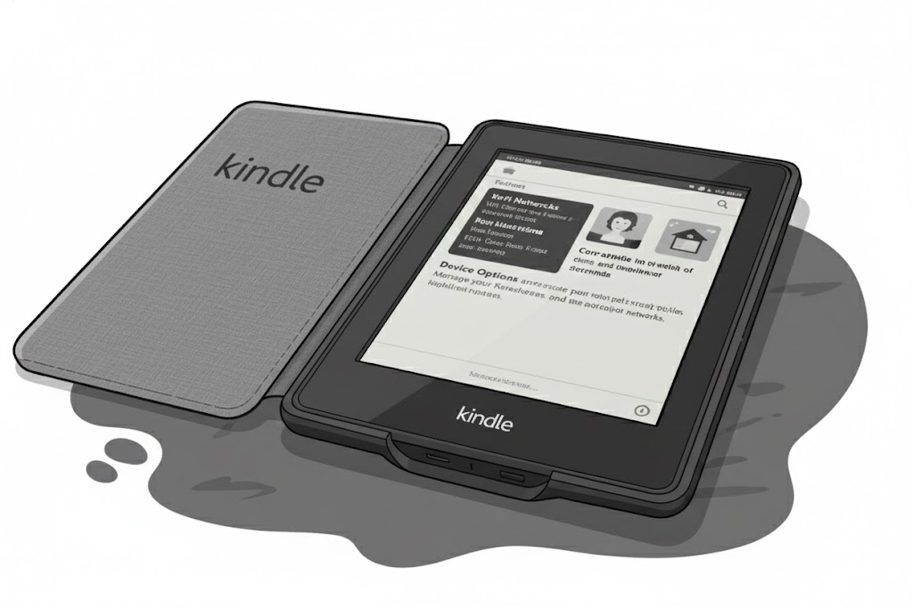
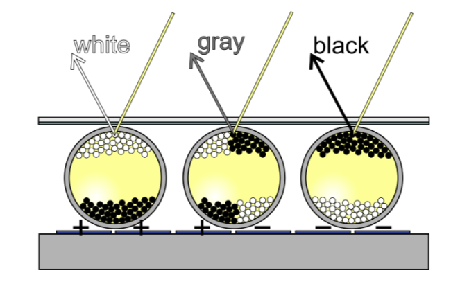
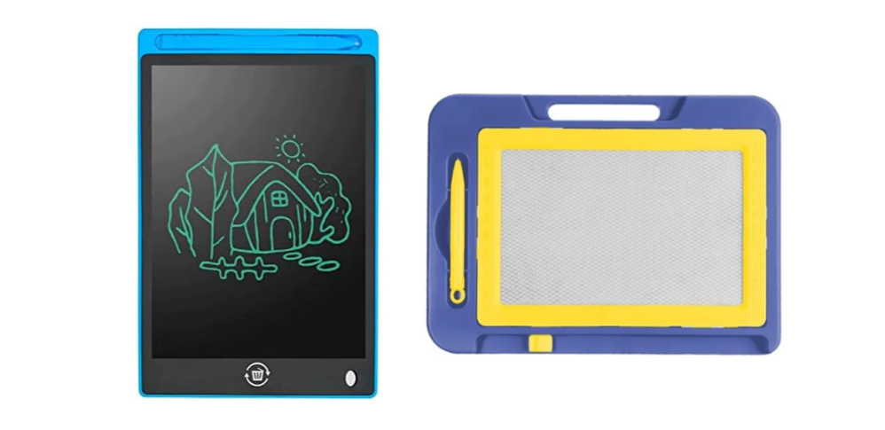
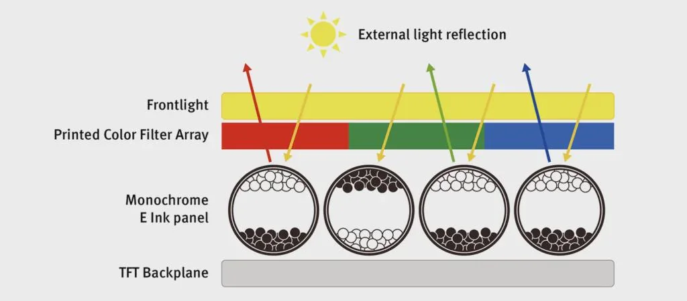
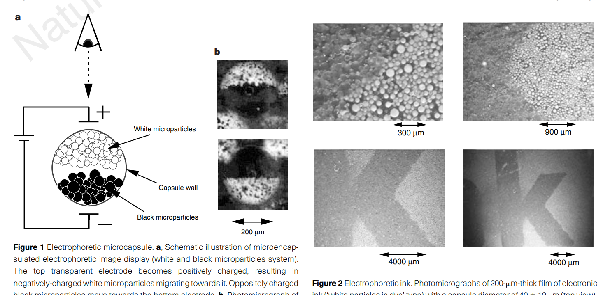

# Como funciona a tela do Kindle (E-ink)

Você já deve ter visto um e-reader (como o Kindle) e notou a diferença na "tela" dele em comparação com os smartphones. Pois é, não é falha dos seus olhos, é porque realmente aquilo não é uma tela, e sim uma forma diferente de visualização chamada E-ink (ou tinta eletrônica).

> O termo e-reader vem do inglês e é a junção de “e”, que significa electronic (eletrônico), e “reader”, que significa leitor. Dessa forma, e-reader pode ser traduzido como “leitor eletrônico”.

## O que é o E-ink?

<figure markdown="span">
{ align=center, width="500"}
</figure>

Diferente das telas de celulares e notebooks (LCD ou OLED), que emitem luz diretamente para os seus olhos, o E-ink é uma tela reflexiva, **o que significa que ele usa a luz do ambiente para que você possa enxergar o conteúdo.** 

Ela funciona com milhões de minúsculas esferas, chamadas microcápsulas, cada uma com o diâmetro aproximado de um fio de cabelo humano. Dentro de cada microcápsula, existe um líquido transparente e partículas de pigmento com cargas elétricas:

- **Partículas Brancas:** Geralmente possuem carga positiva.
- **Partículas Pretas:** Geralmente possuem carga negativa.

Abaixo e acima dessas cápsulas, existem eletrodos que aplicam um campo elétrico. Quando o eletrodo inferior aplica uma carga negativa, ele atrai as partículas brancas (positivas) para o fundo e empurra as pretas (negativas) para o topo. O resultado é que aquele "pixel" aparece preto, branco ou cinza para você.

<figure markdown="span">
{ align=center, width="500"}
</figure>

Aliás, o princípio é semelhante àquele quadro mágico de brinquedo para crianças. No brinquedo, você usa uma caneta magnética para "puxar" o pó escuro (ou outra cor) para a superfície e formar o desenho, que fica lá estático sem precisar de pilhas. No Kindle, a lógica é quase a mesma: em vez de um ímã, o aparelho usa impulsos elétricos para mover milhões de partículas de tinta para a frente ou para o fundo da tela. É por isso que, assim como no brinquedo, a imagem não consome energia para ficar parada e não emite luz, parecendo papel de verdade.

<figure markdown="span">
{ align=center, width="500"}
</figure>

## Os 2 "superpoderes" do E-ink

1. **Biestabilidade (Consumo de energia quase zero):** O E-ink é biestável, como já citado. Isso significa que, uma vez que as partículas se moveram para uma posição (formando uma letra, por exemplo), elas permanecem lá sem precisar de energia.

    > No Kindle: Você gasta bateria apenas para mudar de página. Se você deixar o aparelho ligado em uma página por um mês, ele não consumirá bateria para manter aquela imagem estática.

2. **Reflexão vs. Emissão:** Telas comuns são como lanternas apontadas para o seu rosto. Já o E-ink funciona como um livro físico: ele reflete a luz solar ou da lâmpada.
> Resultado: Quanto mais sol bater na tela, melhor a visibilidade. Além disso, a ausência de luz direta e de cintilação (flicker) reduz drasticamente o cansaço visual.

## Por que a tela "pisca"? (Ghosting)

Se você já usou um e-reader, deve ter notado que, de vez em quando, a tela inverte as cores (fica toda preta) e depois volta ao normal. Isso não é defeito, é faxina!

Como estamos lidando com partículas físicas se movendo, às vezes fica um "rastro" da página anterior, o chamado **Ghosting**. Aquele "piscar" da tela é um **Full Refresh**: o sistema força todas as partículas a se moverem para garantir que nenhum pigmento ficou perdido no caminho, deixando o texto nítido novamente.

## Só funciona com preto e branco?

Não, é possível sim ter mais cores.

A base da tela continua sendo a mesma tinta eletrônica preto e branco (as microcápsulas com partículas positivas e negativas). A grande diferença é que, por cima dessa camada de "papel digital", existe um Filtro de Matriz de Cores (CFA - Color Filter Array). Este filtro é composto por minúsculos pontos nas cores primárias de luz: Vermelho, Verde e Azul (RGB).

<figure markdown="span">
{ align=center, width="600"}
</figure>

Quando o Kindle quer exibir uma cor específica (por exemplo, um marcador de texto amarelo ou a capa de um livro):

1. As partículas brancas da camada inferior são empurradas para a superfície sob os filtros correspondentes.

2. A luz do ambiente (ou a luz frontal do aparelho) atravessa o filtro colorido, bate na partícula branca e reflete de volta para os seus olhos.

Ao combinar diferentes intensidades de luz refletida através dos filtros vermelho, verde e azul, o aparelho consegue criar até 4.096 cores diferentes.

### O acerto não foi de primeira

Antes de chegar nessa estratégia, houve diversas outras abordagens para tentar trazer cores para as telas E-Ink:

- **"Era das Etiquetas" (1997):** As primeiras tentativas não eram "coloridas" no sentido pleno. O que elas faziam era exibir apenas três cores (preto, branco e um "toque" de vermelho ou amarelo), focada em etiquetas de preço de supermercado.
- **Filtros (2010):** A primeira tecnologia para consumidores foi o Triton. Ele usava um filtro de vidro com quadrados coloridos (RGB) sobre a tinta preta e branca. No entanto, como as telas e-ink não emitem luz própria (são reflexivas), o filtro de vidro "roubava" muita luz, deixando a tela escura e com resolução muito baixa. O mercado não aceitou bem.
- **Multipigmentos (2016):** Em vez de filtros, os cientistas tentaram colocar partículas de cores diferentes (Ciano, Magenta, Amarelo e Branco) dentro de cada microcápsula. Essa tecnologia, chamada ACeP (Advanced Color ePaper) ou E Ink Gallery, conseguia criar até 50 mil cores, mas era muito lenta para atualizar a página, sendo usada inicialmente apenas em sinalização digital (cartazes).

- **A nova tentativa do filtro (2019):** A grande virada para os consumidores ocorreu quando uma equipe decidiu redesenhar a ideia do filtro (do antigo Triton), mas de uma forma muito mais avançada:

    - Em vez de uma camada extra de vidro, eles imprimiram o filtro colorido diretamente no filme plástico da tela e adicionaram uma luz frontal (front light) projetada especificamente para rebater na tinta e passar pelo filtro com eficiência.

    Com isso, o primeiro lote da tecnologia Kaleido saiu da fábrica no final de 2019. Em 2020, os primeiros smartphones e e-readers (como o Hisense A5C e o PocketBook Color) chegaram ao mercado. Hoje já estamos na geração **Kaleido 3** (2022), que melhorou significativamente a saturação das cores e a resolução, permitindo histórias em quadrinhos muito mais vibrantes.

> Podemos ver a história mais detalhada na página [IEEE Spectrum - How E Ink Developed Full-Color e-Paper ](https://spectrum.ieee.org/how-e-ink-developed-full-color-epaper)

## Se é tão bom, porque não usamos nos celulares?

O principal motivo é o Refresh Rate (taxa de atualização). O movimento físico das partículas dentro das cápsulas leva tempo (fração de segundo). Isso torna a navegação em menus ou a reprodução de vídeos impossível com a tecnologia atual, pois a tela pareceria estar "travando" o tempo todo.

# Um pouco de história

A tecnologia foi concebida dentro do Massachusetts Institute of Technology (MIT), especificamente no Media Lab. O "pai" da ideia foi o professor Joe Jacobson. Jacobson estava de férias na praia, terminando um livro, e pensou: "Por que eu não posso simplesmente apertar um botão e ter um livro novo nestas mesmas páginas?". Ele queria algo que não tivesse o brilho cansativo das telas de tubo da época e que funcionasse sob a luz do sol.
 

Embora Jacobson tenha tido a visão, ele contou com dois estudantes de graduação brilhantes para transformar a teoria em realidade física:

- Barrett Comiskey: Um estudante de matemática.

- JD Albert: Um estudante de engenharia mecânica.

Eles trabalharam em um laboratório improvisado e, curiosamente, usaram ferramentas comuns, como misturadores de tinta de lojas de ferragens, para criar as primeiras suspensões de microcápsulas. Eles são creditados como os co-inventores da tinta eletrônica moderna.

O marco científico que apresentou o E-ink ao mundo foi publicado na prestigiada revista Nature em 1998, chamada [An electrophoretic ink for all-printing display](https://www.nature.com/articles/28349). O artigo descrevia como eles conseguiram encapsular os pigmentos em microesferas e movê-los com campos elétricos, permitindo que a "tinta" fosse impressa em quase qualquer superfície (plástico, vidro ou até tecido).

<figure markdown="span">
{ align=center, width="500"}
</figure>

Mas, antes mesmo do artigo na Nature, Jacobson e seus alunos, junto com investidores, fundaram a E Ink Corporation em 1997 para comercializar a tecnologia. Durante anos, o E-ink foi uma "tecnologia em busca de um produto". Ele foi usado primeiro em placas de sinalização de lojas (como a J.C. Penney) antes de chegar aos leitores de livros. Muitas pessoas acham que o Kindle foi o primeiro, mas houve pioneiros antes dele:

- **Sony Librié (2004):** O primeiro e-reader comercial com tela E-ink, lançado apenas no Japão. Ele era elegante, mas tinha um sistema de "aluguel" de livros que os usuários odiavam.

- **Sony Reader PRS-500 (2006):** A primeira tentativa séria nos EUA.

- **Amazon Kindle (2007):** Foi o divisor de águas. Jeff Bezos percebeu que o segredo não era apenas a tela, mas a conectividade. O Kindle vinha com 3G gratuito para comprar livros de qualquer lugar, o que tornou a tecnologia E-ink um sucesso global.

> Apesar de ter nascido no MIT (EUA), a E Ink Corporation foi comprada em 2009 pela sua principal fornecedora, uma empresa taiwanesa chamada Prime View International (PVI). Hoje, a empresa resultante chama-se simplesmente E Ink e detém quase todas as patentes e o monopólio global da produção dessas telas.