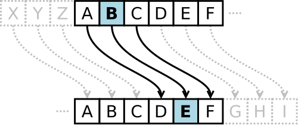
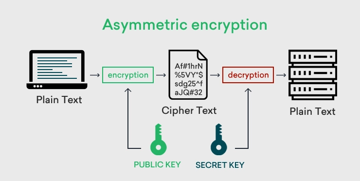
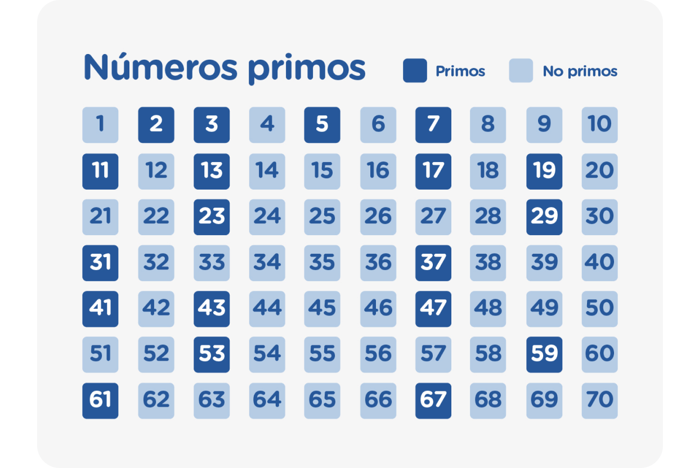

# Como o Algoritmo RSA funciona?

Este post explica os fundamentos que permitem a segurança e o uso do RSA, um dos sistemas de criptografia mais usados e seguros do mundo.

## 1) O que é o RSA?

De forma direta, o RSA é um algoritmo de criptografia assimétrica amplamente usado para proteger dados sensíveis, como em comunicações online e assinaturas digitais. 

Ele foi desenvolvido em 1977 por Ron Rivest, Adi Shamir e Leonard Adleman (daí o nome RSA), revolucionando a segurança digital ao eliminar a necessidade de trocar chaves secretas previamente. 
> O título oficial do trabalho é: ["A Method for Obtaining Digital Signatures and Public-Key Cryptosystems"](https://apps.dtic.mil/sti/citations/ADA606588).

Para entender melhor a importância disso, é necessário entender o que é criptografia.

<figure markdown="span">
{ align=center, width="500"}
</figure>

Podemos definir a criptografia como o processo de codificar informações para protegê-las contra acesso não autorizado, transformando dados legíveis (texto simples) em formato ilegível (texto cifrado) usando algoritmos matemáticos. Para tornar os textos ilegíveis, temos basicamente 2 formas:

- **Criptografia simétrica:** uma mesma chave é utilizada para criptografar e descriptografar.
    > Utilizada em VPNs, WPA (Redes Wi-Fi), Criptografia de disco (BitLocker, Veracrypt), entre outros.
- **Criptografia assimétrica:** utiliza duas chaves diferentes, uma para criptografar e outra para descriptografar.
    > Utilizada no SSL/TLS (HTTPS), Certificados digitais, PGP/GPG (Criptografia de email), SSH (Acesso remoto seguro), Blockchain, entre outros.

## 2) Entendendo as partes

Então, podemos resumir que, para criptografar alguma coisa, temos a combinação de 2 elementos:

- **Chave**: É o "segredo", ou senha que vai permitir acessar aquela informação.
- **Algoritmo**: É a "estratégia", o cálculo utilizado que vai permitir usar aquela chave para esconder as informações de alguma forma.

Para deixar isso mais claro, podemos usar como exemplo um algoritmo bastante famoso: a [Cifra de César](https://pt.wikipedia.org/wiki/Cifra_de_C%C3%A9sar). Trata-se de um método simples de criptografia usado pelo general romano Júlio César para proteger mensagens militares.

<figure markdown="span">
{ align=center, width="500"}
</figure>

Desenvolvida por volta de 50 a.C., essa cifra substitui cada letra do texto pela letra três posições à frente no alfabeto (ex.: A vira D, B vira E). Assim, uma mensagem como **"ATAQUE AO AMANHECER"** com deslocamento 3 vira **"DWDXHDDRDPDQDNHFHU"**. Para decifrar, desloca-se três posições para trás. 

Assim, podemos entender que, nesse caso:

- **Algoritmo:** pegar cada letra e substituí-la pela letra que está *n* posições à frente no alfabeto.
- **Chave:** o número 3. Se mudássemos a chave para 4 ou 5, obteríamos um texto diferente, que só quem soubesse o deslocamento conseguiria decifrar.

> Note que a Cifra de César pode ser considerada uma criptografia simétrica, já que a mesma chave (no caso, o número de deslocamento das posições) é usada para criptografar e descriptografar.

## 3) Entendendo a Criptografia Assimétrica

<figure markdown="span">
{ align=center, width="500"}
</figure>

Nesse modelo, a criptografia é feita usando um par de chaves: chave pública e chave privada. A chave pública pode ser compartilhada com qualquer pessoa, enquanto a chave privada deve ser mantida em segredo (porque só ela consegue acessar os dados).

Um dos algoritmos mais famosos que utilizam essa estratégia é o RSA, no qual estamos focados aqui.

### 3.1) Onde reside a segurança desse método? (O Fundamento Matemático)

Essa criptografia que utilizamos atualmente se baseia no fato de que não temos processamento suficiente para encontrar a chave de criptografia por força bruta (no caso, a chave privada). Isso significa que, se alguém tentar descobrir a chave por tentativa e erro, levaria uma quantidade enorme de anos, tornando o ataque inviável.

O RSA é fundamentado em um ingrediente secreto: números primos. Esses números são considerados os "átomos" da matemática, porque dão origem a todos os outros números.

> Como assim? Qualquer número composto é resultado da multiplicação de dois primos. Qualquer um. 15 = 3×5, 20 = 5×2×2.

<figure markdown="span">
{ align=center, width="500"}
</figure>

Por esse motivo, são chamados de blocos de construção da matemática. Eles são os mais estudados pelos matemáticos porque são cobertos de mistérios. Por exemplo, é impossível predizer onde estará o próximo número; houve muitas tentativas ao longo da história, mas todas falharam. Eles parecem ser completamente aleatórios.

E é aí que entra a ideia do RSA: multiplicação de primos. É fácil multiplicar dois números primos, mas é incrivelmente difícil descobrir quais números primos foram usados para formar esse número. 

Isso é conhecido como uma **função de alçapão** ou uma **função unidirecional**. Embora seja fácil percorrer um caminho, é computacionalmente inviável percorrer o outro caminho.

> Cozinhar um ovo é uma função unidirecional: é fácil ferver um ovo, mas não é possível desfervê-lo.