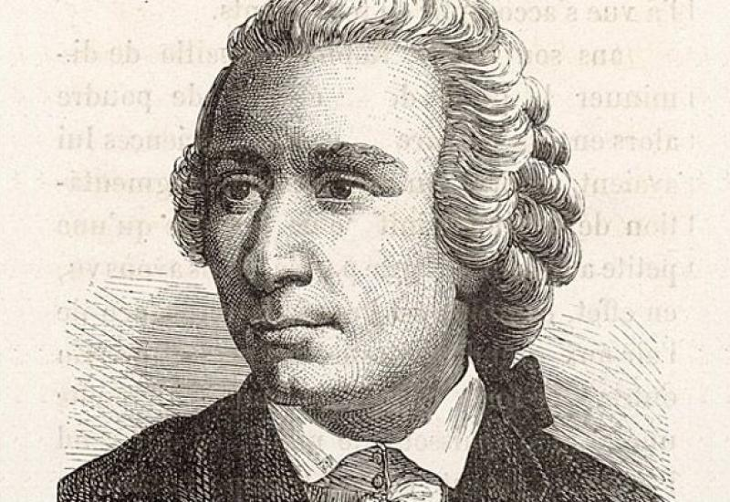
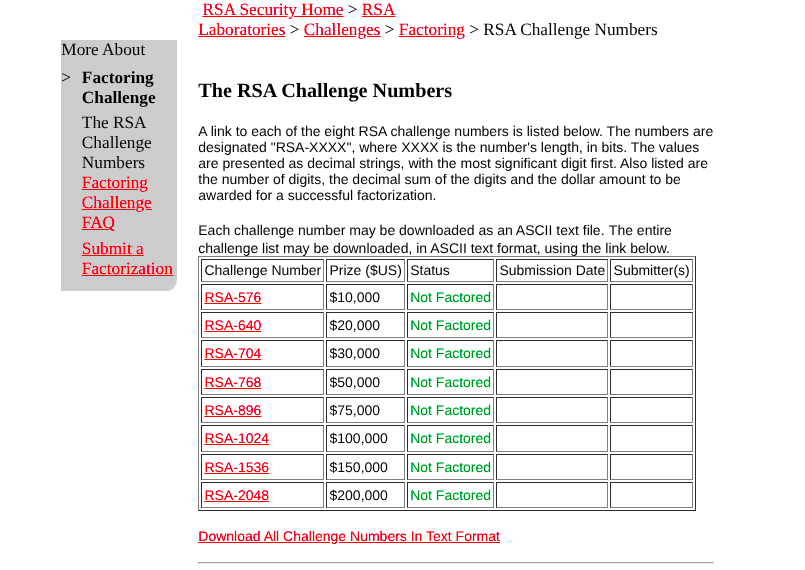

# Como o Algoritmo RSA funciona?


Este post explica os fundamentos que permitem a segurança e o uso do RSA, um dos sistemas de criptografia mais usados e seguros do mundo.


## 1) O que é o RSA?

De forma direta, o RSA é um algoritmo de criptografia assimétrica amplamente usado para proteger dados sensíveis, como em comunicações online e assinaturas digitais. 

Ele foi desenvolvido em 1977 por Ron Rivest, Adi Shamir e Leonard Adleman (daí o nome RSA), revolucionando a segurança digital ao eliminar a necessidade de trocar chaves secretas previamente. 
> Para os interessados, o título oficial do trabalho é: ["A Method for Obtaining Digital Signatures and Public-Key Cryptosystems"](https://apps.dtic.mil/sti/citations/ADA606588).

Para entender melhor a importância disso, é necessário entender o que é criptografia.

<figure markdown="span">
{ align=center, width="500"}
</figure>

Podemos definir a criptografia como o processo de codificar informações para protegê-las contra acesso não autorizado, transformando dados legíveis (texto simples) em formato ilegível (texto cifrado) usando algoritmos matemáticos. Para tornar os textos ilegíveis, temos basicamente 2 formas:

- **Criptografia simétrica:** uma mesma chave é utilizada para criptografar e descriptografar.

    > Utilizada em VPNs, WPA (Redes Wi-Fi), Criptografia de disco (BitLocker, Veracrypt), entre outros.
    
- **Criptografia assimétrica:** utiliza duas chaves diferentes, uma para criptografar e outra para descriptografar.

    > Utilizada no SSL/TLS (HTTPS), Certificados digitais, PGP/GPG (Criptografia de email), SSH (Acesso remoto seguro), Blockchain, entre outros.


## 2) Entendendo as partes

Então, podemos resumir que, para criptografar alguma coisa, temos a combinação de 2 elementos:

- **Chave**: É o "segredo", ou senha que vai permitir acessar aquela informação.
- **Algoritmo**: É a "estratégia", o cálculo utilizado que vai permitir usar aquela chave para esconder as informações de alguma forma.

Para deixar isso mais claro, podemos usar como exemplo um algoritmo bastante famoso: a [Cifra de César](https://pt.wikipedia.org/wiki/Cifra_de_C%C3%A9sar). Trata-se de um método simples de criptografia usado pelo general romano Júlio César para proteger mensagens militares.

<figure markdown="span">
{ align=center, width="500"}
</figure>

Desenvolvida por volta de 50 a.C., essa cifra substitui cada letra do texto pela letra três posições à frente no alfabeto (ex.: A vira D, B vira E). Assim, uma mensagem como **"ATAQUE AO AMANHECER"** com deslocamento 3 vira **"DWDXHDDRDPDQDNHFHU"**. Para decifrar, desloca-se três posições para trás. 

Assim, podemos entender que, nesse caso:

- **Algoritmo:** pegar cada letra e substituí-la pela letra que está *n* posições à frente no alfabeto.
- **Chave:** o número 3. Se mudássemos a chave para 4 ou 5, obteríamos um texto diferente, que só quem soubesse o deslocamento conseguiria decifrar.

> Note que a Cifra de César pode ser considerada uma criptografia simétrica, já que a mesma chave (no caso, o número de deslocamento das posições) é usada para criptografar e descriptografar.

## 3) Entendendo a Criptografia Assimétrica

O modelo simétrico é bastante intuitivo, como você pôde ver: uma senha que embaralha e desembaralha. Mas, e como funciona o modelo assimétrico?

<figure markdown="span">
{ align=center, width="500"}
</figure>

Nesse modelo, a criptografia é feita usando um par de chaves: chave pública e chave privada. A chave pública pode ser compartilhada com qualquer pessoa, enquanto a chave privada deve ser mantida em segredo (porque só ela consegue acessar os dados). Em resumo:

- **Chave Pública:** Responsável por criptografar a mensagem
- **Chave Privada:** Responsável por descriptografar a mensagem

Um dos algoritmos mais famosos que utilizam essa estratégia é o RSA, no qual estamos focados aqui.

### 3.1) O Fundamento Matemático: Onde reside a segurança desse método?

Essa criptografia que utilizamos atualmente se baseia no fato de que não temos processamento suficiente para encontrar a chave de criptografia por força bruta (no caso, a chave privada). Isso significa que, se alguém tentar descobrir a chave por tentativa e erro, levaria uma quantidade enorme de anos, tornando o ataque inviável. Mas, como isso é possível?

Bom, o RSA é fundamentado em um ingrediente secreto: números primos. Esses números são considerados os "átomos" da matemática, porque dão origem a todos os outros números.

> Como assim? Qualquer número composto é resultado da multiplicação de primos. Qualquer um. 15 = 3×5, 20 = 5×2×2...

<figure markdown="span">
{ align=center, width="500"}
</figure>

Por esse motivo, são chamados de blocos de construção da matemática. Eles são os mais estudados pelos matemáticos porque são cobertos de mistérios. Por exemplo, é impossível predizer onde estará o próximo número; houve muitas tentativas ao longo da história, mas todas falharam. Eles parecem ser completamente aleatórios.

E é aí que entra a ideia do RSA: multiplicação de primos. É fácil multiplicar dois números primos, mas é incrivelmente difícil descobrir quais números primos foram usados para formar esse número. Isso é conhecido como uma **função de alçapão** ou uma **função unidirecional**. Embora seja fácil percorrer um caminho, é computacionalmente inviável percorrer o outro caminho.

> Cozinhar um ovo é uma função unidirecional: é fácil ferver um ovo, mas não é possível desfervê-lo.

Tudo começa com dois números primos. No mundo real, eles têm centenas de dígitos, mas aqui usaremos dois primos pequenos para facilitar o acompanhamento. Nossos primos serão esses:

- ###$p = 3$
- ###$q = 5$

Multiplicamos os dois para obter o **módulo** $n$:

$$
n = p \times q = 3 \times 5 = 15
$$

Em seguida, iremos calcular o **totiente** — conceito explicado abaixo.

---

### 3.3) Entendendo o Totiente 

O totiente é o número que nos permitirá criar a chave privada. Também é conhecido como *“O segredo de Euler”*.

<figure markdown="span">
{ align=center, width="500"}
</figure>

**Euler** foi um matemático suíço que descobriu uma fórmula para calcular esse valor. Mas, a princípio, o que é esse totiente? Primeiro, precisamos entender o que é um número **COPRIMO**.

Esse é um termo que é dado a números cujos únicos divisores comuns são 1 e -1, ou seja, o maior divisor comum (MDC) entre eles é 1. Pare entender melhor, vamos pegar como exemplo nosso módulo, que possui valor 15, e vamos fazer o MDC:

> Para relembrar, o MDC consite em você ir fatorando um número até encontrar o maior número inteiro que divide dois ou mais números inteiros sem deixar resto na divisão.

| Operação      | Resultado | Coprimo com 15? |
| ------------- | --------- | ----------------|
| MDC(15, 1)    | 1         | ✅              |
| MDC(15, 2)    | 1         | ✅              |
| MDC(15, 3)    | 3         |                |
| MDC(15, 4)    | 1         | ✅              |
| MDC(15, 5)    | 5         |                |
| MDC(15, 6)    | 3         |                |
| MDC(15, 7)    | 1         | ✅              |
| MDC(15, 8)    | 1         | ✅              |
| MDC(15, 9)    | 3         |                |
| MDC(15, 10)   | 5         |                |
| MDC(15, 11)   | 1         | ✅              |
| MDC(15, 12)   | 3         |                |
| MDC(15, 13)   | 1         | ✅              |
| MDC(15, 14)   | 1         | ✅              |

Com isso, podemos dizer que existem 8 números que são coprimos ao 15: 1, 2, 4, 7, 8, 11, 13 e 14. **O TOTIENTE É O NOME QUE DAMOS A ESSA QUANTIDADE DE COPRIMOS DE UM NÚMERO!** Nesse caso, o totiente de 15 é 8, simples, não?

No entanto, não vamos ter todo esse trabalho massivo sempre, e por isso é que citamos Euler: ele criou uma fórmula para facilitar isso quando conhecemos a fatoração de $n$.

Quando $n$ é o produto de dois primos distintos $p$ e $q$, Euler mostrou que o totiente pode ser calculado assim:

$$
\phi(n) = (p - 1) \times (q - 1)
$$

No caso do número $15$, que pode ser escrito como $15 = 3 \times 5$, temos:

$$
\phi(15) = (3 - 1) \times (5 - 1) = 2 \times 4 = 8
$$

Ou seja, a fórmula confirma exatamente o resultado que obtivemos pela contagem dos coprimos de $15$.

Assim, o número 8 é o nosso segredo que deve ser guardado a sete chaves!

### 3.4) Calculando a Chave Pública

Para gerarmos a chave pública, a regra é que devemos escolher um número $e$ que não compartilhe divisores com 15 e que seja menor que ele. Eles são chamados de [**Números de Fermat**](https://en.wikipedia.org/wiki/Fermat_number), batizada em homenagem ao matemático francês do século XVII, Pierre de Fermat, que projetou uma fórmula que gerava esses números. 


Nesse caso, vamos escolher o **3** (mas poderia ser qualquer outro que atenda a essas condições). Este número comporá a chave pública.

Uma vez que temos a chave pública, podemos agora utilizar a fórmula para criptografar:


$$c = m^e \pmod n$$

Onde:

- c = texto cifrado
- m = mensagem que queremos criptografar (m=??)
- e = a chave pública (e=3)
- n = o módulo, que é aquela multiplicação de primos (n=15)

Para exemplificar, vamos criptografar a mensagem "8". Assim, teremos:

$$c = 8^3 \pmod{15}$$

> No mundo real, sabemos que não trabalhamos apenas com números, mas textos também.. no entanto, o RSA só entende números, então precisamos transformar o texto em um "bandão" de bits. Para isso, pegamos e transformamos em binário ou hexadecimal usando um padrão como o UTF-8.

Agora, vamos calcular isso:

$$8^3 = 512$$

$$512 \div 15 = 34 \text{ resto } 2$$

Ou seja: $512 = 15 \times 34 + 2$, portanto $512 \equiv 2 \pmod{15}$.

Então, nosso texto criptografado será **2**.

### 3.5) Calculando a chave privada

Aqui está o "pulo do gato": qualquer pessoa que veja o número 2 passando pela rede não conseguirá descobrir que a mensagem original era 8, a menos que possua a chave privada, chamada de $d$.

Esse número $d$ deve satisfazer uma condição específica: quando multiplicamos $e$ por $d$ e pegamos o resto da divisão por $\phi(n)$, o resultado precisa ser 1. Em forma matemática, isso é escrito como:

$$(e \times d) \equiv 1 \pmod{\phi(n)}$$

> De forma mais simples, precisamos encontrar o número que, quando multiplicarmos ele com a chave pública (e), o resto da divisão dele pelo nosso totiente, seja 1. Para isso, temos que ir na tentativa mesmo... ou automatizar de alguma forma.

Para agilizar, podemos fazer um breve código para descobrir isso:

```js
function encontrar_d(e, totiente){
    var i = 1;

    while (true){
        if ((e * i) % totiente == 1){
            console.log("d vale:", i);
            break;
        }
        i++;
    }
}
```

Com isso, podemos obter o resultado, que é 3.

### 3.6) Descriptografando a mensagem

Agora que já temos nossa chave privada, podemos seguir para retornar o texto para seu valor original. A fórmula para descriptografar é a seguinte:

$$m = c^d \pmod n$$

Onde:

- m = mensagem original 
- c = texto cifrado (c=2)
- d = chave privada (d=3)
- n = nosso módulo (n=15)

Com isso, podemos começar a aplicar nossos valores na fórmula:

$$m = 2^3 \pmod{15}$$

Calculando:

$$2^3 = 8$$

$$8 \equiv 8 \pmod{15} \quad \text{(pois } 8 = 15 \times 0 + 8\text{)}$$

Portanto, $m = 8$ — recuperamos exatamente a mensagem original. O ciclo está completo: criptografamos "8" com a chave pública e descriptografamos com a chave privada, obtendo de volta o "8".


Como você pode ver, embora a fórmula seja simples, a segurança vem do fato de que:

1. Para encontrar $d$, você precisa conhecer $\phi(n)$.
2. Para conhecer $\phi(n)$, você precisa saber quais são os números primos $p$ e $q$ que formam $n$.
3. Fatorar um número $n$ gigantesco para encontrar $p$ e $q$ levaria milhares de anos para os computadores atuais.

### O Desafio de Fatoração RSA

Embora o algoritmo em si seja público e patenteado originalmente pelos criadores (Rivest, Shamir e Adleman), há uma empresa chamada RSA Security (hoje parte da SecurID Corporation, sob a Dell Technologies) que gerencia o legado, incluindo, no passado, desafios de fatoração.

O Desafio de Fatoração RSA foi criado em 18 de março de 1991 com o objetivo de incentivar pesquisas em teoria dos números computacional e avaliar a dificuldade prática de fatorar números inteiros muito grandes, algo essencial para testar a segurança da criptografia RSA.

Para isso, a empresa publicou uma lista de números semiprimos (é o nome que damos aos números formados pela multiplicação de dois números primos), conhecidos como números RSA (nosso módulo $n$). Quem conseguisse fatorar alguns desses números receberia prêmios em dinheiro.

Em 2001, a RSA Laboratories ampliou o desafio e passou a oferecer prêmios entre US$ 10.000 e US$ 200.000 para quem conseguisse fatorar números com tamanhos entre 576 e 2048 bits.

<figure markdown="span">
{ align=center, width="500"}
</figure>

O desafio foi oficialmente encerrado em 2007. Segundo a própria RSA Laboratories, a indústria já possuía um entendimento muito mais avançado sobre a força criptográfica de algoritmos de chave pública e chave simétrica, tornando desnecessária a continuação da competição. Quando o programa terminou, apenas RSA-576 ([fatorado em 2003](https://web.archive.org/web/20061224002937/http://www.rsasecurity.com/rsalabs/node.asp?id=2096)) e RSA-640 ([fatorado em 2005](https://web.archive.org/web/20070104090822/http://www.rsasecurity.com/rsalabs/node.asp?id=2964)) haviam sido fatorados entre os números propostos em 2001.


---

> Você pode acessar a lista completa em [RSA Factoring Challenge | Wikipedia](https://en.wikipedia.org/wiki/RSA_Factoring_Challenge)

---


Para fins de curiosidade, os maiores “n” que foram quebrados foram o RSA-768 e o RSA-250. O primeiro, foi quebrado em 2009 (ou seja, chegaram tarde para ganhar o prêmio...), e tinha o valor:

- n = 1230186684530117755130494958384962720772853569595334792197322452151726400507263657518745202199786469389956474942774063845925192557326303453731548268507917026122142913461670429214311602221240479274737794080665351419597459856902143413

 O grupo de matemáticos Thorsten Kleinjung, Kazumaro Aoki, Jens Franke, Arjen K. Lenstra, Emmanuel Thomé, Pierrick Gaudry, Alexander Kruppa, Peter Montgomery, Joppe W. Bos, Dag Arne Osvik, Herman te Riele, Andrey Timofeev e Paul Zimmermann, após dois anos, descobriram que este “n” era o produto da multiplicação dos seguintes números primos: 
 
 - p = 33478071698956898786044169848212690817704794983713768568912431388982883793878002287614711652531743087737814467999489
 
 - q = 36746043666799590428244633799627952632279158164343087642676032283815739666511279233373417143396810270092798736308917

> O RSA-768 foi quebrado usando um método chamado de Crivo de Campos Numéricos (Number Field Sieve - NFS). Para quem quiser entender melhor, clique [AQUI](https://studylib.net/doc/27064628/factorization-of-a-768-bit-rsa-modulus) para ver o paper.

Já o RSA-250 é mais recente, sendo quebrado em 2020. E aí você pode estar se perguntando: "Ué, 250 não é menor? Então não seria fácil?". Isso ocorre porque o RSA mudou a nomenclatura com o passar dos anos.

Os primeiros números RSA (do RSA-100 até RSA-500) foram rotulados pelo número de dígitos decimais, e depois, a partir do RSA-576, passaram a usar dígitos binários.

O RSA-250 segue essa primeira convenção, o que significa que possui um número de 250 dígitos, o que dá em torno de 829 bits. O RSA-768 já utiliza a nova nomenclatura, o que significa que ele possui 768 bits (que dá 232 dígitos). Assim, podemos perceber que o RSA-768 é mais "fraco".

O RSA-250 foi fatorado em fevereiro de 2020 por uma equipe internacional de pesquisadores liderada por Thorsten Kleinjung. Eles usaram o algoritmo mais avançado conhecido para fatoração clássica: [General Number Field Sieve](https://web.archive.org/web/20200228160544/https://lists.gforge.inria.fr/pipermail/cado-nfs-discuss/2020-February/001166.html). Esse algoritmo é atualmente o método mais eficiente para fatorar números gigantes usados em criptografia RSA. Aqui estão os valores:


- n = 2140324650240744961264423072839333563008614715144755017797754920881418023447140136643345519095804679610992851872470914587687396261921557363047454770520805119056493106687691590019759405693457452230589325976697471681738069364894699871578494975937497937

E os números primos encontrados foram:

- p = 64135289477071580278790190170577389084825014742943447208116859632024532344630238623598752668347708737661925585694639798853367

- q = 3337202759497815655622601060535511422794076034476755466678452098702384172921003708025744867329688187756571898625803692062711

> Essa mesma equipe também quebrou o RSA-240, em 2019. Para fins de comparação, o número possui 240 dígitos, ou, 795 bits. Veja a lista completa em [RSA numbers | Wikipedia](https://en.wikipedia.org/wiki/RSA_numbers)


# Alguns detalhes técnicos


## O problema do tamanho

O RSA tem um limite físico: a mensagem $m$ tem que ser menor que o módulo $n$.

Então, se você tem uma chave RSA de 2048 bits, você só consegue encriptar um "número" de até 2048 bits (cerca de 256 caracteres).

Como encriptar um site inteiro ou um arquivo de 1GB? A resposta é: você não usa RSA para isso....


# Conclusão

Pois é, como já foi explicado no decorrer deste post, toda a segurança do algoritmo RSA está em proteger os números primos “p” e “q”. Com toda a tecnologia a que chegamos, o máximo que conseguimos quebrar foi o RSA-250. 

No mundo atual, certificados HTTPS emitidos por autoridades certificadoras como a DigiCert usam RSA-2048 ou maiores — inclusive chaves de 3072 e 4096 bits estão disponíveis. Isso significa que o número a ser fatorado tem pelo menos 2048 bits, o que corresponde a aproximadamente 617 dígitos decimais. Praticamente impossível de quebrar por força bruta hoje.

Esse é o número $n$ do RSA-2048 (617 dígitos decimais):

```
2519590847565789349402718324004839857142928212620403202777713783604366202070759555626401852588078440
6918290641249515082189298559149176184502808489120072844992687392807287776735971418347270261896375
0149718246911650776133798590957000973304597488084284017974291006424586918171951874612151517265463
2282168699875491824224336372590851418654620435767984233871847744479207399342365848238242811981638
1501067481045166037730605620161967625613384414360383390441495263443219011465754445417842402092461
6515723350778707749817125772467962926386356373289912154831438167899885040445364023527381951378636
564391212010397122822120720357
```

Os melhores ataques conhecidos usam o algoritmo *General Number Field Sieve* (GNFS), cuja complexidade cresce super-exponencialmente conforme o número aumenta. Aumentar apenas algumas centenas de bits no tamanho da chave pode tornar o problema bilhões ou trilhões de vezes mais difícil.

Essa segurança pode mudar no futuro se computadores quânticos conseguirem rodar o **algoritmo de Shor**, que teoricamente poderia fatorar números gigantes em tempo polinomial... mas isso é assunto para outro dia. Até mais!


---

## Histórico de Evolução

### 2026-02-28 - Fundamentos do RSA
- Entendendo o conceito de criptografia e diferenças da simétrica para assimétrica
- Explicando os fundamentos do algoritmo

### 2026-03-01 - Começando a exploração do Algoritmo
- Introdução ao fundamento matemático (totiente, coprimos)
- Explicando a classificação do RSA

### 2026-03-08 - Explicando os algoritmos para Criptografar e Descriptografar
- Detalhes de uso das fórmulas
- Exemplos de uso com código para automatizar