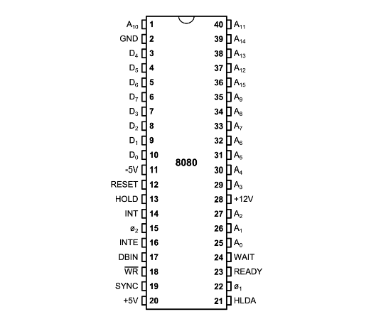
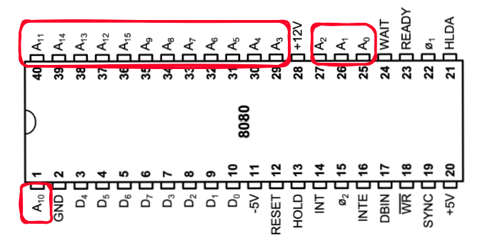
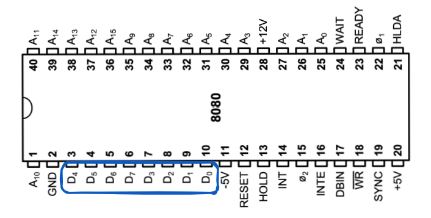
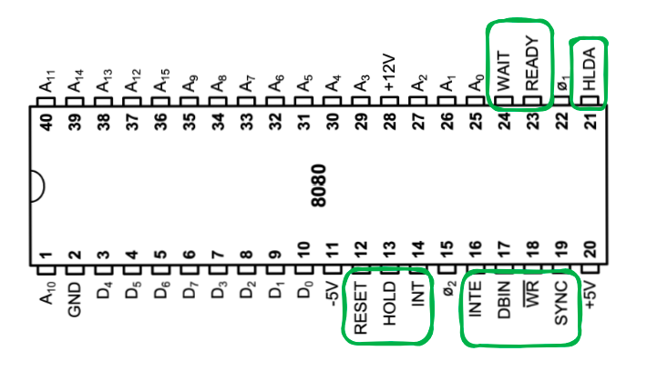
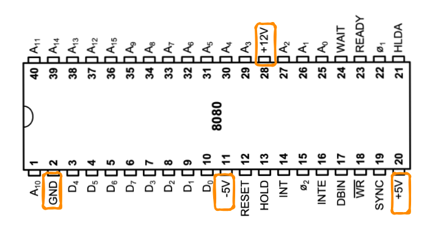
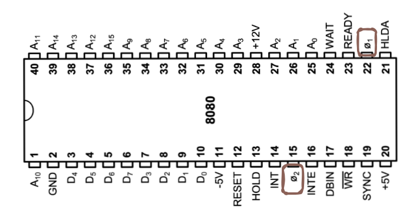
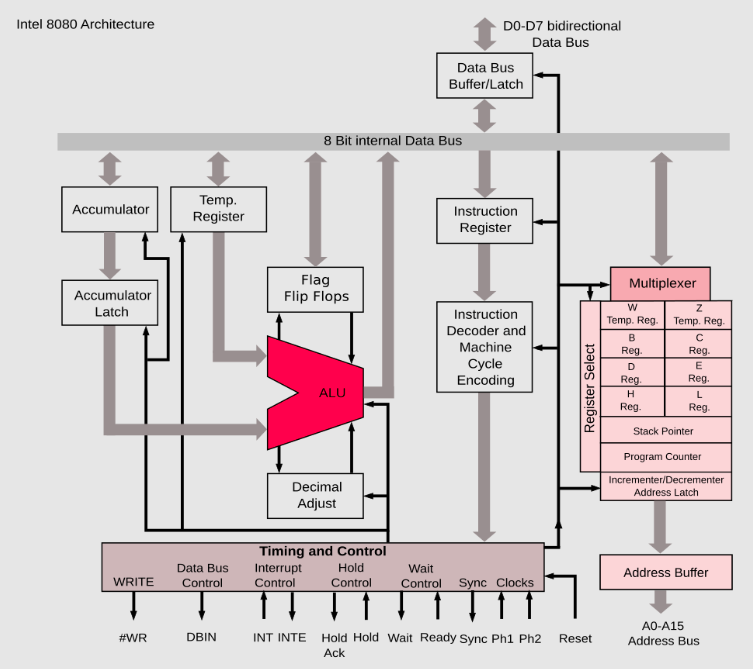
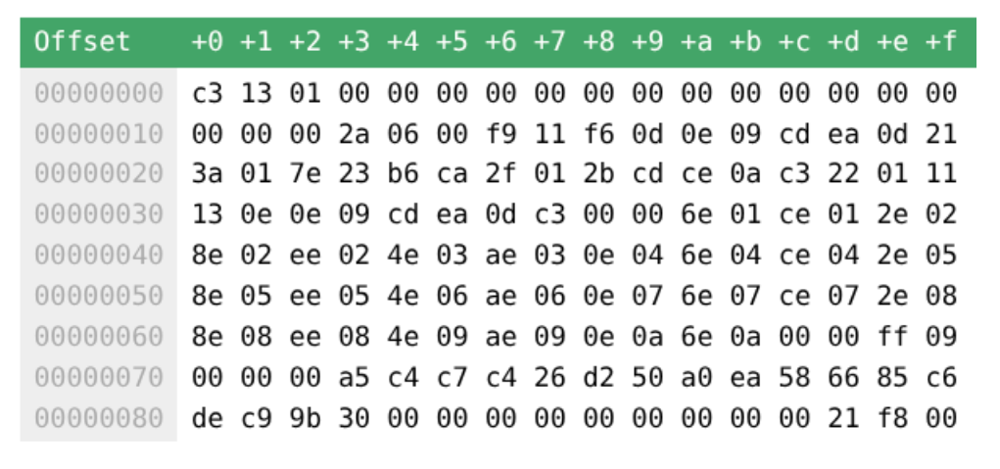
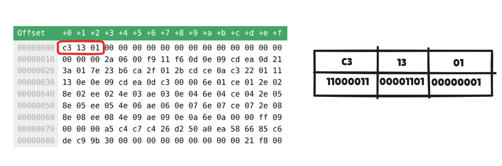
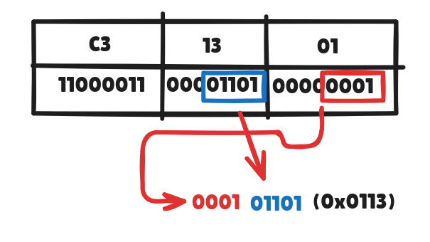

# Criando um Emulador de Intel 8080

Recentemente eu apresentei meu TCC voltado para emulação, mais especificamente sobre o CHIP-8. Durante esse processo, me veio a vontade de fazer um de Game Boy também, apenas porque me interessei em todo esse processo de entender as coisas. Com isso, me deparei com a informação que o processador do GameBoy é bastante semelhante com o do Intel 8080. Por isso, irei fazer um deste sistema primeiro e depois seguir para o Gameboy 😁

# O que é o Intel 8080

<figure markdown="span">
{ align=center, width="300"}
</figure>

O Intel 8080 é um microprocessador de 8 bits lançado pela Intel em abril de 1974, considerado o primeiro processador mainstream da empresa e um marco na história da computação. Desenvolvido por Federico Faggin e Masatoshi Shima, o 8080 veio em encapsulamento DIP de 40 pinos e custava US$ 360 inicialmente, impulsionando o mercado de microcomputadores.

> DIP significa Dual In-line Package, e é um nome que damos a um tipo de encapsulamento para circuitos integrados com pinos dispostos em duas fileiras paralelas.

# 1) Arquitetura

## 1.1) Pinagem

<figure markdown="span">
{ align=center, width="400"}
</figure>


Para entender sua pinagem, o ideal é dividir os pinos em 4 categorias funcionais: Barramento de Endereços, Barramento de Dados, Sinais de Controle e Alimentação/Clock.

### 1.1.1) Barramento de Endereços (Address Bus)

São 16 pinos unidirecionais ( $A_0$ a $A_{15}$ ) que permitem ao processador endereçar até $2^{16}$ bytes ($64\text{ KB}$) de memória ou portas de I/O. Os respectivos pinos são de 25 a 27 e depois de 29  a 40, como é mostrado na imagem abaixo.

<figure markdown="span">
{ align=center, width="400"}
</figure>

> O nome do pino é bem intuitivo, pois A vem de "Adress" (que é a palavra "Endereço" em português).

### 1.1.2) Barramento de Dados (Data Bus)

São 8 pinos bidirecionais ($D_0$ a $D_7$) usados para transferir dados entre a CPU, a memória e periféricos. Durante o início de cada ciclo de máquina (sinal SYNC), esses pinos também emitem uma "palavra de status" que descreve o tipo de ciclo que está sendo executado.

<figure markdown="span">
{ align=center, width="400"}
</figure>

> Também bem claro, pois é D de "Data", que é dados em português.

### 1.1.3) Sinais de Controle e Estado
Estes pinos gerenciam o fluxo de dados e a sincronização com o sistema.

| Pino | Nome  | Descrição |
| :--: | :---  | :--- |
| 19   | SYNC  | Indica o início de um ciclo de máquina; o status é colocado no barramento de dados. |
| 18   | /WR   | Write: Sinal de saída indicando que o barramento de dados contém informações para escrita. |
| 17   | DBIN  | Data Bus In: Sinal de saída avisando que o barramento de dados está em modo de entrada. |
| 16   | INTE  | Interrupt Enable: Indica o estado interno do flip-flop de habilitação de interrupção. |
| 14   | INT   | Interrupt Request: Entrada para solicitação de interrupção externa. |
| 13   | HOLD  | Entrada para solicitar que a CPU libere os barramentos (usado em DMA). |
| 21   | HLDA  | Hold Acknowledge: Confirmação de que a CPU liberou os barramentos. |
| 23   | READY | Entrada de sincronização para memórias ou periféricos mais lentos que a CPU. |
| 24   | WAIT  | Indica que a CPU entrou em estado de espera (Wait State). |
| 12   | RESET | Zera o contador de programa (PC) e reinicia a execução. |

<figure markdown="span">
{ align=center, width="400"}
</figure>

### 1.1.4) Alimentação e Clocks

Diferente dos processadores modernos que usam apenas uma voltagem, o 8080 exigia três tensões diferentes e um clock de duas fases.

> Em resumo, era 3 pinos para voltagem e 2 para clocks. Ele precisava dessas três tensões devido às limitações da tecnologia NMOS (N-channel Metal-Oxide-Semiconductor) da época.

- **PARA ALIMENTAÇÃO**

    | Pino | Nome | Tensão | Descrição |
| :--: | :--- | :----: | :--- |
| 28   | VDD  | +12V   | Alimentação principal para os transistores e circuitos de clock. |
| 20   | VCC  | +5V    | Alimentação da lógica interna e interface com outros chips (TTL). |
| 1    | VBB  | -5V    | Tensão de polarização do substrato (Pino crítico para evitar danos). |
| 2    | GND  | 0V     | Terra / Referência comum do sistema. |

    ---
    Naquela época, os transistores "vazavam" bastante eletricidade. Se muita eletricidade vazasse, o chip esquentava ou os transistores ligavam sozinhos (o que causaria erros de cálculo).
    A solução: Os $-5\text{V}$ serviam para "sugar" esse excesso de energia do terreno, mantendo-o estável. Era como uma bomba de drenagem.

    Além disso, os transistores daquela época eram lentos para "abrir e fechar". Para que o processador conseguisse trabalhar na velocidade adequada, ele precisava de um "empurrão" forte.
    A solução: Os $+12\text{V}$ forneciam essa pressão alta. Era como usar um motor potente de 12 volts para girar as engrenagens mais rápido do que um motor comum de 5 volts conseguiria.

    O $+5\text{V}$ era a voltagem da "conversa". Todos os outros componentes do computador (como as memórias e teclados da época) usavam o padrão TTL, que só entendia sinais de $5\text{V}$.
    Assim, o computador usava essa voltagem apenas para os seus pinos de saída e entrada.

    ---
    <figure markdown="span">
    { align=center, width="400"}
    </figure>

- **PARA OS CLOCKS**

    | Pino | Nome | Nível  | Descrição |
| :--: | :--- | :----: | :--- |
| 22   | Φ1   | 0V-12V | Fase 1 do clock externo. Sincroniza as operações internas. |
| 15   | Φ2   | 0V-12V | Fase 2 do clock externo. Deve ser não-sobreposta à Fase 1. |


    <figure markdown="span">
    { align=center, width="400"}
    </figure>

    > Um processador executa milhões de passos por segundo. Imagine que a CPU precisa ler um número da memória e somá-lo a outro. Se ela tentar somar antes do número chegar, o resultado será um erro. O clock garante que o Passo A termine antes do Passo B começar. Ele define o Ciclo de Máquina: o tempo necessário para realizar uma operação básica.

## 1.2) Diagrama de Blocos (Partes)

O Intel 8080 é um microprocessador composto por 3 partes principais:

<figure markdown="span">
{ align=center, width="500"}
</figure>

1. 7 registradores de propósito geral e 2 específicos.
2. Memória.
5. Entrada/Saída (I/O).


###  1.2.1) Registradores

O processador utiliza espaços de armazenamento interno chamados registradores para realizar cálculos e tomar decisões. No 8080 eles são:

- **A (Acumulador)**: O registrador mais importante; é onde ocorrem quase todas as operações aritméticas e lógicas.
- **B, C, D, E**: Registradores de uso geral, frequentemente chamados de "scratchpad" para armazenamento temporário.
- **H e L**: Usados principalmente como um par de registradores de 16 bits para apontar para endereços de memória. O H armazena o byte mais significativo (MSB) e o L o menos significativo (LSB).

---
#### REPRESENTAÇÕES DOS REGISTRADORES

Nas instruções em si, cada registrador é referenciado por um número, que vai de 0 até 7. Então, se por exemplo queremos mover um valor do registrador B para o D, diremos: "Mova o conteúdo do registrador 000 para o registrador 010". A tabela abaixo mostra essa relação:

| Código Binário | Valor Decimal | Registrador | Descrição |
|----------------|---------------|-------------|-----------|
| 000 | 0 | B | Registrador B |
| 001 | 1 | C | Registrador C |
| 010 | 2 | D | Registrador D |
| 011 | 3 | E | Registrador E |
| 100 | 4 | H | Registrador H (parte alta de HL) |
| 101 | 5 | L | Registrador L (parte baixa de HL) |
| 110 | 6 | M | Memória (endereço em H:L) |
| 111 | 7 | A | Acumulador (Accumulator) |


---


Além disso, temos dois registradores de controle:

- **Contador de Programa (PC)**: É um registrador de 16 bits que possui o endereço da próxima instrução a ser executada.
- **Ponteiro de Pilha (SP)**: É um registrador de 16 bits que aponta para o topo da "pilha" na memória, usado para sub-rotinas e salvamento de dados.
- **Registrador de Status**: O processador mantém um registrador especial que guarda resultados das operações lógicas e aritméticas que são realizadas. As flags são:

    O processador mantém bits de flag internos (um registrador de status), que indicam os resultados das instruções aritméticas e lógicas. Apenas certas instruções afetam as flags. As flags são:

    | Flag | Nome | Descrição |
    |------|------|-----------|
    | S | Sinal (Sign) | Definida se o resultado for negativo |
    | Z | Zero | Definida se o resultado for zero |
    | P | Paridade (Parity) | Definida se o número de bits 1 no resultado for par |
    | C | Transporte (Carry) | Definida se a última operação de adição resultou em transporte ou se a última operação de subtração necessitou de empréstimo |
    | AC | Transporte Auxiliar (Auxiliary Carry) | Usada para aritmética decimal codificada em binário (BCD) |


### 1.2.2) Memória

- **Tamanho**: 64 KB de memória.

    > O DIP de 40 pintos possui 16 bits (permitindo endereçar 2¹⁶, que é os 64 KB) 

Além disso, ele possuía 3 barramentos: de dados, endereços e controle.

1. **Barramento de Endereços:** O barramento de endereços fornece endereçamento à memória (até 64K palavras de 8 bits) e aos 256 dispositivos de entrada e 256 dispositivos de saída. A0 é o bit de endereço menos significativo. O barramento de endereços possui 16 bits.

2. **Barramento de Dados:** O barramento de dados fornece comunicação bidirecional entre a CPU, memória e dispositivos I/O para processar instruções e dados. Além disso, durante o primeiro ciclo de clock (estado) de cada ciclo de máquina, o Intel 8080A envia uma palavra de status descrevendo o ciclo de máquina atual no barramento de dados. D0 é o bit menos significativo. O barramento de dados possui 8 bits.

3. **Barramento de Controle:** Consiste em 10 linhas que são usadas para transmitir sinais de controle que determinam a natureza e o funcionamento dos componentes da CPU.

### Modos de Endereçamento de Memória

- **Endereçamento Direto**: A instrução fornece o endereço exato da memória
- **Endereçamento por Par de Registradores**: Um registrador contém o endereço. O registrador H contém o byte mais significativo, L contém o byte menos significativo.
- **Endereçamento por Ponteiro de Pilha**: O endereço do ponteiro de pilha é usado. Veja **pop/push** na seção "Ponteiro de Pilha".
- **Endereçamento Imediato**: Carrega o próximo byte (byte após o byte da instrução) no registrador **A**.

## Instruções

O Intel 8080 usava um conjunto de instruções de 8 bits no formato CISC, com cerca de 78 instruções básicas codificadas em um único byte, permitindo simplicidade e compactação no código assembly. Nós podemos categorizar em 5 tipos de instruções:

- **Movimentação de Dados**: Movem bytes de um local para outro sem alterar seu valor.
- **Aritmético**: Realizam operações matemáticas básicas nos dados armazenados em registradores ou na memória.
- **Lógico**: Executam operações booleanas e manipulações de bits.
- **Desvio ou Controle**: Inclui saltos condicionais e incondicionais, chamadas de sub-rotina e retornos
- **Instruções I/O**: Estas instruções facilitam a comunicação com dispositivos periféricos.

A maioria das instruções ocupava 1 byte (opcode incluindo registradores), mas podia ser seguida por 1 ou 2 bytes adicionais para dados imediatos, endereços de memória ou números de portas I/O. 

No entanto, apesar de ser essencialmente um processador de 8 bits, ele incorporava capacidades limitadas de operações de 16 bits para expandir sua versatilidade em tarefas como aritmética e gerenciamento de pilha. Isso era feito utilizando pares de registradores de 8 bits (como BC, DE e HL). A lista completa das intruções eu consegui encontrar nos seguintes sites:

-  [Emulator 101 - 8080 By Opcode](https://web.archive.org/web/20200220004250/https://www.emulator101.com/8080-by-opcode.html) (através do Wayback Machine, porque o site parece off).

- [Github Gist organizado por um cara chamado joefg](https://gist.github.com/joefg/634fa4a1046516d785c9)

- [Quick guide to 8080 Instruction Set - Dunfield](http://dunfield.classiccmp.org//r/8080.txt)

> Assim, as instruções podem variar de 1 a 3 bytes. Tenha isso em mente!

- Como exemplo de instrução de 1 byte (8 bits) temos a `MOV D, S`
- Como exemplo de 2 bytes (16 bits), temos a `ADI #` 
- Como exemplo de 3 bytes (24 bits), temos a `JMP a`

Você deve ter notado que existe algumas coisas estranhas, como o D, S e # nas instruções. Isso é porque é comum que as instruções utilizem alguns caracteres para representar algumas coisas. Primeiro, vamos entender o que elas significam:

| Símbolo | Inglês | Português |
|---------|--------|-----------|
| `D` | Destination register (8 bit) | Registrador de Destino (8 bits) |
| `S` | Source register (8 bit) | Registrador de Origem (8 bits) |
| `RP` | Register pair (16 bit) | Par de Registradores (16 bits) |
| `#` | 8 or 16 bit immediate operand | Operando imediato de 8 ou 16 bits |
| `a` | 16 bit Memory address | Endereço de memória de 16 bits |
| `p` | 8 bit port address | Endereço de porta de 8 bits |
| `ccc` | Conditional | Condicional |
| `db` | Data byte (8 bit) | Byte de dados (8 bits) |
| `lb` | Low byte of 16 bit value | Byte baixo de valor de 16 bits |
| `hb` | High byte of 16 bit value | Byte alto de valor de 16 bits |
| `pa` | Port address (8 bit) | Endereço de porta (8 bits) |

Para entender melhor a lógica, vamos pegar algumas instruções simples:


| Categoria | Instrução | Opcode | Flags | Descrição |
|-----------|-----------|--------|-------|-----------|
| **MOV** | MOV D,S | 01DDDSSS | - | Move register to register |
| **ADD** | ADD S | 10000SSS | ZSPCA | Add register to A |
| **JMP a** | 11000011 lb hb | - | Unconditional jump |

### MOV

O `MOV`é a instrução responsável por mover valores de um registrador para outro. Podemos ver que ela é identificável por começar com o valor `01`, e todo o resto (6 bits) são os operandos da instrução. Por exemlo, podemos ter o seguinte valor em uma ROM:


| Hexadecimal | Binário |
|-------------|---------|
| 7E | 01111110 |

Já que começa em `01`, temos um MOV. Então, o resto da instrução é nosso DDD e SSS:

| Parte |  Valor Binário | Valor Decimal | Registrador |
|-------|---------------|---------------|-------------|
| MOV | 01 | 1 | - |
| DDD (Destino) | 111 | 7 | A |
| SSS (Fonte) | 110 | 6 | M (HL) |

> Caso se perdeu o porquê de 7 ser o registrador A e 6 ser o M, clique [AQUI](#representações-dos-registradores) para relembrar disso.

Com isso, podemos entender que a instrução `7E` significa: “Copie o byte da memória apontada por HL para o registrador A”.
> Como assim copiar? Não era mover? Bom, no Intel 8080, MOV não move no sentido de tirar de um lugar, é mais como uma cópia mesmo. A ideia de "mover" é mais no sentido de falar "colocar em outro registrador", mas não no sentido que temos hoje, de cut & paste....


### JMP

O mesmo ocorre com a instrução `JMP a`, que possui a diferença de ser no tamanho de 3 bytes (24 bits)...

Ou seja, os 8 primeiros bits identificam a intrução (`11000011`) e os outros 16 representam os operandos! Para entender melhor, vamos ver os dados de uma rom real:

<figure markdown="span">
{ align=center, width="500"}
</figure>

Essa é uma rom para o Intel 8080, e podemos ver diversos valores hexadecimais (apenas carreguei ela em um site chamado ["Online Binary File Viewer"](https://iamkate.com/code/binary-file-viewer/), para ver os dados em binário). Se fôssemos converter os 3 primeiros valores para binário, teríamos algo como:

<figure markdown="span">
{ align=center, width="700"}
</figure>

Ora, se começou com `11000011`, temos um JMP aqui. Então os próximos 2 bytes (16 bits) são os operandos dessa instrução! A documentação diz para pegarmos o endereço de 16 bits (`a`) e organizarmos da seguinte forma:

- A primeira parte será a "parte baixa" (LB): `0x01`
- A segunda parte será a "parte alta" (HB): `0x13`

Assim, para formarmos o endereço para onde será feito o pulo, combinamos esses dois. Nesse caso, o endereço final será `0x0113` (ou `00000001 00001011` em binário):

<figure markdown="span">
{ align=center, width="400"}
</figure>

Na prática, faremos isso usando operações bit a bit:

```
Endereço = 01h << 8 | 13h
Endereço = 0113h
```
> Esse "h" é uma espécie de "etiqueta" para sinalizar que o número está em hexadecimal, para não ocorrer confusões. Basicamente, é dizendo: “Ei, leia isso como hexadecimal, não como decimal”...

Por fim, o que vamos fazer é definir o `PC`como `0x0113`, ou seja, vamos pular para esse endereço que formamos. Pronto, é assim que funciona!


###  Tabela Completa de Instruções

| Instrução | Encoding | Flags | Descrição |
|------|----------|-------|-------------|
| MOV D,S | 01DDDSSS | - | Move register to register |
| MVI D,# | 00DDD110 db | - | Move immediate to register |
| LXI RP,# | 00RP0001 lb hb | - | Load register pair immediate |
| LDA a | 00111010 lb hb | - | Load A from memory |
| STA a | 00110010 lb hb | - | Store A to memory |
| LHLD a | 00101010 lb hb | - | Load H:L from memory |
| SHLD a | 00100010 lb hb | - | Store H:L to memory |
| LDAX RP | 00RP1010 *1 | - | Load indirect through BC or DE |
| STAX RP | 00RP0010 *1 | - | Store indirect through BC or DE |
| XCHG | 11101011 | - | Exchange DE and HL content |
| ADD S | 10000SSS | ZSPCA | Add register to A |
| ADI # | 11000110 db | ZSCPA | Add immediate to A |
| ADC S | 10001SSS | ZSCPA | Add register to A with carry |
| ACI # | 11001110 db | ZSCPA | Add immediate to A with carry |
| SUB S | 10010SSS | ZSCPA | Subtract register from A |
| SUI # | 11010110 db | ZSCPA | Subtract immediate from A |
| SBB S | 10011SSS | ZSCPA | Subtract register from A with borrow |
| SBI # | 11011110 db | ZSCPA | Subtract immediate from A with borrow |
| INR D | 00DDD100 | ZSPA | Increment register |
| DCR D | 00DDD101 | ZSPA | Decrement register |
| INX RP | 00RP0011 | - | Increment register pair |
| DCX RP | 00RP1011 | - | Decrement register pair |
| DAD RP | 00RP1001 | C | Add register pair to HL (16 bit add) |
| DAA | 00100111 | ZSPCA | Decimal Adjust accumulator |
| ANA S | 10100SSS | ZSCPA | AND register with A |
| ANI # | 11100110 db | ZSPCA | AND immediate with A |
| ORA S | 10110SSS | ZSPCA | OR register with A |
| ORI # | 11110110 | ZSPCA | OR immediate with A |
| XRA S | 10101SSS | ZSPCA | ExclusiveOR register with A |
| XRI # | 11101110 db | ZSPCA | ExclusiveOR immediate with A |
| CMP S | 10111SSS | ZSPCA | Compare register with A |
| CPI # | 11111110 | ZSPCA | Compare immediate with A |
| RLC | 00000111 | C | Rotate A left |
| RRC | 00001111 | C | Rotate A right |
| RAL | 00010111 | C | Rotate A left through carry |
| RAR | 00011111 | C | Rotate A right through carry |
| CMA | 00101111 | - | Compliment A |
| CMC | 00111111 | C | Compliment Carry flag |
| STC | 00110111 | C | Set Carry flag |
| JMP a | 11000011 lb hb | - | Unconditional jump |
| Jccc a | 11CCC010 lb hb | - | Conditional jump |
| CALL a | 11001101 lb hb | - | Unconditional subroutine call |
| Cccc a | 11CCC100 lb hb | - | Conditional subroutine call |
| RET | 11001001 | - | Unconditional return from subroutine |
| Rccc | 11CCC000 | - | Conditional return from subroutine |
| RST n | 11NNN111 | - | Restart (Call n*8) |
| PCHL | 11101001 | - | Jump to address in H:L |
| PUSH RP | 11RP0101 *2 | - | Push register pair on the stack |
| POP RP | 11RP0001 *2 | *2 | Pop register pair from the stack |
| XTHL | 11100011 | - | Swap H:L with top word on stack |
| SPHL | 11111001 | - | Set SP to content of H:L |
| IN p | 11011011 pa | - | Read input port into A |
| OUT p | 11010011 pa | - | Write A to output port |
| EI | 11111011 | - | Enable interrupts |
| DI | 11110011 | - | Disable interrupts |
| HLT | 01110110 | - | Halt processor |
| NOP | 00000000 | - | No operation |

## Detalhes Importantes
- **Little Endian**: O 8080 armazena os endereços no formato Little Endian
    
    > Isso quer dizer que os valores são colocados de forma inversa.

- **Velocidade do clock**: Inicialmente ele oferecia velocidades de 1 MHz, mas as versões posteriores podiam atingir até 3 MHz.